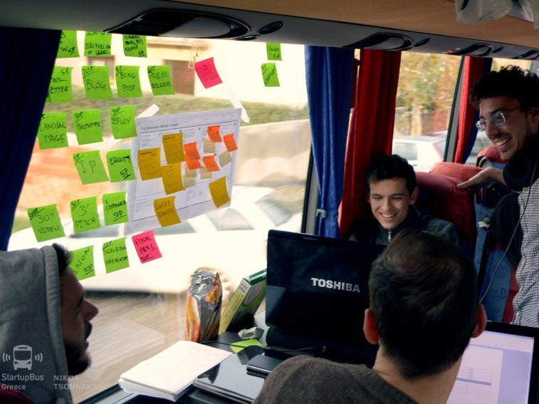
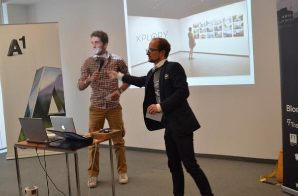
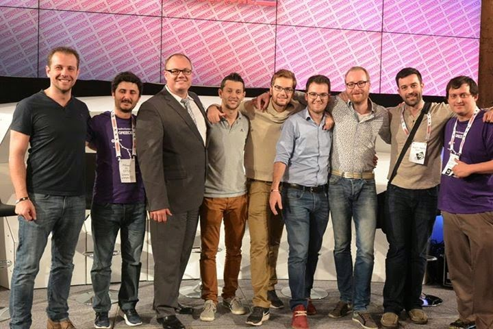

During the last week of October 2014, I had the privilege of being member of the StartupBus Europe 2014, participating in the Greek Bus, plus attending Pioneers Festival 2014. It was an amazing experience and I would encourage more people to try it (not at home)!

I experienced so many things during this one week, but I will try to keep it brief. Let's start from the [StartupBus](http://europe.startupbus.com/). This is a great initiative that was bootstrapped in Australia some years ago from the idea of Elias Bezanis, who realised that this event inspired a great number of talented people and decided to make it global. At the time of writing, it's organized in various places around the world (Europe, USA etc.) and Elias is also the CEO of [StartupHouse](http://startuphouse.com/), an incubator in Sillicon Valley, where many startups created in StartupBus have been hosted and mentored during their first steps after the event.

So, the StartupBus is about meeting young, ambitious, talented people, exploring ideas and constantly learning new things in an attempt to solve a problem and create a life-changing idea. I am not gonna lie, StartupBus is not an event for those pettish people always complaining about difficulties. In our case, this entailed travelling 72 hours in a bus with a problematic WiFi from Athens to Vienna, ignoring all the problems and trying hard to create a strong product and build a whole business plan around it. It's about marrying healty competition with strong cooperation. I've seen teams, strongly competitive, that did not hesitate to help other teams and consult them. From personal experience, I believe a high percentage of people may "regret" participating during the first 3 hard days in the bus. But, I also believe that all of them will be grateful they did not give up and a lot of them will be waiting for the applications of the next year to re-live this unique experience.

{: .image-pull-right}

<b>Life in the StartupBus</b>

I was really lucky to meet very nice people and make good friends during my time in the bus. I've learned the value of qualities, like resourcefullness, determination, teamwork and a lot more. The biggest lesson for me was to have 2 things guide me in my life:
* **Focus**
* **Vision**

So, I give my rendez-vous for the next StartupBus and invite everyone to apply!

All the teams were collecting points during the trip based on some criteria, in a Hogwarts fashion. These points gave some of the teams some advantage during the knock-out phase, where we had to pitch our ideas in front of a big audience and a set of judges from some of the biggest companies in the world. After the final, all the buspreneurs had the chance to attend Pioneers Festival, one of the greatest conferences about startups and technological trends of the next years. In Pioneers, we met the 50 most upcoming startups of the world. We also saw the launch of AeroMobile 3.0, the first user-oriented flying car, which was being designed since 1990!

{: .image-pull-right}

Our team, <b>Xplory</b>, pitching in front of the judges in the finals

{: .image-pull-right}

<b>Zumo</b>, the winners from StartupBus 2014 from the Greek bus

We also saw an amazing show, where 2 pianos were "armed" with robotic arms, and Andrew Sorensen used programming and closures to create a musical artifact. If you're curious, you can have a look [here](https://www.youtube.com/watch?v=5DuVuoe-_UQ).

There were also a lot of other speeches around Security, a futuristic use of beacons in daily life and a great, inspirational speech for "how to hustle" from Steli Efti. Pioneers Festival is a real "technology playroom" and I would totally recommend it for young enthusiasts like me. I bet that you'll really love it. 

So, I'll wrap up here and I'll be waiting to meet you in the next StartupBus!
