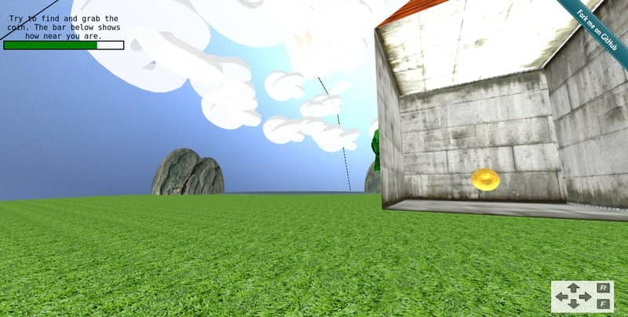

{: .image-pull-right}

This is a basic, experimental, 3-dimensional (3D) game that can be played in a web browser.

You can play it [here](http://dimosr.github.io/webGL-scenery).

You can find the source code in Github [here](https://github.com/dimosr/webGL-scenery).