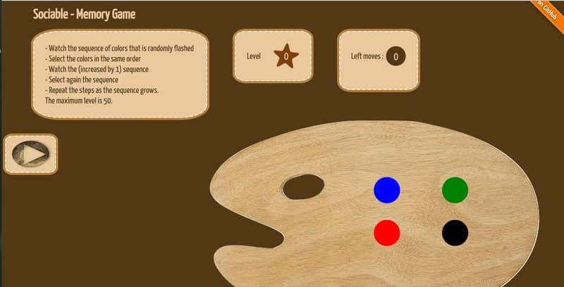

{: .image-pull-right}

This is an interactive memory game, which aimed to be part of a bigger platform (Sociable) for assistive cognitive training and social activation. The user is shown a sequence of colours (that is steadily increasing in size in later levels) and then he is called to select the colours in the same order.

You can play it [here](http://dimosr.github.io/sociable-memory-game).

You can find the source code in Github [here](https://github.com/dimosr/sociable-memory-game).