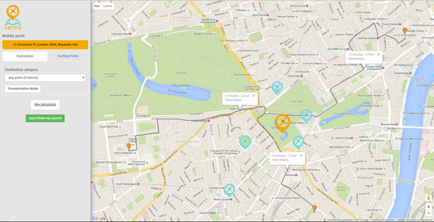

{: .image-pull-right}

Centro is a geo-location, web-based application, used for getting suggestions about meeting locations given several starting points and additional constraints. The user can add several locations and the application recommends places that will be as fair as possible to all attendees.

You can find more about the project [here](https://github.com/dimosr/Centro).