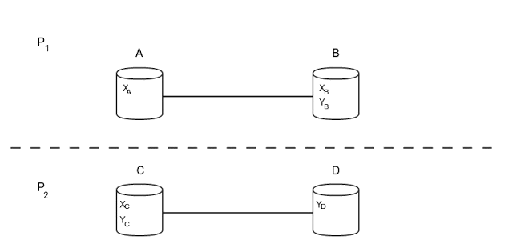
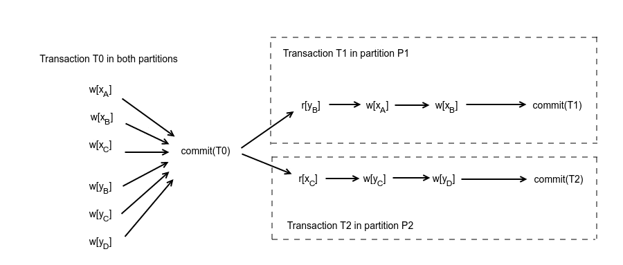

One of the simplest forms of a database system is a centralised database system without replication (which is widely used in relatively low-traffic web applications nowadays) . The 2 terms used correspond to the following:
* **Centralised** means that the whole database is hosted in a single server. This requires, of course, that the size of the data is sufficiently small to fit in a single server.
* **Without replication** means that each data item (a table row in the case of an RDBMS, for example) resides a single time (single copy) in this server.

The model of a centralised, non-replicated database becomes less and less attractive for systems that need to be scalable. Some of the reasons are the following:
* as data grow above the order of TBs, it becomes extremely expensive to buy servers that can host all that data in a single place
* maintaining all the data in a single place means there is a single point of failure, decreasing the availability of the system. A single failure can render the whole system unusable.
* it's difficult (and expensive) to scale in terms of performance as well, because you can't distribute work to multiple servers, so the only choice is to buy "stronger" servers.

Thus, this is the point, where distributed databases come into play. A **distributed** database, compared to a centralised database, is a database that hosts different parts of data in different servers. However, this can decrease availability further, since now we have more servers and a failure of one of them can cause an outage. For this reason, most distributed databases employ **replication**. Using replication, a distributed database can have multiple copies (replicas) of each data item, with each one hosted in a different server. As a result, if one of the server fails, a query can retrieve data items, that were residing in the failed server, from the servers that contain their replicas. In this way, the whole system provides higher availability to the end user.

But, beware that replication and the "here be dragons" warning come in pairs. Now, the database internally has multiple copies, while an external observer views the system as having a single copy. There are various read/write strategies, depending on the things one wants to optimise for (e.g. read vs write availability, latency etc.). The most basic ones we'll explore are the following:
* **write all - read one**
* **write one - read all**
* **write quorum + read quorum**

## Write all - Read one

This is the most basic strategy, that was initially adopted in most RDBMS systems in their early attempts to provide partitioning/replication functionalities. Each write operation is handled by one of the servers that hold a replica for the affected item. This server is responsible for making sure that the write is being completed in all the replicas, before acknowledging to the client that the operation has been completed. On the other hand, the data are consistent all the time, so every read operation can proceed in any of the available replicas. This strategy provides high availability for reads, compromising availability in write operations. In order for the system to become unavailable for reads, all the replicas for the requested item must be down simultaneously, which is highly unlikely. However, if a single replica is down, the system is unable to perform a write operation.

## Write one - Read all

This is a strategy sitting on the other end of the availability spectrum. Every write operation is performed on a single replica. For every read operation, one of the replica servers is responsible for reading the values from all the replicas and returning the most recent one to the client. Actually, this is more complex and involves conflict resolution and potentially informing the stale replicas about newer values. This strategy provides high availability for writes, while compromising availability for read operations. As before, a single replica failure makes read operations unavailable, while all the replicas must be down for writes to become unavailable.

## Write quorum + Read quorum

This is a middle ground between the previous 2 strategies. Every write operation has to be completed in a number of random replicas that are defined by the size of the **write quorum**. Similarly, every read operation has to be completed in a number of random replicas that are defined by the size of the **read quorum**. When the sizes of these quorums are selected carefully, we can ensure data consistency. Actually, making sure that the following 2 properties hold for our quorums is enough, where **V** is the number of replicas, **Vr** is the size of the read quorum and **Vw** is the size of the write quorum:
* **Vr + Vw > V**, which ensures that every read will read the last write
* **Vw > V/2**, which ensures that every write will overwrite the last write

Both of the previous rules together ensure that the final execution will be serialisable, thus equivalent to a serial one. The reason is simple: looking at the first rule, you can see that the read and write quorums have to intersect in at least 1 server. Since this server belongs to both quorums, it will have observed the latest write for sure (and it will also act as the point, where these operations will be serialised). Following exactly the same thinking, when there are 2 concurrent writes, there will be one server belonging to both write quorums, thus serialising the 2 writes, as reflected in the second rule above.This strategy provides the best of both worlds, ensuring high availability for both reads and write operations. As inferred from the definition, writes become unavailable, when more than (V - Vw) replicas have failed, while reads become unavailable, when more than (V - Vr) have failed.

## An example

We are now going to study a slightly more complicated example, where transactions are composed of multiple operations each, in order to understand better how quorums work and how they handle weird failure scenarios. The simplest failures are single-node failures, aka when a server crashes or communication failures happen between 2 servers, which can also be approached as single-node failures. A more interesting failure scenario is a **network partition**, which is a combination of communication and server failures that can divide a network of servers into multiple different components, where each server can only communicate with other servers inside its own components. Servers in different components are isolated and cannot communicate.

Let's investigate a simple case of a network partition. Let's assume we have 4 servers (A,B,C,D) and 2 data items (x,y). The 3 replicas of x reside in A, B and C. The 3 replicas of y reside in B, C and D. Also, due to some failures, a network partition has occured that divides the whole network into 2 different components, P1 {A,B} and P2 {C,D}. The architecture can also be seen in the following diagram.

{: .image-pull-right}

System topology under network partition

Now, let's assume there are 3 incoming transactions T0, T1, T2 with the following operations each:
* T0: w(x), w(y)
* T1: r(y), w(x)
* T2: r(x), w(y)

where w(x) corresponds to a write on x and r(x) corresponds to a read of x. The network partition happens, after transaction T0 has completed and before T1,T2 have begun. In case of network partition, the database can execute the transactions in the following way:

{: .image-pull-right}

Concurrent execution of transactions T1, T2

One of the basic tenets in concurrency control algorithms is that a concurrent execution of multiple transactions should be equivalent to one serial execution of them, so that data consistency is preserved. This is also called **serialisability**. Let's see how serialisability is maintained by quorums.

Transaction T0 is handled by any server and updates x,y in all replicas. After the network partition happens, T1 is handled by some server in partition P1. Since, there is no communication with partition P2, servers C, D are assumed to have failed and only replicas residing inside the partition can be updated. In the same logic, transaction T2 happens to be handled by one server in partition P2 that assumes servers of partition P1 failed and can only update replicas of servers in P2. By comparing this execution with the serial execution T0,T1,T2, we can observe that T2 reads the value of x written by T0, while T1 has also executed before T2 and written to x in the serial execution. So, **the concurrent execution** is not equivalent to the serial execution T0, T1, T2. In the same logic, we can conclude that the concurrent execution is not equivalent to the serial T0, T2, T1, and in fact it **is not equivalent to any serial execution**. Thus, it is **not serialisable**, and thus **not consistent**.

Going back to our quorum strategy, with the given topology we have V = 3 (replicas). So, there are 2 possible configurations:
* Vr = 1, Vw = 3, where both transactions T1, T2 can complete the read operations, but they cannot complete the write operations (since they can only write over 2 replicas).
* Vr = 2, Vw = 2, where they can complete the write quorums, but now they cannot complete the read quorums. 

So, in all cases, both transactions will either delay until the network partition is fixed and they can complete both read and write quorums or they will abort. For this specific network partition, the quorums strategy was also unable to proceed, but there are other network partitions where the superiority of the quorums strategy is more evident. For instance, you can examine the case of a parition creating the 2 components {A, B, C} and {D}, where the first 2 strategies (write all - read one & write one - read all) would cause unavailability, while a quorum strategy (with Vr = 2, Vw = 2) would be able to proceed successfully.

In reality, things are even more complicated, because of the fact that transactions are composed of multiple operations and we might also need to guarantee there is isolation between the transactions (the I in the ACID properties). To understand what I am referring to, consider the following scenario. In the first potential setup (Vr = 1, Vw = 3) applying only the methodology described above, both T1 and T2 could execute the read operations (r[yB], r[xC]), wait until the network partition is resolved, so that they can execute the writes in the whole write quorum and then finish with the remaining write operation. This satisfies the quorum conditions mentioned above, but would still be a non-serialisable execution. So, when transactions are composed of multiple operations, the quorum strategy would need to be combined with an appropriate concurrency control algorithm. This is a really big field with many different, available algorithms, so I won't be able to cover it in this post. However, as a quick hint, one such algorithm could make use of locks in the beginning of the transaction for all the affected items (known as 2-phase locking). That would prevent the problematic execution that was just described, thus forcing the transactions to follow a serialisable execution.  

For anyone interested in learning more about concurrency control in database systems, I would highly recommend reading [1]. For a nice explanation of an implementation of a Quorum Consensus algorithm, I would also recommend reading [2], written by Amazon and containing many concepts applied to their key-value stores.

### References:
[1] "Concurrency Control and Recovery in Database Systems", Phil Bernstein

[2] "Dynamo: Amazon’s Highly Available Key-value Store", Giuseppe DeCandia et al.