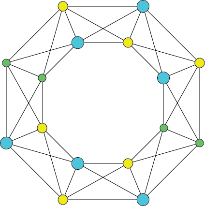

{: .image-pull-right}

<b>Monitorito</b> is an in-browser plugin that helps you visualise your web activity.

This can help you identify which websites might be tracking you and how that information is being exchanged through the multiple parties.

You can install the plugin in the below links, depending on your browser:
* [Chrome](https://chrome.google.com/webstore/detail/monitorito/cpnoiekgkadngaefmiiomndachemdcde)
* [Firefox](https://addons.mozilla.org/en-US/firefox/addon/monitorito/)
* [Opera](https://addons.opera.com/en/extensions/details/monitorito/)

You can find more info about the project [here](https://monitorito.github.io/).