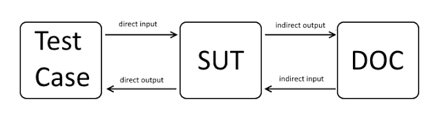

This is another one of those posts trying to establish a naming pattern between the multiple test doubles that can improve the unit testing processes in a software development project. During the past months, I noticed that there is a lot of confusion around the differences between stubs, mocks and spies in the software community. This confusion is probably due to the combination of the following 2 facts:
* people are not willing to devote a significant amount of time to read a book that is focused on the field of unit testing (or even better an academic paper; yes there really are academic papers about stubs, mocks and unit testing!).
* most of the frameworks used across the industry have done a very good job providing a set of really useful features, but blur the concept of stubs and mocks by providing them under a single entity. Some of these frameworks have also adjusted the notion of spies, diverting from their original definition to cover more use-cases.

But, since everyone is interested in shipping software faster and more efficient, what's the reason of all that rumbling ? Because if one knows the difference between these concepts, he/she will also write more readable, maintainable and less fragile unit tests, thus actually increasing the software development cadence. So, here we go.

First things first, we have to setup the context before diving deep. As we all know (or should know), **SUT** (System Under Test) is the part we are trying to test and as **DOC** (Depended On Component) I will refer to every dependency of the SUT. In general, unit testing consists of feeding some data (input) to our SUT and testing that the correct data (output) is being provided as a result from it. However, there is also data flow not visible to the client, which is between the SUT and its DOCs. The most generic pattern of interaction between the SUT's client, the SUT and the DOC can be summed up in the following diagram. The client calls an SUT's method providing the **direct input**. The SUT then makes any necessary calls to its DOCs providing the so-called **indirect outputs**, because this is behaviour of the SUT which is not directly observable to the client of the SUT. The DOC will reply to the SUT with the **indirect input**, which is called this way because it's data that will affect how the SUT will behave, but they are again not visible to the client. Finally, the SUT will reply with the direct output. The simplest unit tests only test what the **direct output** is, given a specific direct input (and perhaps some specific indirect inputs from the DOCs). This is the so-called **State Verification**. However, the are some cases, where we also want to verify some of the indirect outputs of the SUT. For instance, imagine that our SUT persists a message to a message queue as part of an operation to be processed later by other components. We want to make sure that the DOC (which is the message queue) is indeed called, so that the message is persisted successfully. This is the so-called **Behaviour Verificiation**. 

{: .image-pull-right}

All this is not just a random rant, this is the utmost reason why stubs, mocks and spies exist in the first place. Without them, we would not be able to verify indirect outputs of the SUT and we would neither be able to verify direct outputs that are based on indirect inputs of the DOCs. Or at least, we would not be able to do so simply and quickly, without a lot of fuss. All these test doubles give us the opportunity to test our SUT, by replacing all the DOCs with test doubles, instead of actual objects. We need that, because real objects are sometimes really hard to construct and we cannot make them behave in all the possible ways we want, while we can do that with test doubles.

So, back to our topic and now getting it done. Stubs were born out of need to make DOCs provide the necessary indirect inputs to our SUT. A stub is an object that is configured, so that it responds with a specific answer when called with a specific question. Nothing more. We are using them to make sure that the SUT will be fed from the DOCs with the necessary data, so that the desired code path is exercised. Good so far, but then how are we verifying the indirect outputs of our SUT ? This is where mocks and spies come in place. These are objects that can be configured to "listen" for requests and then tell us whether they were really called. The difference is in the way they are used. Spies are used in a "recording" mode, so that they record all the calls being made (and their arguments) and after we exercise the SUT, we can go and check all the calls being made (and their arguments) and verify that everything is as needed. On the other hand, mock objects are not recording calls. We set some expectations based on which methods we expect to be called (and with what arguments). We set all these expectations before exercising the SUT and the mocks are responsible for verifying that the calls are made and with the correct arguments. For this reason, spies can be considered somewhat more flexible in use, while there is a big controversy on which one is the most readable and maintainable method. Usually, junior people tend to prefer spies, while the more experienced people prefer to set all the expectations (via mocks) in advance and let the verification be automatic.

However, this is the theoretical side of things. Knowing all that stuff is useful, so that you can decide which is the right approach based on what you want to test. There are several caveats, because frameworks do not completely follow the pattern described before. Briefly:
* Depending on the framework, verification of mocks is not always automatic. For instance, strict frameworks, such as jMock, provide automatic verification, failing when a call that has not been set as expectation was called. More lenient frameworks, such as Mockito, verification calls have to be done explicitly and, testing that no more methods were called besides the expected ones, requires manual setting. It's up to your preferences and the strictness you want to impose in your testing.
* Many frameworks do not differentiate between stubs and mocks in terms of implementation. That does not mean though that you can now forget everything we said and treat them the same. No, you can still maintain this boundary, by knowing that stubs will only be used to provide indirect inputs and you will never perform verification on them. Remember the purpose of stubs is feeding data, while the purpose of mocks is verifying that they receive data.
* Finally, Mockito provides the theoretical notion of spies under a different entity, called ArgumentCaptor which allows recording arguments and checking conditions on them later. It uses the concept of Spies for a different purpose. In Mockito, a spy is an object that is a wrapper of a real object and will dispatch all the calls to it (while also recording them and providing verification functionality). Furthermore, you can also configure it so that only several methods are dispatched and the rest are mocked. So, again please try to keep clear in your head the difference between the original notion of a spy and the one provided by Mockito. And be aware that while the original notion of a Spy is really useful and could co-exist with mocks, the notion of Spy introduced by Mockito usually leads to code smells and you should struggle as much as possible to not use it for your test, unless necessary.

Pheew, that's it. I am done. I hope this helped a bit.

And before leaving, if you are hungry for more, go check the references below.

Cheers. See ya.

### References:
[1] "XUnit Test Patterns: Refactoring Test Code", Gerard Meszaros

[2] "Mock Roles, not Objects", Steve Freeman, Nat Pryce, Tim Mackinnon, Joe Walnes