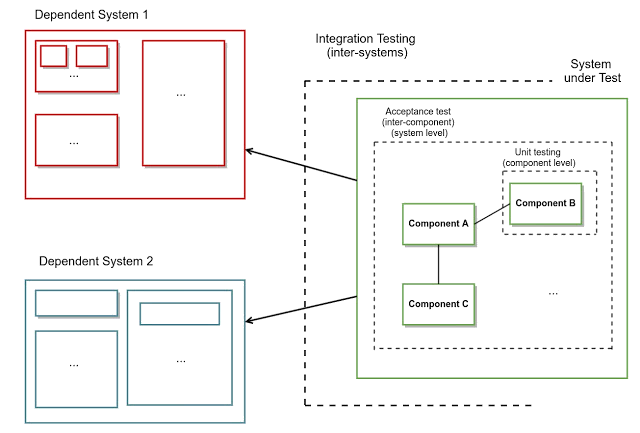
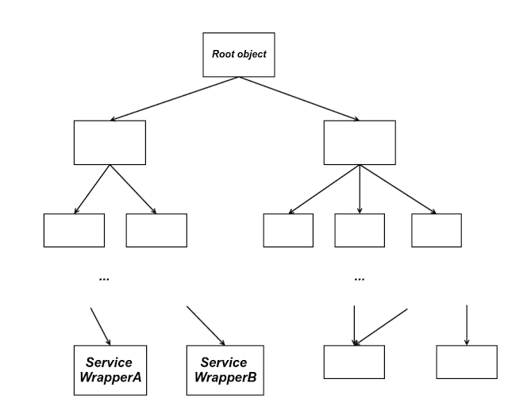

In this post, I will try to showcase how Dependency Injection can be used to help you write acceptance tests for your software system, while avoiding writing boilerplate, plumbing code to wire sub-components with each other. For the sake of clarity, I will use Spring for demonstration, but the approach described here can be easily applied with any DI framework (such as Guice). But, before proceeding, I want to first clarify what I mean by acceptance tests to prevent misunderstandings, since this concept is slightly controversial between individuals. We will first have to agree though that every single software environment can be viewed as a collection of (at least one) software systems  communicating with each other across the network. Meanwhile, each one of those software systems is composed of sub-components. In a more detailed view, these sub-components are themselves composed of other sub-components, which end up being composed of simple classes.

Now, unit testing is used to ensure that each single class functions as expected (or a sub-component, but this is a different argument and I don't want to diverge). On the other hand, integration testing is used to ensure that the communication between the various software systems (from which the system under test requests data) is successful. As a result, unit testing exercises each component/class isolated from everything else, thus not crossing network boundaries. In contrast, integration testing tests crosses network boundaries, since its purpose is to test this network communication. Between these 2 different types of testing, there is a need that is covered by acceptance tests, as I define them. In a similar way to the unit tests, I would really like to have a way to test a whole software system end-to-end, but mocking the responses of other software systems, instead of performing actual calls. What are the benefits of this ?
* The basic use-cases (user stories, in software parlance) of a software system can be encoded into acceptance tests. Then, the developers can get immediate feedback on a code change, since they can execute the acceptance tests locally, instead of waiting for every change to go through their build pipeline.
* It's feasible to test many more scenarios than what is possible with integration tests. When our system is only dependent on a database, it's easy to reproduce any required data. But, when we're talking about a microservices architecture, there are cases, where we cannot exercise certain behaviours from the real software systems. An example can be software systems performing credit card transactions, where certain states (e.g. stolen credit card) are not easily reproducible with actual data, while they can easily be reproduced when stubbing these systems and their responses. Another example is trying to test refunds, where having a customer refund multiple times (once for each execution of your integration tests) the same product is probably not going to work in a straightforward way. 
* Since acceptance tests do not involve cross-network calls, they are expected to be an order of magnitude faster than integration tests (hundreds of milliseconds, instead of seconds). As a result, you could include an extensive set of use-cases in your acceptance test suite, while maintaining only a basic subset of them in your integration tests. This will significantly reduce the time required for your build pipeline to execute the integration tests, thus speeding up your development process.


{: .image-pull-right}

To sum up, we use acceptance tests in order to verify that our system (as a whole) will function as expected, depending on the behaviour of the dependent systems. We will assume that the architecture of our software system is based on a dependency injection framework. This assumption is quite realistic, since the majority of systems today are built on dependency injection frameworks, as the benefits are numerous. As mentioned before, the presented example is using Spring features, but the same concepts exist in every framework, so this approach can be universally applied. Looking our software system at a smaller granularity, we can see that it eventually consists of a (potentially quite deep) hierarchy of dependent objects. We will consider as root objects the entry points of our system, aka the objects that are invoked when a request comes in to our system (or our service, if you want to think about it this way). These objects are considered as roots, since no other object is dependent on them. Following the same logic, we will consider as leaves the objects that have no further dependent objects. We are mainly interested in a specific subset of these objects, those that make requests to other systems, which we will call ServiceWrappers in the context of our exercise.


{: .image-pull-right}

So, the wiring of all these dependencies is being accomplished by a set of .xml files, or even better by a set of configuration classes (classes annotated with **`@Configuration`** in Spring), because who doesn't prefer java code to xml ?.. However, what we need for our acceptance tests is to keep exactly the same environment as our production configuration, replacing just the ServiceWrappers with mock ones. I have come across many teams that have realised the benefits and have developed acceptance tests in a similar way. Nonetheless, most of these teams rewrite the whole configuration for their acceptance frameworks, ending up writing a lot of boilerplate code, where every single change to the production environment has ripple effects in the acceptance tests configuration.

Spring provides 2 awesome and dangerous (with great power always comes great responsibility..) features: the **`@Primary`** annotation and Spring profiles. The same result can be achieved with any of these mechanisms, but I will use Spring profiles, because it results in a much cleaner solution. I assume that you are already familiar with all the mentioned features of Spring, so if you are not completely familiar with **`@Configuration`** or Spring profiles, feel free to dive deep into them before proceeding further in this post.

In our existing configuration, we will have to separate all the ServiceWrappers in a separate configuration class, which will be imported in our "root" configuration class. This configuration class will have the following form:
``` java
@Configuration
@Profile("production")
public class ServiceWrappersConfiguration {

	@Bean
	public ServiceWrapperA wrapperA() {
		...
	}

	@Bean
	public ServiceWrapperB wrapperB() {
		...
	}
}
```

Furthermore, we will also need to have a root configuration class that imports all our configuration classes, e.g.:
```java
@Configuration
@Import({ 
	FirstLayerConfiguration.class,
	...,/* all the additional configurations */
	ServiceWrappersConfiguration.class 
})
public class OurSystemConfiguration {
	...
}
```

Now, for running our acceptance tests we will need to have an additional configuration, which ideally will produce exactly the same environment, except for the ServiceWrappers which will be replaced with mock/stub objects. Here comes the juicy stuff. Provided that we have structured our dependency injection configuration as mentioned before, all we have to do now is just two things. First, we create another configuration class for the ServiceWrappers in the following way:
```java
@Configuration
@Profile("acceptance-tests")
public class ServiceWrappersConfiguration {

	@Bean
	public ServiceWrapperA wrapperA() {
		//return a mock one
	}

	@Bean
	public ServiceWrapperB wrapperB() {
		//return a mock one
	}
}
```

Finally, we create one more configuration class that just imports the existing root one, plus the configuration with the mock service wrappers. This is the configuration class that will be used to startup our application during the acceptance tests execution:
``` java
@Configuration
@Import({ 
	OurSystemConfiguration,
	ServiceWrappersConfiguration.class 
})
public class OurAcceptanceTestsConfiguration {
	...
}
```

Note that the actual ServiceWrappers will be injected only when the application is started with the "production" profile, while the mock ServiceWrappers will be injected when the application is started with the "acceptance-tests" profile. Everything else will be injected the same way under all the profiles. What's missing is how you keep a reference to your mocks, so that you can later set the necessary expectations for your acceptance tests. I'll leave that up to you as a DI exercise. Let's review now what we have achieved. We managed to duplicate the whole production environment (excluding the dependent systems) by writing a single configuration class. As a bonus to that, no matter how our system evolves, our acceptance tests will still keep working without any change, since they will use the actual configuration. The only case, where we will have to make an update is if our system becomes dependent to a new system. In that case, the only thing we'll have to do is add one more mock bean into our single configuration class for the acceptance tests.

I think this is a good place for this post to come to an end. As a fun fact, the first time I applied this approach was in a system, which was part of a microservices architecture, being dependent on 7 other systems (fortunately, all of these systems exposed a json interface). Combining this approach with Mockito & the Jackson framework to mock the responses of the dependent systems, I managed to create an acceptance test suite framework, which was composed of just a handful of classes and a bunch of text files, containing the dependencies data.

## Contract changes

In the method described before, we are essentially mocking all the dependent systems. As a result, we are verifying that our system will work as expected, when the dependent systems work as expected (according to a contract agreed between the teams owning the systems). But, what happens if a dependent system updates their contract ? This behaviour change will not be detected by our acceptance tests and this is the reason that integration tests should also be used in combination to catch these changes. However, integration tests add quite a lot of overhead and they can also be quite flaky, since they involve interactions of multiple systems. 

There's another approach to this problem, called **consumer-driven contract tests**. These tests are meant to test just the contract between 2 systems and they can detect changes in the contract, avoiding all the overhead of integration tests. Thus, theoretically the combination of **acceptance + consumer-driven tests** can achieve the same behaviour coverage as the combination of **acceptance + integration tests**, while keeping tests more focused on a single thing and less flaky. For a more elaborate discussion on this pattern and the usage of contract tests, a very good reference is [this article](https://martinfowler.com/articles/practical-test-pyramid.html).

**[Update - 13/11/2018]** Almost a year after this post was published, I was invited to give a talk about the methodology presented here in the microservices meetup in London. So, if you prefer the audiovisual version, you can find this talk [here](https://skillsmatter.com/skillscasts/12275-acceptance-testing-in-the-microservices-world).

## References

[[1](https://martinfowler.com/articles/microservice-testing/)] "Testing Strategies in a Microservices Architecture", Martin Fowler

[[2](https://martinfowler.com/bliki/TestPyramid.html)] "TestPyramid", Martin Fowler

[[3](https://martinfowler.com/articles/practical-test-pyramid.html)] "The Practical Test Pyramid", Ham Vocke