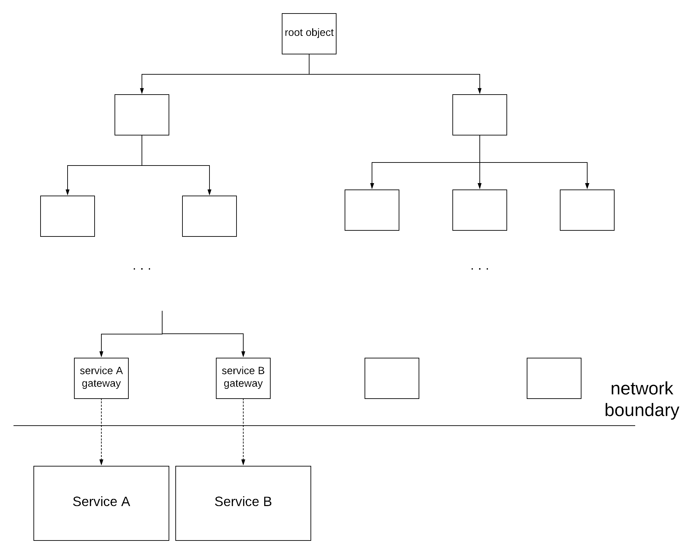

In this post, I will try to showcase how Dependency Injection can be used to help you write acceptance tests for your software system, while avoiding writing boilerplate, plumbing code to wire sub-components with each other. For the sake of clarity, I will use Spring for demonstration, but the approach described here can be easily applied with any DI framework (such as Guice). Before proceeding, I want to first clarify what I mean by acceptance tests to prevent misunderstandings, since this concept is slightly controversial between individuals. We will first have to agree though that every single software environment can be viewed as a collection of software systems  communicating with each other across the network. Meanwhile, each one of those software systems is composed of sub-components. In a more detailed view, these sub-components are themselves composed of other sub-components, which end up being composed of simple classes.

Now, unit testing is used to ensure that each single class functions as expected. On the other hand, integration testing is used to ensure that the communication between the various software systems is successful. As a result, unit testing exercises each component/class isolated from everything else, thus not crossing network boundaries. In contrast, integration tests cross network boundaries, since their purpose is to test this network communication. Between these 2 different types of testing, there is still a need that is left uncovered. It would be useful to have a way to test the functionality of a software system as a whole, while not calling any dependent systems in real life, but instead calling fake instances that have been instrumented by the test - in the same way it's done for unit testing. This is what I will refer to as **acceptance tests** in this post. What benefits would this new category bring ?
* .The basic use-cases (user stories, in software parlance) of a software system can be encoded into acceptance tests. These acceptance tests can be several orders of magnitude faster than tests that would involve actual networks calls making the feedback cycles much smaller.
* They are expected to be less flaky and more deterministic, since they would not be affected by potential outages of the dependent services or change of the underlying data.
* It's easier to troubleshoot failures of this kind of tests. Since they are supposed to run completely in-memory and with the same tooling used for unit testing, one can easily spot the reason for a test breakage with the help of the common debugging tools of the IDE. Furthermore, the fact that there is no need to call 3rd party services means there would be no need to run the tests in isolated, secured environments that would probably be less amenable to the aforementioned debugging tools.
* It's feasible to test many more scenarios than what is possible with integration tests. When our system is only dependent on a database, it's easy to reproduce any required data. But, when we're talking about a microservices architecture, there are cases, where we cannot exercise certain behaviours from the real software systems. An example can be software systems performing credit card transactions, where certain states (e.g. stolen credit card) are not easily reproducible with actual data, while they can easily be reproduced when stubbing these systems and their responses. Another example is trying to test refunds, where having a customer refund multiple times the same product (once for each execution of your integration tests) is probably not going to work in a straightforward way. Even when setting up the necessary data to exercise a specific behaviour is theoretically possible, these data most likely need to be setup in a separate service owned by a different team that has different priorities than ours.


{: .image-pull-right}

To sum up, we use acceptance tests in order to verify that our system will function as expected, assuming a specific behaviour from the dependent systems. We will assume that the architecture of our software system is based on a dependency injection framework. This assumption is quite realistic, since the majority of systems today are built on dependency injection frameworks, as the benefits are numerous. As mentioned before, the presented example is using Spring features, but the same concepts exist in every framework, so this approach can be universally applied. Looking at our software system at a smaller granularity, we can see that it consists of a hierarchy of dependent objects, which can potentially get rather deep. We will consider as root objects the entry points of our system, aka the objects that are invoked when a request comes into our system. These objects are considered as roots, since no other object is dependent on them. Following the same logic, we will consider as leaves the objects that have no further dependent objects. We are mainly interested in a specific subset of these objects, those that make requests to other systems, which we will call **gateways** in the context of our exercise.


{: .image-pull-right}

So, the wiring of all these dependencies is being accomplished by a set of .xml files, or even better by a set of configuration classes (classes annotated with **`@Configuration`** in Spring), because who doesn't prefer java code to xml ? However, what we ideally want for our acceptance tests is to keep exactly the same environment as our production configuration, replacing just the gateways with mock ones. I have come across some teams that have realised the benefits and have developed acceptance tests in a similar way. Nonetheless, most of these teams rewrite the whole configuration for their acceptance frameworks, ending up duplicating a lot of boilerplate code. On top of that, every single change to the production environment or introduction of a new class has ripple effects in the acceptance tests configuration.

Spring provides 2 features that can be really useful for this purpose: the **`@Primary`** annotation and Spring *profiles*. The same result can be achieved with any of these mechanisms, but I will use Spring profiles, because it results in a much cleaner solution. I assume that you are already familiar with all the mentioned features of Spring, so if you are not completely familiar with **`@Configuration`** or Spring profiles, feel free to have a look at them before proceeding further in this post.

In our existing configuration, we will have to separate all the gateways in a separate configuration class, which will be imported in our main configuration class. This configuration class will have the following form:
``` java
@Configuration
@Profile("production")
public class GatewaysConfiguration {

	@Bean
	public ServiceAGateway serviceAGateway() {
		...
	}

	@Bean
	public ServiceBGateway serviceBGateway() {
		...
	}
}
```

Furthermore, we will also need to have a main configuration class that imports all our configuration classes, e.g.:
```java
@Configuration
@Import({ 
	FirstLayerConfiguration.class,
	...,/* all the additional configurations */
	GatewaysConfiguration.class 
})
public class MainConfiguration {
	...
}
```

Now, for running our acceptance tests we will need to have an additional configuration, which ideally will produce exactly the same environment, except for the gateways which will be replaced with mock/stub objects. Here comes the juicy stuff. Provided that we have structured our dependency injection configuration as mentioned before, all we have to do now is just two things. First, we create another configuration class for the gateways in the following way:
```java
@Configuration
@Profile("acceptance-tests")
public class StubGatewaysConfiguration {

	@Bean
	public ServiceAGateway serviceAGateway() {
		//return a mock one
	}

	@Bean
	public ServiceBGateway serviceBGateway() {
		//return a mock one
	}
}
```

Finally, we create one more configuration class that just imports the existing main one, plus the configuration with the mock gateways. This is the configuration class that will be used to startup our application during the acceptance tests execution:
``` java
@Configuration
@Import({ 
	MainConfiguration.class,
	StubGatewaysConfiguration.class 
})
public class AcceptanceTestsConfiguration {
	...
}
```

Note that the actual gateways will be injected only when the application is started with the `production` profile, while the mock gateways will be injected when the application is started with the `acceptance-tests` profile. Everything else will be injected the same way under all the profiles. What's missing here is how you keep a reference to your mocks, so that you can later set the necessary expectations for your acceptance tests. I'll leave that up to you as a DI exercise. Let's review now what we have achieved. We managed to duplicate the whole production environment - excluding the dependent systems - only by writing a single configuration class. As a bonus to that, no matter how our system evolves, our acceptance tests will still keep working without any change, since they will use the actual configuration. The only case, where we will have to make an update is if our system becomes dependent to a new system. In that case, we will have to add a `bean` for the new gateway in both configuration files, the one used for production and the one used for the acceptance tests.

The first time I applied this approach was in a system, which was part of a microservices architecture, being dependent on 7 other systems. Fortunately, all of these systems exposed a json interface. Combining this approach with Mockito & the Jackson framework to mock the responses of the dependent systems, I managed to create an acceptance test suite framework, which was composed of just a handful of classes and a bunch of text files, containing the dependencies data.

## Contract changes

In the method described before, we are essentially mocking all the dependent systems. As a result, we are verifying that our system will work as expected, when the dependent systems work as expected according to a contract agreed between the teams owning the systems. But, what happens if a dependent system updates their contract ? This behaviour change might not be detected by our acceptance tests and this is the reason that integration tests should also be used in combination to catch these changes.

Recently, people started discussing about a new category of tests, called **consumer-driven contract tests**. These tests are meant to test just the contract between 2 systems and they should detect changes in the contract. In reality, they are not very different to integration tests, since they also make network calls, but they have 2 main properties:
* they are supposed to only test the contract for the interaction between 2 services and nothing more. Sometimes, people start using integration tests to also verify business functionality of the system under test, thus degrading them into some form of end-to-end tests. These are usually subject to all the pitfalls that acceptance testing is trying to tackle, as explained above. Of course, I am not trying to say that end-to-end tests bring no value here, but you should be mindful of when and how you use them.
* they are supposed to capture the full contract between 2 services. So, if there are different categories of data or edge cases, there should be contract tests that capture each one of them. Unfortunately, integration tests are usually written only for the basic cases not capturing all the possible situations.

As a result, acceptance tests should be combined with the appropriate suite of contract tests. This combination can achieve good behaviour coverage, while also keeping tests more focused on a single thing and less flaky. For a more elaborate discussion on this pattern and the usage of contract tests, a very good reference is [this article](https://martinfowler.com/articles/practical-test-pyramid.html).

**[Update - 21/07/2019]** I finally managed to get some time to create a code prototype of what is described in this post. You can find it [here](https://github.com/dimosr/acceptance-testing-demo).

**[Update - 13/11/2018]** I was also invited to give a talk about the methodology presented here in the London Java Community. So, if you prefer the audiovisual version, you can find this talk [here](https://skillsmatter.com/skillscasts/14037-london-java-community-june).

**[Update - 27/01/2021]** I have lately realised that the term "integration test" is used in many different ways across the industry, which is not helpful. As I explained in the post, I define it as a test that exercises the integration between two components over the network, but people sometimes don't include the network as part of the definition. This means that for these people testing two classes that interact directly in memory could also be considered an integration test. I prefer to make this distinction, because this difference can have important consequences (e.g. speed & reliability of tests).

## References

[[1](https://martinfowler.com/articles/microservice-testing/)] "Testing Strategies in a Microservices Architecture", Martin Fowler

[[2](https://martinfowler.com/bliki/TestPyramid.html)] "TestPyramid", Martin Fowler

[[3](https://martinfowler.com/articles/practical-test-pyramid.html)] "The Practical Test Pyramid", Ham Vocke