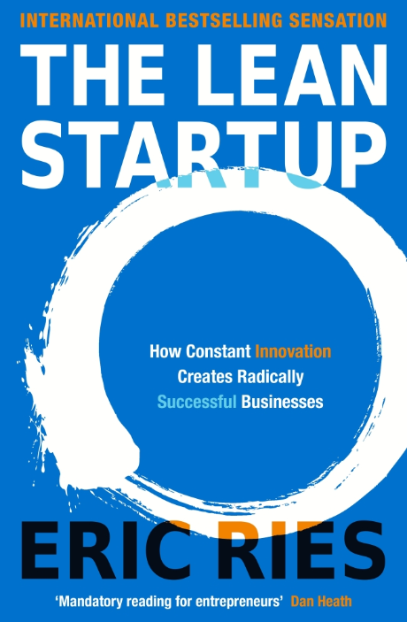
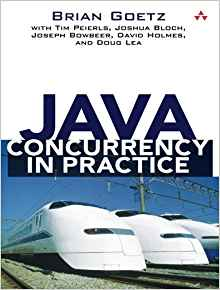

This post is part of the ["Things you MUST do (if you haven't yet)" series]({{ site.baseurl }}), covering books about technology and software. If you want to read a bit more of my rumbling on why I started doing this, feel free to read the original post, linked above.

This post contains some of the best tech books I've read so far. Every suggestion comes with a brief summary of what I gained from each book and why I think it's worth investing the time to read it. Similar to all the posts belonging in this series, keep in mind this is a (constant) work-in-progress, so entries might be added without further notice.

 

----

 

### Designing Data-Intensive Applications

{:class="img-pair-left"}

_As you can confirm by the reviews of the book, this is definitely a must-read for any professional who is involved in the design of large-scale systems. That said, this book is not an easy read, it's quite big and touches a lot of concepts. The author has selected a bottom-up approach, starting from a rather interesting analysis of the low-level parts of storage engines and then moving on to how these can be composed to build bigger systems, like the ones commonly used today (such as Cassandra, ElasticSearch etc.). Along the way, there's an ongoing, background analysis on trade-offs behing design decisions. The author manages to provide a nice explanation of almost all the basic building blocks of distributed algorithms, such as sharding, replication, consensus, transactions etc. However, he would not be able to go into full detail in a single book, so you will need to spend time on your own, studying each part. Fortunately, the author provides very useful resources and references to start with._

 

### Domain-Driven Design: Tackling Complexity in the Heart of Software

{:class="img-pair-left"}

_This is one of the few books that have shaped the way I develop and think about software. It's a quite old book, written in 2003, but it's still very applicable to the way software is developed nowadays. Eric Evans is the pioneer of the term Domain-Driven Design, which has ended up being quite a fad lately. As a result, there are much more recent books. However, I think that this book also provides insight into the early days of software development, which is extremely valuable and interesting. The language of the book can get quite abstract at times, the writing style is not the best and it has received a lot of criticism on that. Still, if you want to become an expert in data and domain modelling, this is the place to start from. Plus, you will be able to boast having read the whole "blue" book (for those who know)!_

 

### The Lean Startup: How Constant Innovation Creates Radically Successful Businesses 

{:class="img-pair-left"}

_If you work in the software industry, most likely you will already have heard of this book, since it's quite popular for shaping the way a lot of successful startups have been operating. What struck me though is the fact that the principles and concepts explained in the book are pretty generic and can be applied in many different settings both in your professional and personal life. One of the trigger points for this book was the amount of effort that goes to waste in the software industry. Software development teams invest months (or sometimes even years) working on a project only to find out that they were actually building the wrong thing after delivering it. This phenomenon is more prevalent and poses bigger risks for startups that have limited resources and more uncertainty, which is the main reason behind the title of the book. However, I've personally experienced this problem in bigger companies as well, so any takeaways from the book can be useful in general. The author makes the case for the virtuous cycle of build-measure-learn and gives ample real-life examples of companies in order to illustrate mistakes, successes and lessons learned. If you are a software developer, it will help you rethink how you approach software development. If you are a person not developing software, but leading people doing that, you will learn how to identify what your team should be working on. In any other case, I daresay this book will still have to offer useful insights._

 

### Java Concurrency in Practice 

{:class="img-pair-left"}

_If you are a software developer working in Java, this is one of the books that you must definitely read, especially if you are working on concurrent, multi-threaded systems. The authors of this book have made extremely valuable contributions to the Java programming language and this book gives you the chance to hear them explain what they built! The book starts from fundamental concepts, such as Java's memory model, and then gradually proceeds to higher-level tools, such as concurrent data structures and patterns. Depending on your experience, this book might make you realise some things that you would never imagine or you would have to discover yourself the hard way. Personally, I've read it twice, one in the early days of my programming journey and one after having worked extensively with concurrent systems, it was equally valuable both times. Highly recommended for any Java developer that wants to write efficient and robust software systems._
