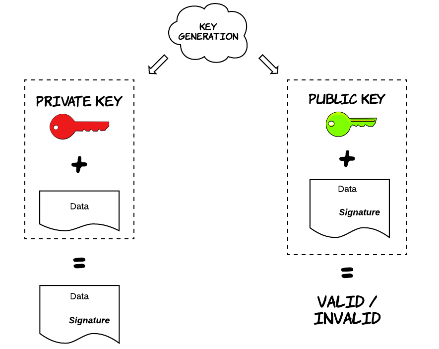
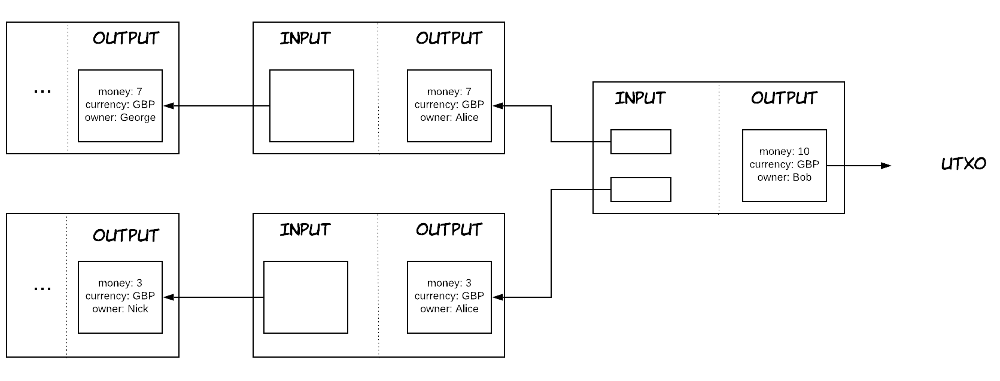
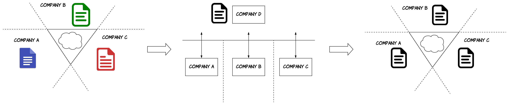
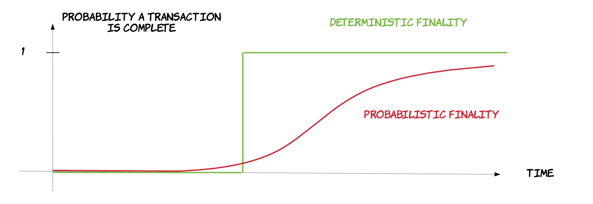
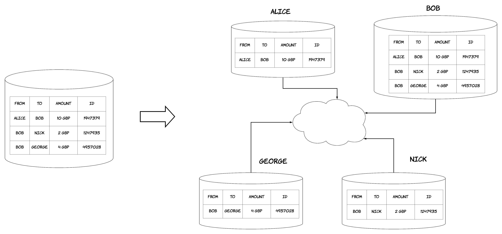

As some of you might already know, last year I made the decision to leave my amazing role at Amazon and pursue an even more exciting opportunity at R3, helping them build the next-generation blockchain platform, [*Corda*](https://www.corda.net/). Since then, I have come to realise that many people are having a hard time understanding the essence of blockchain, even people that are highly technical and can understand most of the associated technical concepts. I believe this is not a coincidence and it's mostly due to the following reasons. First of all, the concept of blockchain is interleaved with many different technical mechanisms that interact in various ways, thus making it harder to reason about a single thing at a time. On top of that, it's a rather transformational technology, so in order to understand how and where it can be used, one needs to also gain sufficient domain knowledge. In this post, I will make an attempt to lay down the basic aspects of it in the simplest way possible, hoping this will make it easier for people to understand why it can be useful and explore potential applications of it.

But, before we start, we first have to clarify the following: a blockchain means different things to different people and this is reasonable, since this concept has evolved dramatically since its genesis. Clearly, *a blockchain is a chain of data blocks* (no pun intended). However, in this post, I'll refer to blockchain as a set of technologies and mechanisms which altogether form a platform, referred to as a *blockchain* or *distributed ledger platform*. Strictly speaking, the term blockchain refers to something much more specific, but this generalisation will help me set the context, explain concepts in a simple way and explain the vision behind this kind of platforms. I will follow a bottom-up approach, starting from an explanation of the basic building blocks and explaining how they are all combined in the end. So, buckle up and let's get started.

## Digital Signatures

Digital signatures is a core concept. Conceptually, they are not very different to signatures the way we use them in the physical world. It's a way to attest to something, such as agreeing the conditions of employment with your employer. An interesting observation is that any activity that requires your approval could equally well require your signature, but this is not done for practical reasons in many cases. Digital signatures are used for the same reasons, but signing and verification mechanisms are quite different. The workings of digital signatures rely on rather complicated properties of maths. More specifically, a pair of keys can be generated with the use of a mathematical function, where these keys are just a piece of random data. One of these keys is called a **private key**, which needs to be safely stored and accessible only by the party that will use it to generate signatures. The other one is called **public key** and is publicly accessible and provided to everyone that needs to verify signatures from this person.

The mathematical properties that underlie digital signatures provide a set of desirable security properties. Unlike physical signatures, digital signatures have inherent randomness and differ from one document to the other. Furthermore, it's computationally really hard (to the point of being practically infeasible) for someone to calculate a valid signature on my behalf (essentially forging my signature), as long as my private key remains safely stored and uncompromised. On the other hand, forging a physical signature is a much more nebulous topic, especially with all the progress in computer vision during the last years. As a result, digital signatures can help us automate a lot of processes, achieving that with an increased level of security.

## The UTXO model

The UTXO model is an accounting/record-keeping model, which has been made popular after its use in Bitcoin. For someone without context or advanced knowledge in the finance domain, it might feel unnatural, since humans are mostly used to the alternative account/balance model. The account/balance model is what we tend to see in our everyday financial transactions. Each one of us has an account in a bank, which in turn has a balance. When Alice wants to transfer some money - say 10 pounds - to Bob, then Alice account's balance is reduced by 10 units, while Bob account's balance is increased by 10 units. Of course, a check might also be made initially to make sure that Alice account's balance is actually larger than 10 and won't become negative (I said might, because this is not how financial systems actually work :smirk:). 

The UTXO model takes a more holistic approach, modelling the process in a more granular way. For instance, we saw that 10 pounds were essentially transferred between 2 persons, but this was not *visible* concretely, we just saw the account balances being updated to reflect this transfer. The UTXO model attempts to capture this in some form. As a result, money are represented as separate entities in the UTXO model. Let's think about it as a piece of data `{money: 10, currency: GBP, owner: Alice}`. In the UTXO model, this transaction is essentially substituting this piece of data with the following piece of data `{money: 10, currency: GBP, owner: Bob}`. What changed essentially is just the owner of the money. One important thing to note is that the UTXO model favors immutability, so instead of "re-writing" this piece of data, what happens is the previous piece of data is "spent" and considered invalid and the new piece of data is created and considered valid after the completion of the transaction. For this reason, the first piece of data is considered the **input** of the transaction, while the second piece of data is considered the **output** of the transaction. Of course, we still need to keep track of the various balances, so how is this done in the UTXO model? Well, we just have to count all the valid pieces of data and group them by owner. These pieces of data are essentially *unspent*, which is the origin of the model's name. UTXO stands for unspent transaction output. What's becoming clear by now is that the UTXO model seems to be modelling a *superset* of the concepts the account/balance model does. If you are familiar with the technical term of [materialised views](https://en.wikipedia.org/wiki/Materialized_view), then you could say that the account/balance model is a *materialised view* of the UTXO model.

UTXO has a set of really interesting properties. First of all, even though it looks very oriented towards financial payments, it can actually be leveraged for many different fields and people have started realising that during the last years. The reason is that most of the business and system interactions tend to be transfers of "assets", think of supply chain, healthcare records, trade and the list goes on. And the UTXO is capable of modelling these transfers in a very intuitive and natural way. Besides that there are also many technical benefits. One of them is the inherent scalability that results from the natural partitioning of the model. In the account/balance model, every account is the unit of scaling. For example, if an account has an extremely big activitity during a day (i.e. imagine a big bank/company), then it will act as a single source of contention as many other accounts will attempt to transfer money in and out of this account. On the other hand, this is not true with the UTXO model, where every unspent output is essentially the unit of scaling. In our previous example, that imaginary party would just have a huge number of these outputs (being spent and created). That wouldn't necessarily be a problem though, since these could reside in different resources (i.e. servers), thus distributing the load and the contention between them. Another benefit is increased auditability, since the system keeps track of everything now by default, instead of just updating balances, so it's easier to analyse data or inspect the provenance of a specific piece of data when needed. Another characteristic of this model we did not explicitly mention is that each transaction is essentially anchored to the transactions of its inputs via a cryptographic mechanism, called [hash](https://en.wikipedia.org/wiki/Cryptographic_hash_function). As a result of this, the data in a transaction cannot be altered after its completion, because that would change the hash of this transaction, essentially invalidating all the subsequent ones. This immutability brings additional security to the system.

## Smart Contracts

Smart contracts essentially contain a **codified definition of what a valid transaction looks like**, so that computers can execute them and accept or reject transactions respectively. For instance, in our previous example, a smart contract could verify that the sum of the money from all the input equals the sum of the money from the output, so that no money is created out of thin air and no money is lost. In the simplest scenarios like this one, all the data that are needed to determine whether a transaction is valid are part of the transaction itself. However, there are cases, where the system needs 3rd party data that are not part of the transaction. This purpose is served by a different entity, which is called an *Oracle*. An oracle can be queried as part of the execution of a smart contract and provide an attestation that a specific fact is actually true. An important thing to note here is that after a transaction is executed, other parties might need to re-verify it later on and they need to reach the same decision. One way to achieve that is by attaching the Oracle's attestation to the transaction accompanied with its digital signature.

 

 

This concept creates a big paradigm shift in the architecture of software systems and business processes in general, as demonstrated by the figure above. In the early days, each company was building its own software systems, but they all had to communicate as part of their common processes. This is not as straightforward as it sounds, since there were communication silos between companies. As a result, each company ended up having a different view of how a business process should operate. This led to overcomplicated interactions and additional reconciliation needed to compensate for these differences. Another issue is that companies ended up developing almost the same software multiple times, which was not very cost-efficient. As people started realising this, they covered this gap, by developing common applications, which were used by all these companies to perform their common business interactions. These were commonly provided as [SaaS platforms](https://en.wikipedia.org/wiki/Software_as_a_service). This reduced the friction between the companies and reduced the costs significantly. However, there was now a middle-man, which had several other repercussions, such as additional delays, single point of failures and reduced privacy. Smart contracts create an opportunity for all these entities to come together, formulate a common, shared view of how a business process is supposed to work and create a single codified version of it, which can then be executed by everyone.

## Double spending & Consensus

The main value proposition of blockchain is in making human processes more efficient via digitisation and automation. However, there is an important difference between physical assets and digital assets. Physical assets can only be present in a single location, but this is not necessarily true with digital assets. Let me explain: in the physical world, you cannot spend a banknote more than once, because after the first transaction you are not in possession of this physical asset anymore, so nobody would accept to transact with you if you can't show and eventually give them the banknote. However, in the digital world, you could create two digital copies of a piece of data that represents some of your money and give them to two different people. This process is called **double spending** and is an inherent risk in the digital world. In a broader sense, this problem is also called [**consensus**](https://en.wikipedia.org/wiki/Consensus_(computer_science)) and refers to the fact that different entities need to agree on a specific fact or value. In our case, we could say that this value is whether an input has been consumed or not or alternatively whether a transaction is valid or not.

In order to resolve this issue, there needs to be an entity that is responsible for keeping account of everything that has been spent. At every new transaction, participants will have to consult this entity to make sure the assets in question have not been spent already. There are many different strategies used by different platforms, but there are two main characteristics amongst all of them, which are related to a concept, called **finality**. Finality is the point, where a transaction is considered complete and irreversible, with all the associated inputs being spent/invalidated and the associated outputs being available for consumption. Finality can come in 2 main forms: *deterministic finality* and *probabilistic finality*. Deterministic finality means that there is a specific point in time, when a transaction can be declared completed. This decision is final and cannot be revoked after this point. On the other hand, in probabilistic finality, there is no such point. As time passes by, one can only have increased confidence that a transaction has been completed and will not be revoked, but he/she can't be 100% sure at any point. An example of probabilistic finality is Bitcoin's approach, called [*proof of work* (PoW)](https://en.wikipedia.org/wiki/Proof-of-work_system). In this approach, there is no single entity responsible for keeping track for verifying transactions, but all the nodes can compete in verifying them, creating a dynamic that prevents double spends, as long as no entity in the network has assembled more than 51% of the computing power of the whole network. Of course, deterministic finality is more appealing for business scenarios, where people want to be sure about the finality of processes. As a result, it's been increasingly adopted by many blockchain platforms.

## The distributed ledger

Everything I have described so far is mainly abstract concepts and terminologies. However, for all of this to be concrete and useful for practical reasons, we need to store and process data. This is done via a **distributed ledger** that allows different parties to transact with each other in way that allows each party to view data that are only relevant to it, without having access to irrelevant data of other parties. I will illustrate how all of that works via a simple example. Let's imagine a scenario similar to our previous one, where people need to maintain different bank accounts in order to pay each other. Originally, that would be done in the following way: there would be a central party holding all the data about these accounts and performing these transactions on behalf of these people. Essentially, this party would keep a *centralised, single-copy ledger*, containing all the transactions between these people. By using a distributed ledger, each individual party could maintain the data of its own transactions with the other parties. Of course, as described previously, there would also be one (or more than one) party responsible for keeping  track of what has been spent. This is visualised in the diagram below. One could argue that that we didn't gain a lot from this shift, since that central party would still have access to all the data, cancelling any privacy benefits. However, this is not universally true; what this central party needs ultimately is the identifiers of every input and output in order to keep track of what has been spent. It does not necessarily need the actual data of them or any other data from transactions. Even in the cases, where a transaction needs to be verified by this party, there are some ways to do that without revealing the actual contents of the transaction. However, these are quite advanced approaches, mostly coming from research and are out-of-topic for this post.

## How it all works together

All the technologies and techniques I've described so far are very interesting and can be really powerful. However, the most interesting is how they can all be combined in a unique way to form a platform that can provide benefits in many different dimensions, as we have described previously, such as **privacy**, **simplicity**, **cost reduction**, **ease of automation**, **auditability**, **security** etc. Let's recap here and give a quick overview of the interplay between all these aspects. The journey begins from a party in need to perform a transaction. To do this, it will either search in its own view of the ledger (i.e. to identify the money it  will spend) or it will communicate with other parties to get information about what data they hold. After necessary pieces of data are identified, this party forms a transaction with all the necessary inputs and the outputs that the transaction will produce. The parties that need to give an approval for the transaction will create a signature on the transaction's data and include it in the transaction after verifying first that the transaction is valid. In our previous example, the person giving the money will definitely need to provide a signature, testifying that it actually wants to transfer its money. The party receiving the money might also need to provide a signature to accept them, depending on our model. After all the signatures have been completed, the transaction can be sent for verification and validation to the entity that is responsible for doing this in the platform. An Oracle might be engaged in this stage if data off-ledger need to be included in the transaction. The verification of the transactions by this entity is performed using the pre-defined smart contract code. The point where the transaction is verified is *the point of finality* we described previously. Afterwards, the various parties that were involved in the transaction are informed about its finality, so they record in their ledger that the inputs of the transactions have been spent and the associated outputs are now available for use. It seems like a lot of back-and-forth, but there are nowadays powerful platforms that provide most of these steps as basic blocks one can use. As a result, a developer does not need to write boilerplate infrastructure code anymore, he/she only needs to write some parts of code that are executed by the platform. In our example, this would probably include the code of the smart contract and the sequence of API calls needed for the parties to communicate. As a result, many parts will be taken care of by the platform, such as the finality part or the collection and verification of signatures.

## The vision

As you have probably realised from this post, a blockchain platform could provide a very wide feature set. This can be leveraged in many different ways, where only a subset of them are actually needed. However, there is a single vision underpinning this feature set: **one day to be capable of transacting seamlessly even between different business domains without friction, data silos or additional reconciliation needed**. For example, imagine that you wanted to provide your health record to an insurance provider, so that you can get a lower price, since your health history is exceptional. But, you can do this without having to manually send health documents to this provider (i.e. via e-mail) or this provider having to spend months developing software in order to integrate with the systems of the associated health system. This is the vision! It's acceptably a grandiose vision, but if you get a glimpse of what initiatives from different industries have achieved in the last few years through the use of blockchain platforms, it's definitely feasible and capable of transforming the way our world works. An interesting observation is that the main challenge of implementing this vision is not only the technological aspect, but also the sociopolitical aspect, since entities that operate for profit need to change their mindset from a purely competitive to a collaborative one for the greater good.

If you want to see how Corda aspires to make this vision possible, you should have a look at the [Corda Network](https://corda.network/) 

------------------

 

Also, if the concepts in this blog sounded interesting and you want to learn more, the [key concepts of Corda](https://docs.corda.net/key-concepts.html) is a great place to start. If you are one of those people that get fascinated by the history of computers, then I would highly recommend you read the original [Bitcoin paper](https://bitcoin.org/bitcoin.pdf), which is essentially where all of this thinking was born. Furthermore, the payment examples I provided are massively oversimplified, but if you are interested in learning how payment systems actually work, I would highly recommend [Richard's blogpost](https://gendal.me/2013/11/24/a-simple-explanation-of-how-money-moves-around-the-banking-system/), which explains everything with great clarity, as always.

**[Update - 05/06/2019]** Mike and Carolyne - 2 colleagues from R3 - recently gave a well-rounded talk at the QCon conference 2019, which touches on many areas from why blockchain is useful to how Corda differs from other blockchains and a lot more. Check it out [here](https://qconlondon.com/london2019/presentation/corda-looking-forward-and-back-blockchain-jvm-stack).

