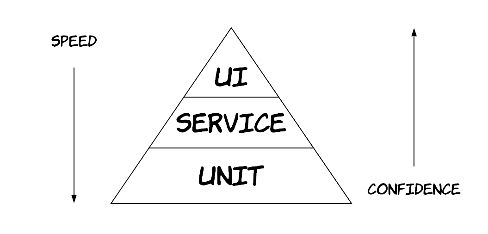
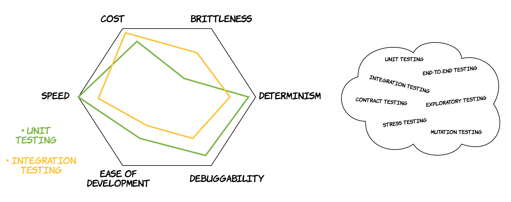

A few weeks ago, I was attending one more meetup of the London Software Craftsmanship Community. The meetups of this group contain a very interesting component, the *round table discussion*. Participants are split into multiple teams according to their interest and the members of each team are sitting around in chairs and discussing a single topic. All the members are encouraged to express any experiences the have, so that the whole group can form a full picture of the associated topic.

The topic of my group was around testing. More specifically, there was one member that faced the classical dilemma at work and wanted to solicit other people's opinions and experiences: *"Should I test my new feature through a unit test or an integration test?"*. Fortunately, the discussion unfolded in all different directions creating an ideal opportunity to re-visit many different aspects of testing and quality assurance, in general, in software. All this discussion made me realise that a lot of people are monomaniacally looking for this **single, ideal type of testing** that will solve all their problems once and for all. As a result, I decided to write this blog post with a title that pays homage to the amazing movie *"The Pursuit of Happyness"*. However, this blog post's goal is not just to reveal that Santa Claus is not real (I am talking metaphorically here, of course Santa is real..), but to trigger a slightly deeper discussion on the various types of testing and what each has to offer in our arsenal of tools. 

If you have been writing software (and most importantly tests for it), most likely you will already have heard about the concept of *test pyramid* [1]. The main idea is that you have 3 main categories of testing: unit tests, service (or integration) tests and UI (or end-to-end) tests. The pyramid shape means that you should have many tests from the category that's in the bottom and less tests from the category that's in the top. As you move from the bottom to the top of the pyramid, you get tests that run slower, but can give you greater confidence.



This visualisation contains a lot of wisdom in it. However, people have been misreading it at times, thinking that unit tests are the holy grail of testing, while integration and end-to-end tests are things one should avoid like the plague. Actually, in reality there are many more different approaches of testing and there also a lot more dimensions on which these different approaches score differently. Visually, that would look like the below diagram. Of course, the tests in the bag can be sub-categorized based on another criterion, whether they are *functional* or *non-functional* tests. This would open a separate discussion, but in the context of this discussion we don't have to make this distinction. Practically speaking, what we care about is whether the software we are building will be able to do what it's supposed to do; whether that's a functional or a non-functional requirement, it does not really matter.



The main takeaway is the following: 

>> *"There are many different types of testing and they all have something to offer"*

Now, let's start peeling off the various layers of the testing discussion.

## Unit testing

Unit testing is one of the most common form of unit tests nowadays, but still people get troubled by so many questions:

* What is a unit?
* Should I use mocks or not?
* Are they really useful? I've never found a bug in my code through a unit test...

I don't want to give a plain yes/no answer to these questions. Instead, I would prefer to explain my thinking and I hope you will discover the answers on your own, which is usually a more powerful process. Before we begin though, I first want you to ponder for a moment what a software system really is. Thinking about it in an abstract way, a software system is a collection of pieces of code. Let's imagine each one of those pieces as a box, containing some code (logic) that performs a specific functionality. Ideally, each of those boxes contains a small enough amount of code (logic), so that we - as humans - can easily keep track of what this is doing. To build more complex functionality, we need more logic and more code as a consequence. Of course, we can build a huge box that contains all the logic, but then it would be quite hard to change something in this box or find a specific thing. So, instead we try to build small boxes that do a very specific thing and then we assemble these small boxes into bigger boxes that can do more complex things. And this is called **software composition**.

Let's make it a bit more concrete with a slightly contrived example. Imagine we need to build a rather simple system that is given an array of numbers and then calculates the number `a*b`, where `a` is the greatest common divisor (GCD) of them and `b` is the least common multiple (LCM).

We could achieve this in the following way, using an object-oriented approach:
```java
class GCDCalculator {
	int find(int[] numbers) {
		...
	}
}

class LCMCalculator {
	int find(int[] numbers) {
		...
	}
}

class Calculator {
	GCDCalculator gcdCalculator;
	LCMCalculator lcmCalculator;

	int find(int[] numbers) {
		gcd = gcdCalculator.find(numbers);
		lcm = lcmCalculator.find(numbers);

		return gcd*lcm;
	}
}
```

We could also achieve it in a slightly different way, using a functional-programming approach:
```scala
def calculateGcd(numbers: Array[Int]): Int = {
	...
}

def calculateLcm(numbers: Array[Int]): Int = {
	...
}

def composeByMultiplication(function1: Array[Int] => Int, function2: Array[Int] => Int, numbers: Array[Int]): Int = {
	return function1(numbers)*function2(numbers);
}

composeByMultiplication(calculateGcd, calculateLcm, numbers);
```

In the first example, our boxes are classes, while in the second example our boxes are functions. As illustrated by the example, "what is a unit?" does not have a single answer. However, by unit testing, we usually refer to a type of testing that attempts to verify the functionality of one of those boxes is correct in isolation from the other boxes. This means that when testing the functionality of `Calculator`, we don't really care if there are bugs in `GCDCalculator`. Those bugs will be found in `GCDCalculator`'s tests. And we can achieve this isolation in our tests by using the so-called **test doubles** [2]. There are various different types of those and ways to use them, but that's a discussion for another day (I've written another post on this by the way, [available here](())). In theory, a mock is one kind of test double, but it's common for people to use the word mock to mean a test double. Again, there is no single, universal answer to the question "should I use a mock or not?". This depends on the specific context of what you are talking about. However, if we are supposed to test something in isolation of all its collaborators, we will definitely need to replace the collaborators with their *doubles*. 

In the object-oriented case above, a test would look like the following:
```java
class CalculatorTest {
	GCDCalculator gcdCalculator = mock(GCDCalculator.class);
	LCMCalculator lcmCalculator = mock(LCMCalculator.class);

	Calculator calculator = Calculator(gcdCalculator, lcmCalculator);

	@Test
	void testCalculatorReturnsCombinedResultCorrectly() {
		int[] numbers = new int[]{4, 5, 15};
		when(gcdCalculator.find(numbers)).thenReturn(1);
		when(lcmCalculator.find(numbers)).thenReturn(60);

		assertEquals(60, calculator.find(numbers));
	}
}
```
In the functional case, the test could be something along the following lines:
```scala
class CalculatorTest {

	@Test
	def testCalculatorReturnsCombinedResultCorrectly() {
		val numbers = Array(4, 5, 15)
		val calculateGcd = (numbers: Array[Int]) => 1
		val calculateLcm = (numbers: Array[Int]) => 60

		assertEquals(60, composeByMultiplication(calculateGcd, calculateLcm, numbers))
	}
}
```

As you can see, in both cases we achieved isolation. In the first one we used mocks, while in the second one we use *custom-made* doubles.  So, the question that's left unanswered after all this is the following: is this isolation really useful, why don't we use the real collaborators? 

And my *personal* answer to this would be: yes, **isolation is very important** for the following reasons:
* *Troubleshooting* : by developing isolated tests, you can ensure that when something goes wrong or there is a bug, there will always be a single failing test, which will signal to you where (in which box) the problem lies. 
* *Documentation of the code* : these isolated tests essentially are the documentation of the contract of each box. As the contract of a box, you can think of a set of pairs `(input, output)`, where we define what should the outputs of a box be for each input. These outputs can either be data returns or side-effects triggered via interaction with its collaborators, depending on the case. A newcomer in the codebase can easily identify what the role of each box is, just by having a look at the associated test.
* *Design heuristic* : writing this kind of tests requires some work to setup the collaborators, which can serve as a signal of design smells. The more collaborators a box has, the more complicated it becomes and after a certain number, it can become almost impossible to reason about it. Each and every one of the collaborators are right there, thus making it much more easier to spot anti-patterns.
* *Maintainability* : the problem with not using test doubles is that it does not scale at all and it degrades very quickly. Our example was quite simple, containing only 3 boxes. So, using the real boxes instead of doubles would probably be perfectly fine, since the logic is quite limited. But, in large codebases that are common across the industry, there are many more boxes, usually hundreds of them. You can think of them as a big tree hierarchy of boxes depending on other boxes. By not using test doubles, the following will happen: you will want to test a box that sits in the top of that hierarchy (say the root of the tree), but you will essentially be testing the whole tree!

If you are following the [TDD](https://en.wikipedia.org/wiki/Test-driven_development) community, you might have come across the 2 main TDD schools: the classicist school (or Detroit) and the mockist school (or London). If you look on the Internet, you will see articles describing that these 2 schools appear to have a lot of differences, but if you look under the surface, their main difference is one: whether they believe isolation is useful or not. All the rest stem from this basic principle.

## Integration testing

So, according to the above, if we write these beautiful, isolated tests for all our boxes, then we should be done, we've verified everything works as expected, right? I really wish I could reply with yes.

The ugly truth is that only a set of unit tests (no matter how well written) cannot give us significant confidence that the overall system will work as expected. I've met people that have a deep love for unit tests to the point of living under this illusion. Of course, that usually lasts only until they release their system in production to real customers. There are a lot of reasons for this, but the main one is the following: when we are replacing a collaborator with a double, we are essentially defining what is the contract that the collaborator should satisfy. In a separate unit test (belonging to this collaborator), we will probably verify that this contract is satisfied. However, a lot of mistakes can creep into this process. For instance, in our previous example, in the unit test of `Calculator` we might expect that the `LCMCalculator` will return 60 for the input `(4,5,15)`, while this has never been tested in the unit test of `LCMCalculator` because we ended up using different data there, e.g. testing that it returns 72 for the input `(3,8,9)`.

This can leave a lot of gaps in the interactions between our boxes. Essentially, we need a way to also test the integration between multiple boxes. And this is why they are called integration tests. So, we take multiple boxes (depending on how many we want to test together), we assemble them and then we write a test that invokes operation at the top-level box, which will essentially exercise the functionality of all the involved boxes. This can obviously provide us with a lot more confidence that our system will function as required. However, it comes with several caveats as well, some of which are the following:
* Harder to setup: setting up these tests might require extra work, such as creating fake data in databases or components that are not that simple to initialise.
* Harder to troubleshoot: when one of the tests fail, then more work is required to identify which box contains the functionality that is causing the test to fail, since multiple boxes can be included in one of those tests.

Unfortunately, the various categories of testing do not have clear boundaries and the difference between them can end up being fuzzy. People across the industry sometimes use the same word to refer to different things, so it's always useful to make clear what you are referring to explicitly. For instance, one could argue that a test that exercises all the boxes of our system should be called an integration test, since it tests the integration between all these boxes. However, some people might use a different term for this, such as system testing.

The main takeaway from this section should be the following though: unit tests are not enough and one should test multiple parts of a system in combination to make sure they will all function together properly.

## The testing quadrant

As I've explained so far, there are a lot of differences between unit tests and integration tests. As a result, there can be times where it might not be clear which category of testing would bring more value to a part of our system. A colleague of mine showed me something in the past, which ended up being quite a revelation for me, **the testing quadrant** [3]. Using this quadrant, we can classify our boxes in 4 different basic categories. For this classification, we will use 2 main dimensions: the number for dependencies/collaborators and the amount of code logic involved. In our example, the `GCDCalculator` would probably have no dependencies, but it would contain significant amount of logic for the calculations. On the other hand, the `Calculator` has minimal logic, but it has 2 dependencies. As visualised in the diagram below, these 2 dimensions can create a quadrant with 4 basic types for our boxes:
* In the top left, boxes that have a few or no dependencies at all, but significant amount of code logic (like our `GCDCalculator`). These are usually boxes containing algorithms or business logic. For the most part, we should be able to test these boxes with unit tests.
* In the bottom right, boxes that don't have significant amount of logic, but have a significant number of dependencies. These are boxes that act mostly like coordinators, combining functionality from other boxes, without offering a lot of functionality on top (like our `Calculator`). As described before, unit tests for these boxes can contain a lot of false assumptions. So, these boxes should also be tested via some integration tests too to get enough confidence. Another slightly different example of this type would be a component that makes a call to a 3<sup>rd</sup> party system. Again, the integration test would give us more confidence here. The only case a unit test with a test double would be useful is if we want to simulate some behaviour from the 3<sup>rd</sup> party, which is not easy to trigger in real life for some reason. 
* In the bottom left, boxes that have no dependencies and any code logic involved is trivial. An example of these could be [DTOs](https://en.wikipedia.org/wiki/Data_transfer_object). Unit testing these can be simply wasted time, since they are exercised anyway by the other tests.
* In the bottom right, boxes that both have a significant number of dependencies and a significant amount of code logic. In my opinion, this is the most interesting category and where the revelation happened for me. These are the boxes that are too big and complex to reason about and need to be split into some of the other 3 categories. This kind is also sometimes referred to as a *"[God class](http://wiki.c2.com/?GodClass)"*. Unit tests for these tend to be hard to read and write, so that can be a handy code smell to detect them.


## Testing in Production

**Testing in production** is a concept that used to have a really bad reputation, but people have recently realised it can add a lot of value in the process of quality assurance. Conceptually, the reason testing in production can add value on top of integration tests is the same reason that integration tests can provide additional value on top of unit tests. It's the fact that integration tests will always be developed under assumptions that might not hold in production, so some integration tests might not exercise exactly the same scenario that will happen in production. Some examples are the following:
* the environment you are using for integration tests might be a replica of the production environment, but it will most likely have some small deviations. For instance, if you are using a 3<sup>rd</sup> party system for payments, the integration environment might not use the actual production service to reduce costs. 
* the datasets that are being tested in the integration environment can differ significantly from the real datasets in production. For instance, your integration tests might not contain a test for that weird customer that will decide to make fun, by sending a gift card of $0.00001 to his friend's account.

Testing in production is an interesting technique to evaluate your software out in the wild. However, you also have to be careful to make sure it does not cause adverse effects, namely exposing the defects instead of identifying them. There are multiple micro-techniques to help with that:
* feature toggles in combination with fake customer accounts
* A/B testing & canary deployments
* shadow deployments
* traffic replay

## And the list goes on

Of course, there are many more approaches I cannot cover here. But, I think there is one main theme: there are always thing that we will miss and there are always techniques we can use to reduce the number of these things.

One interesting observation is that the various unit tests and integration tests are simply exercising very specific, targeted use-cases we have in mind, which are expected to cover only a very small space. Of course, the production testing approaches we mentioned previously can help us cover a larger space. Another approach one can use is **property-based testing**. In this approach, instead of defining concrete inputs and expected outputs, one defines the space of valid inputs and the property that the output must satisfy with regards to the input. Then, the test runner can create a lot of different, random inputs in the space provided and verify that the associated outputs satisfy the properties we have defined. Of course, exploring the whole space is infeasible in most cases for practical reasons, so we are always relying on a best effort basis. An even more powerful (but also more complicated) version of this approach are **formal specification languages**, such as [TLA+](https://en.wikipedia.org/wiki/TLA%2B).

Of course, in most of these approaches the tests are developed by people that have been working with the system already and are relatively familiar. This is another factor that can introduce false assumptions or risk for oversight. A technique to alleviate this problem is **exploratory testing**, which is performed by people that know little or nothing about a system, so they are essentially testing the system as they learn how it works.

### References

[[1](https://martinfowler.com/bliki/TestPyramid.html)] "Test Pyramid", Martin Fowler

[[2](https://martinfowler.com/bliki/TestDouble.html)] "Test Double", Martin Fowler

[[3](http://blog.stevensanderson.com/2009/11/04/selective-unit-testing-costs-and-benefits/)] "Selective Unit Testing – Costs and Benefits", Steve Sanderson