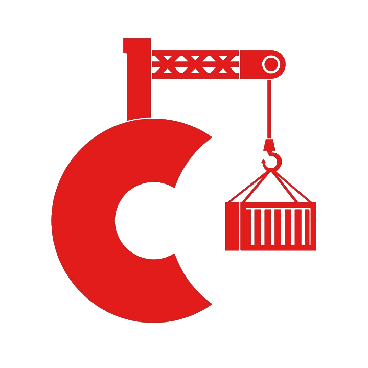

{: .image-pull-right}

This is a CorDapp demonstrating how the [Corda](https://www.corda.net/) blockchain platform can be used to solve a supply chain problem.

Instructions on how to run this demo and access to the code is available [here](https://github.com/dimosr/corda-supply-chain).