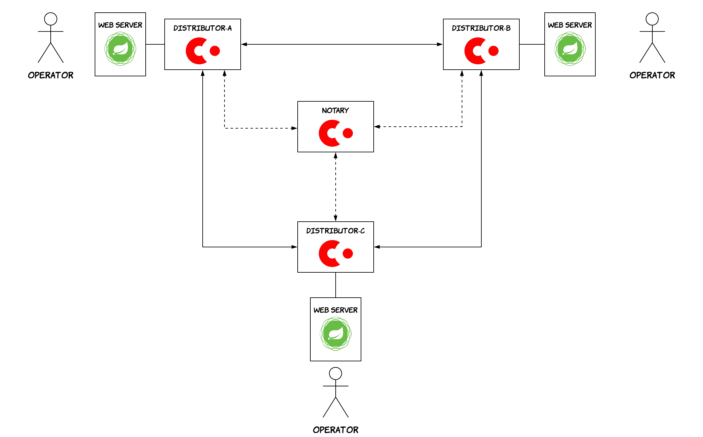

I finally managed to get some time to build a CorDapp and I will try to give an overview of it in this blog post. I intend to start from the fundamentals and gradually proceed to lower-level details, explaining the concepts in the simplest possible way, so that people that are not very familiar with Corda will be able to follow. That said, if you are not very familiar with blockchain and distributed ledger technology in general, you might benefit from reading my previous post [here](), where I am laying down some of the basic building blocks. If you feel familiar with blockchain and DLT concepts, but you would like to become more familiar with Corda first, then I would strongly recommend looking at [Corda's key concepts](https://docs.corda.net/key-concepts.html). Before we start, note that the source code of the project we will be looking at is available [here](https://github.com/dimosr/corda-supply-chain) along with instructions on how to run the demo.

The domain I chose for this CorDapp is supply chain. In order to keep things simple, the application is tackling a quite abstract and oversimplified view of this problem. Specifically, we assume there are a set of different entities that cooperate in order to transfer an item from place A to place Z. We will call these entities ***distributors***. The item that is transferred can be anything really and we will refer to it as a ***cargo item***. Of course, in order for a cargo item to be transferred from place A to place Z, more than one distributors might need to work in cooperation. For instance, an item that needs to be transferred from London to Athens might have to go through Valencia and Genoa, thus involving 4 different distributors.


Let's follow a top-down approach starting from the high-level architecture and then moving down to the code level. Each one of the distributors will be running a Corda node and a Spring web server, which will be used by employees in order to trigger actions, when a cargo item is shipped or delivered. A notary will also be used to finalise all the transactions, so that double spendings are prevented. Note that this is one of the use-cases, where double spending might not be really incentivised by the parties (as is the case for financial applications, for instance). This means that the parties could equally well agree on not using a notary and rely on the signatures of the involved parties. However, the sequencing and de-duplication performed by the notarisation process can still provide value, i.e. as a belt-and-braces approach against data corruption. The high-level architecture can be seen in the diagram below.



As described previously, the main data this application will be handling is cargo items. This will be modelled by a Corda ***state***, called `CargoState`. This will contain things like the distributors that are part of a trip, an identifier for the item and the current location of the item (or better the *last* distributor, when the item is travelling between two distributors). As time passes by, we could say that a state evolves. However, Corda makes use of the UTXO model and states are immutable. As a result, this evolution is achieved by consuming a state via a transaction that creates the new version of this state. The diagram below illustrates how that would look like in this case. The initial form of a state (representing a cargo item that has just been scheduled for shipment) will be created using a transaction with zero inputs. Everytime the cargo item reaches its next stop, a transaction will be consuming the existing state for this cargo item and will be producing a new one that will have an updated distributor set as the current one. Last but not least, when the cargo item is delivered by the last distributor to its end destination, a final transaction will be executed with the state as the input and no outputs.


This evolution of a state is governed by the associated ***smart contract***. This association between a state and its smart contract can be defined in the code by adding the `@BelongsToContract` annotation on the state class. We can act on states by using the available ***commands*** and the smart contract is in turn responsible of defining the allowed behaviour for each one of those commands. In our case, we have 3 different types of commands: `Enter`, `Transfer` and `Exit`. The first one is used for *"entering"* a state in the ledger by creating a shipment for a cargo item. The second one is used for transferring a cargo item between 2 distributors and it's supposed to be created by the distributor that is receiving a cargo item. The last one is used for *"exiting"* a state from the ledger and it's triggered when a cargo is delivered by the final distributor to its destination. As the saying goes "talk is cheap, show me the code". So, let's have a look at the code that does all of this, it should be self-explanatory. 

``` kotlin
class CargoContract : Contract {
	override fun verify(tx: LedgerTransaction) {
            Commands.Enter() -> {
                /* validation logic ... */
            }
            Commands.Transfer() -> {
                val signers = tx.commands.first().signers
                val outputStates = tx.outputStates
                val inputStates = tx.inputStates
                requireThat { "Transfer contains one input and one output state" using (outputStates.size == 1 && inputStates.size == 1) }

                val outputState = outputStates.first() as CargoState
                val inputState = inputStates.first() as CargoState
                requireThat { "Scheduled trip has not changed" using (inputState.participatingDistributors == outputState.participatingDistributors) }
                requireThat { "Current distributor included in the scheduled trip" using (outputState.currentDistributor in outputState.participatingDistributors) }
                requireThat { "Output and input state corresponds to the same cargo " using (inputState.cargoID == outputState.cargoID)}

                requireThat { "Both sender and receiver have signed the transfer" using (outputState.currentDistributor.owningKey in signers && inputState.currentDistributor.owningKey in signers) }
            }
            Commands.Exit() -> {
                /* validation logic ... */
            }
            else -> throw IllegalArgumentException("Invalid command included in the transaction: ${commandWithParties.value}")
	}
}

@BelongsToContract(CargoContract::class)
data class CargoState(val participatingDistributors: List<Party>, 
                      val cargoID: UniqueIdentifier, 
                      val currentDistributor: Party)
```

For the sake of simplicity, some parts of the code have been omitted. You can see how the smart contract assumes the responsibility of validating the commands and execute the proper checks, some of which relate to business domain logic. As an example, in the case of the `Transfer` command, the smart contract is checking that the trip has remained the same and only the current distributor has changed, which must also be included in the initial trip. It also checks that the previous and the new distributor have both signed the transaction. This essentially forms the handshake between the party that delivers a cargo item and the party that receives it and is responsible for the next steps. Note that the smart contract just has to specify which parties need to sign, the verification that these signatures actually exist is done by default for all smart contracts in Corda.

Smart contracts govern how states can evolve and which transactions are valid. ***Flows*** are the mechanism that allows nodes to interact with each other via messages, build and sign transactions or interact with third-party systems. In this case, we will have 2 flows, an `EnterFlow`, an `ArrivalFlow` and an `ExitFlow`. The first one is used to create a new cargo shipment, the second one is used when an anticipated cargo has arrived at a distributor and the last one is used when a cargo has been delivered to its end destination by the last distributor. Let's focus on the `ArrivalFlow` which is the meatier one. The diagram below shows the main parts of this flow. The flow is triggered via the web UI by an operator who provides the ID of the cargo item that arrived. The node initially queries the database to retrieve the state for this ID, then proceeds with building the transaction, signing it and sending it to the previous distributor. The previous distributor in turn checks that the transaction is valid and then signs it. If we wanted to make this example fancier, we could involve an ***Oracle*** at this point, which would sign the transaction depending on the actual location of this cargo item using a GPS signal. The transaction is sent back to the original node that sends it to the notary to be finalised. After the transaction is finalised, the original node takes care of letting all the other nodes know about that.


Let's have a look at the code of this flow now.

``` kotlin
@InitiatingFlow
class CargoArrivalReceiverFlow(private val cargoID: UniqueIdentifier): FlowLogic<Unit>() {

    override fun call() {
        val stateAndRef = retrieveCargoState(cargoID, serviceHub.vaultService)
        val transactionState = stateAndRef.state
        val cargoState = transactionState.data

        val transactionBuilder = TransactionBuilder(transactionState.notary)
                .addInputState(stateAndRef)
                .addOutputState(cargoState.copy(currentDistributor = ourIdentity))
                .addCommand(Command(CargoContract.Commands.Transfer(), listOf(ourIdentity.owningKey, cargoState.currentDistributor.owningKey)))

        val signedTransaction = serviceHub.signInitialTransaction(transactionBuilder, ourIdentity.owningKey)

        val otherDistributors = cargoState.participatingDistributors
        val sessionWithOtherDistributors = otherDistributors
                .filterNot { it == ourIdentity }
                .map { initiateFlow(it) }

        val sessionWithPreviousDistributor = sessionWithOtherDistributors.find { it.counterparty == cargoState.currentDistributor}!!
        sessionWithOtherDistributors.minus(sessionWithPreviousDistributor)
                .forEach { it.send(TransferRole.PARTICIPANT) }
        sessionWithPreviousDistributor.send(TransferRole.SIGNER)


        val txSignedByOtherSide = signedTransaction + subFlow(CollectSignatureFlow(signedTransaction, sessionWithPreviousDistributor, listOf(sessionWithPreviousDistributor.counterparty.owningKey)))

        subFlow(FinalityFlow(txSignedByOtherSide, sessionWithOtherDistributors))
    }

}

@InitiatedBy(CargoArrivalReceiverFlow::class)
class CargoArrivalResponderFlow(private val otherSide: FlowSession): FlowLogic<Unit>() {

    override fun call() {
        val signTransactionFlow = object: SignTransactionFlow(otherSide) {
            override fun checkTransaction(stx: SignedTransaction) {
                /* validation logic ... */
            }
        }
        val role = otherSide.receive(TransferRole::class.java).unwrap { it }

        when (role) {
            TransferRole.SIGNER -> {
                val txId = subFlow(signTransactionFlow).id
                subFlow(ReceiveFinalityFlow(otherSide, txId))
            }
            TransferRole.PARTICIPANT -> {
                subFlow(ReceiveFinalityFlow(otherSide))
            }
        }

    }

}
```

Again, the code is pretty self-explanatory, which is usually a good signal. This flow makes use of several flows provided by the Corda framework, thus reducing the need for boilerplate code. Some important things to note:

* Flows usually come in pairs, the initiating flow and the initiated one (or *responder flow*). In our case, the initiating flow is the `CargoArrivalReceiverFlow`, which is triggered at the node that receives a cargo item. The initiated one is the one triggered on the other nodes as a response (named `CargoArrivalResponderFlow` in the code). The type of each flow and the association between them is defined via annotations, as shown above.
* The `Transfer` command that is added to the transaction also contains the public keys of the nodes that need to sign the transaction for it to be valid. As mentioned above, the smart contract will verify that the transaction has been signed by all the keys specified in the embedded commands by default. However, the developer has to add the appropriate logic in the smart contract in order to check that this list in the command contains the appropriate parties.
* A moniker message is sent initially to all the involved nodes, which contains a different value. The value `SIGNER` is sent to the previous distributor that needs to sign the transaction, while the value `PARTICIPANT` is sent to any other node included in the shipment that needs to learn about this change, without necessarily approving it. In our case, the initiated flow is meant to incorporate conditional logic, since it might or might not need to sign the transaction depending on the node it's being executed at. This message helps the flow acquire the necessary context to understand how it should proceed. You can see that the `CargoArrivalResponderFlow` behaves differently according to the value of this message[^flow_note].
* The `CollectSignatureFlow` provided by the framework allows a node to easily collect signatures from the required parties just by providing their keys.
* The `FinalityFlow` provided by the framework allows a node to easily send a transaction to the notary to finalise it and then also propagate it to all the relevant parties after it has been finalised.

And this is the end, finally. I hope that was a good overview of the main parts. Of course, you can see the full code (and most importantly run it!) in the [associated Github repo](https://github.com/dimosr/corda-supply-chain).

[^flow_note]: Note that if you want to avoid this extra message, there is a way. You can define a pair of flows (an initiating and a responder one) for each case (one pair for the `SIGNER` case and one for the `PARTICIPANT` case). Then, the initial node will kick-off the appropriate sub-flow, depending on the role of the counterpart node. This would come with some trade-offs around code readability and maintainability though.