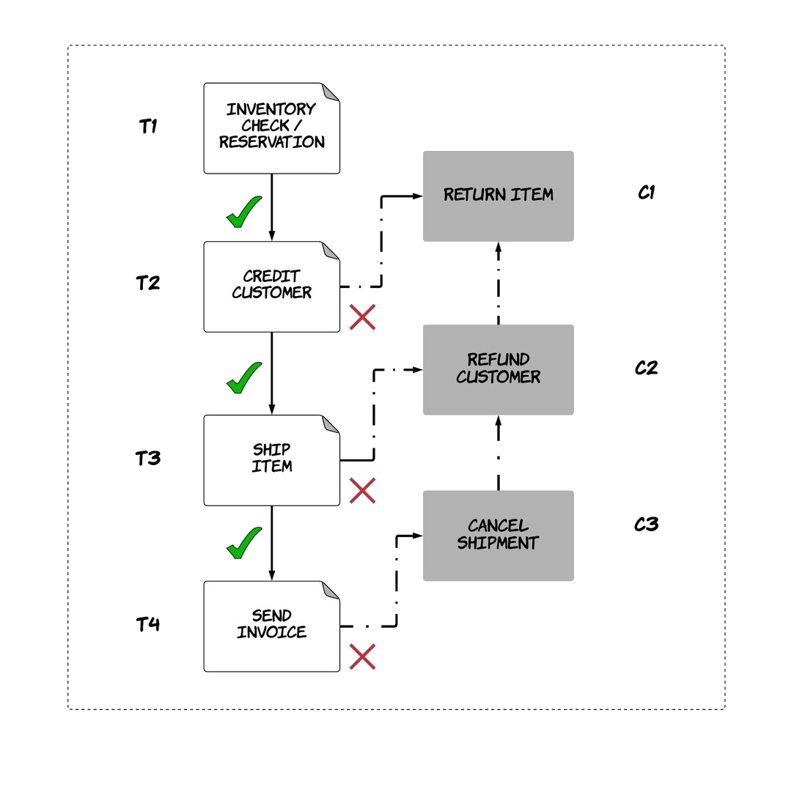

A few years ago, I came across a very interesting paper from 1987. In some of the teams I worked in the past, we happened to actually use the pattern introduced in this paper without even knowing it. During the last year, I realised the ideas introduced by this paper are becoming increasingly relevant in the current technological landscape that entails increased distribution of components. As a result, I decided to spend the time and write a blog post on it.

The title of the paper is rather laconic and consists of a single word: **"Sagas"** [1]. It's also available for free, at least at the moment of writing. This paper examines the concept of *long-lived transactions* (LLTs), which are transactions that can hold on database resources for long periods of time, thus delaying shorter and more common transactions. The paper introduces the concept of a saga transaction, which is composed of sub-transactions. The saga transaction executes in an atomic way, so that either all or none of the sub-transactions take effect. However, no isolation is necessarily guaranteed between the sub-transactions of different sagas.

The original problem, as described in the paper, might not be present nowadays given all the progress made in the capabilities of hardware and the concurrency control algorithms of relational databases. Nonetheless, the concept of long-lived transactions is still present in systems in a different form. In distributed architectures composed of multiple services, in some cases there is still a need to perform an operation across multiple of these systems in an atomic way. These systems are probably encapsulating their datastores and provide an abstract API on top, which means there is no single, shared database across the systems on which an ACID transaction can be performed. An alternative would be to execute a distributed transaction across these systems, but this would have its own drawbacks: the systems would have to provide support for that (e.g. via something such as the [XA standard](https://en.wikipedia.org/wiki/X/Open_XA)) and distributed transactions tend to incorporate protocols that can decrease availability and performance of the system significantly (e.g. [2PL](https://en.wikipedia.org/wiki/Two-phase_locking) & [2PC](https://en.wikipedia.org/wiki/Two-phase_commit_protocol)). The concept of saga transactions provides an interesting alternative to make these systems cooperate.

The canonical example for this use-case is the ordering workflow of a company, where multiple checks need to be done in order to deliver a product to a customer, such as inventory check, payment, shipping etc. These operations are served from different systems and some of them can fail, but the result of the overall workflow needs to be atomic. This means that we cannot charge the customer if there is zero inventory for the requested product. In the same way, if the credit check for a customer fails, any reserved items from the wharehouse need to be returned. Let's look at how this could be solved using the idea of a saga transaction. As explained in the paper, each saga transaction is composed of multiple sub-transactions T1, T2, .., Tn. Each of these transactions Ti has an associated *compensating transaction* Ci, which defines how the effects of the transaction can be rolled back. The saga transaction executes sequentially the sub-transactions. If transaction Ti succeeds, then Ti+1 is executed and so on until all of them succeed, which is when the saga transaction succeeds. On the other hand, if one of these transactions Ti fails, then all compensating transactions up to this are executed in reverse order Ci-1, .., C1. This logic maintains the atomicity of the saga transaction.

In our example, the saga transaction could have four different stages, as shown in the diagram below. The first transaction checks for inventory and reserves an item, while the associated compensating transaction returns the item. The second transaction charges the customer's card, while the associated compensating transaction gives a refund. As a result, if the saga transaction fails at the second stage due to insufficient balance in the customer's card, the item that was reserved will be returned back. 

Now, there are two different ways to implement this pattern:

* **orchestration**
* **choreography**

In orchestration, there is a single, central component that is responsible for coordinating the execution of the various stages, keeping track of the status of the saga transaction and knowing what is the responsibility of each of the involved components. In choreography, all the involved components need to know the structure of the saga transaction and at least the previous and the next component. They form a pipeline, where each component receives a sub-transaction, executes it and depending on the result it either triggers the next sub-transaction or the previous compensating transaction. In both approaches, the communication between the various components can be done synchronously (e.g. using RPC calls) or asynchronously (e.g. using message queues). There are some important trade-offs between these two approaches: the orchestration approach allows the various components to remain more loosely coupled, since in choreography the components need to know about each other. In the first approach, the business logic of the saga transaction is kept in a single component that can also track the status of each transaction more easily, while in the second approach business logic and information about the status of the various stages is dispersed across components. On the other hand, the coordinator also acts as a single point of failure.

As mentioned in the beginning of the post, it is important to notice that a saga transaction provides guarantees around atomicity, but it does not provide guarantees around isolation. This can be problematic in some cases. For example, think about the scenario where two customers attempt to order the same product, thus running two concurrent sagas. The first one reserves the last item from the inventory forcing the second saga to abort assuming there are no more products to sell. Later on, the first saga fails at the second stage during the credit check and returns the item. The end result is that the second saga was aborted even though the inventory was sufficient. Fortunately, in this case the result is not catastrophic, but it could be worse if the order of the operations were different. So, some use-cases might require some reduced form of isolation to prevent problems like this. 

This isolation can be added in the application layer via different mechanisms. In fact, this topic and the various mechanisms have been researched previously [2]. Let's have a quick look at some of them. 
* A simple, helpful strategy is to structure a saga transaction so that it's composed of 3 parts: the first part contains transactions that can fail (e.g. withdrawal from an account could be an example), the second part contains a pivot transaction that signals whether the transaction has succeeded or not and acts as a boundary between the first and the last part, while the third part contains any transactions that cannot fail (e.g. deposit to an account could be an example). This structure on its own can help prevent some isolation anomalies. For instance, if a saga S2 sees some money that have been deposited form another saga S1 and S1 is later rolled back, this can be a serious problem since S2 might have taken business decisions based on this fact that's not true anymore. This anomaly is known as a *dirty read*. The structure described above could prevent this scenario, since the deposit would be included in the third section where the saga cannot fail and be rolled back. Of course, this is not always easy to achieve, since transactions that cannot fail conceptually might still fail in practice due to physical limitations.
* Another mechanism is the use of a *semantic lock*, which signals that some data are in process and should be treated differently. A transaction contained in the first section can set this lock to a value that signals it's held. A corresponding transaction contained in the last section can essentially release this lock by setting the appropriate value. The associated compensating transaction can also release the lock in a similar way during a potential rollback. This lock indicates the possible presence of a dirty read. For instance, in the example with deposits, the initial transaction could create a record indicating the money deposited with the status `PENDING`. The third section of the saga will contain a transaction that will set the status to `COMPLETED`. Transactions from other sagas will not make use of the data if status is not set to `COMPLETED` yet. 
* Another possible anomaly besides dirty reads that can happen is lost updates. For example, imagine there is a separate saga that can cancel an existing order. In an unfortunate interleaving, that saga might cancel an order, but an ongoing saga might not notice that and overwrite the changes by making this cancellation disappear. One potential countermeasure for this is use of versioning and conditional updates. Data items can be versioned and transactions can operate on them conditionally either based on the version or the value of some specific field. In this way, any transactions making changes to an order could check that the version has not changed in the meanwhile or that the status of the order has not changed (e.g. to `CANCELLED`).

Of course, most of these mechanisms are not really new ideas and they originate from the concurrency protocols used by relational databases, such as two-phase locking or snapshot isolation. The more of these mechanisms one needs to introduce to avoid these anomalies from happening, the more likely it becomes that saga transactions might not be the right tool for the job and you might be re-inventing the wheel. However, I think it's still a very interesting pattern that can be useful in many scenarios.

Last but not least, to give credit where it's due, Chris Richardson has been writing about this pattern for a while and he also explains the ideas nicely in [this talk](https://www.youtube.com/watch?v=7dy5WPSv2DQ).

### References

[[1](https://www.cs.cornell.edu/andru/cs711/2002fa/reading/sagas.pdf)] "Sagas", Hector Garcia Molina & Keneth Salem, Princeton University, 1987

[[2](https://dl.acm.org/citation.cfm?id=284478)] "Semantic ACID properties in multidatabases using remote procedure calls and update propagations", Lars Frank & Torben U. Zahle, 1998