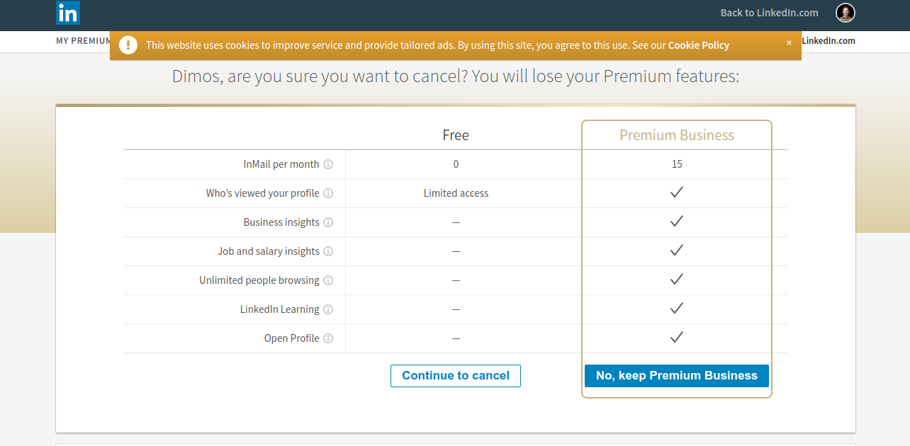
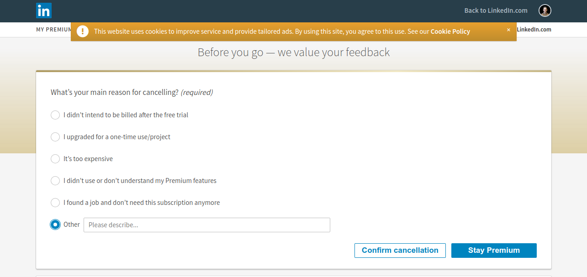
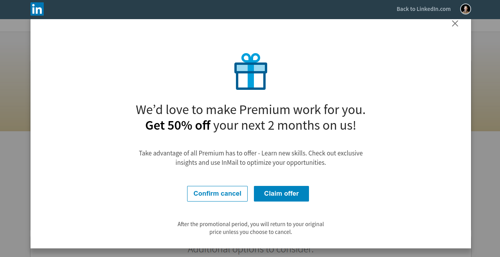
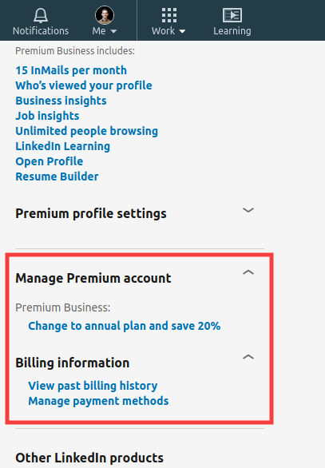

Unfortunately, [dark patterns](https://en.wikipedia.org/wiki/Dark_pattern) have become commonplace nowadays. However, what I experienced the other day is beyond anything I have seen so far. I got an e-mail from Linkedin inviting me to try their Premium offering for free for 1 month. As a freebie lover, I said *"sure, why not?"*. After almost a month, I received a reminder e-mail that my free trial would expire. Since I hadn't really used any of the additional features, I decided to just cancel the subscription. And this is where the fun begins.

Clicking the button that was supposed to cancel my subscription leads me to the following page.

Nothing special really. Dark patterns 101. A simple reversal of action buttons, where what I wanted to really do is presented as the fallback option, while the default option is what the company really wants. I am used to it, since I have to go through the same thing everytime I purchase something online that comes with a subscription. Subconsciously, I click the left button and I am presented with the following form.

Of course, Linkedin desperately wants my feedback so that they can improve their service and increase customer retention. However, at the same time they sneaked another reversal in hoping that I will not pay attention to the buttons and I will select the default option. The journey does not end here though. Clicking on the cancellation button takes me through to the following page.

Now, this is what I would call a *masterpiece of deception*. It initially looks like the cancellation process is over, since this is just a popup dialog with some additional offers. However, it's not. This dialog contains yet another confirmation button, which is not the default option of course. The interesting thing is the following: being a dialog, this window contains a cross in the top-right corner that naturally closes the window. A lot of Internet users have developed a habit of closing these advertisement dialogs instantly via this element. But, in this case this will not just close this offer, it will cancel the whole previous workflow.

Here is the funny part of the story. I've managed to go through all these stages. Yet, a couple of days later I received an e-mail from Linkedin saying that there is a pending payment for my Premium subscription. This means there was probably some other trick that I didn't identify and fell victim of. Of course, I am always suspicious with these free trial periods and I provide a debit card, where I can control the payments that go through. This is the reason this payment was rejected. 

So, I buckle up and get ready to go through the same process, now trying to solve the remaining mysteries in order to cancel my subscription. Before anything else, I have to visit the homepage, where I can select the button that gets me through the cancellation process. However, something is going wrong, the option is not there anymore. 

Now, the only options I can see is switching to an annual plan or changing my payment methods - ideally to a new one that does not control the payments that go through. Scraping support pages of Linkedin, I finally found a link to the initial page of the cancellation process and finished it completely.

Big tech companies, such as Linkedin, do not leave things to luck, they carefully analyse the impact of a new feature. So, I am fairly confident this is not just an oversight, it is the result of extensive A/B testing in order to make sure customers are actually tricked into renewing their subscription inadvertently. And it's proving to be quite [successful](https://www.linkedin.cn/help/linkedin/forum/question/641328/hi-i-want-refund-my-premium-subscription-amount-i-don-t-want-to-use-my-premium-that-to-i-don-t-like-it-without-any-password-otp-automatically-money-got-deducted-from-my-account-?lang=en) in this. 

This makes me sad. I pursued this profession, because I sincerely believe technology can make a difference in our lives. A positive one.

So, when I see examples like that I feel obliged to share them publicly so that:

* companies stop following these practices and focus on serving real customer needs instead.
* software developers start realising the impact their work can have and make a conscious effort for this impact to be positive.

**[Update - 27/06/2020]** I came across [this](https://queue.acm.org/detail.cfm?id=3400901) very interesting article from ACM Queue, called "Dark Patterns: Past, Present, and Future". It touches on the history behind dark patterns, how they evolved through time, the nuances in terms of ethics and law, approaches to uncover dark patterns that might have been introduced inadvertently as part of an optimisation process and concluding with a discussion on self-regulation and law enforcement. If you are interested in the topic, I would highly recommend it.
