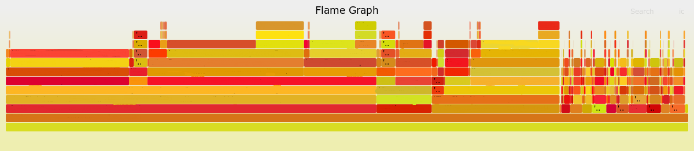
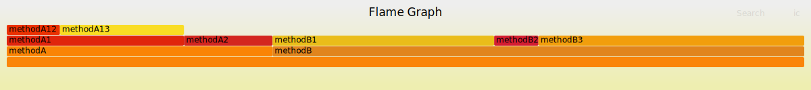
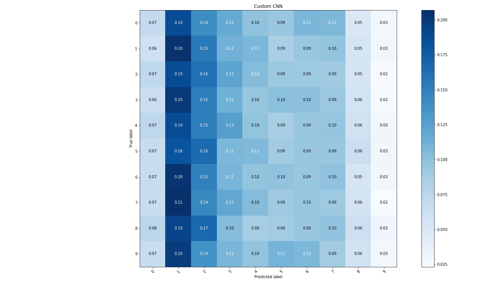

The other day, I was trying to profile the performance of a rather complicated system in order to identify areas for performance and scalability improvements. It was one of those cases, where simply attaching one of the widely used profilers and trying to identify hotspots would not cut it. There were several reasons for this, slightly off topic for this post. But, just to give you an idea, this system contained a lot of asynchronous code paths which are not really amenable to the common  profiling techniques. What's more, the overall system consisted of multiple components communicating over network, sometimes asynchronously via message queues.

My initial approach was fragmenting the relevant parts in pieces and timing their duration. That helped me gain an initial understanding. However, as I started diving deeper, the volume of the data started becoming too big to analyze manually. I started looking for some form of visualisation that could give me a high-level overview without me having to inspect the logs and create this picture mechanically in my mind. I already had a specific one in mind, **flamegraphs**. I've seen them already in action in some of the profilers I had used in the past. The only difference is that in this case, I wanted to generate these graphs from my own data. I was really excited to find that this is possible using Brendan Gregg's tool, available [here](https://github.com/brendangregg/FlameGraph) in Github. Brendan was the inventor of flamegraphs and he maintains a really interesting page about the concept on his website [here](http://www.brendangregg.com/flamegraphs.html), which contains the history behind it and a lot of resources.

Getting back on topic, I had a log that was roughly 8,000 lines long, which made it pretty hard to inspect manually. I just had to transform it in the form that tool expected to generate a flamegraph out of it. It took me roughly 10 minutes to write a script to do so and I could have my flamegraph, which you can see below. Of course, the method names have been redacted to protect the suspects. As you can see, that visualisation was a lot easier to parse. After identifying specific parts that looked suspect, I could always switch back to the raw log data for a more fine-grained view[^1]. 



The format of the tool is also very simple, making it very easy to use. You only have to format the logs as a sequence of lines, each one having the title of the method and the execution time separated by a space. The method title should contain the name of the associated method, but it should also contain the names of all the predecessor methods in the form of a stack trace. You only have to include the methods at the bottom of the stracktrace. An example of this would be the following:

```
methodA;methodA1;methodA12 30
methodA;methodA1;methodA13 70
methodA;methodA2 50
methodB;methodB1 50
methodB;methodB1 75
methodB;methodB2 25
methodB;methodB3 150
```

Then, you can just execute the tool running:

```
./flamegraph.pl /path/to/logfile.log > /path/to/output.svg
```

And you get the following result:



The generated SVG image is interactive allowing you to hover over blocks to get the full method name or filter & zoom into specific parts of the graph. To do that with the graph above, you can open the image in a new browser tab or download it and open it in your browser.

What struck me with flamegraphs is the extent to which they help you mentally reduce the volume of data and derive insights in a quick and easy way. In my opinion, it's somewhat different to the other common charts, such as bar plots or pie charts. These charts require you to have done a significant piece of analysis and drill-down already before generating the final graphs. Furthermore, scanning the raw data and deriving the same insight is not that much harder in some cases. Amongst the graphs I've used so far, perhaps confusion matrices (such as the one below) come a bit closer to the degree of noise reduction and information density they achieve.



But, each one of these plots has a different audience. So, if I was to refer to the confusion matrix as the data scientist's chart, I would refer to the framegraph as the software engineer's chart. 


[^1]: Note that some of the fat blocks at the top of the graph correspond to executions of the same method, since the flamegraph tool sums up all instances with the same title under every parent block. This can be helpful in some cases, if you want to get a view of which methods take most of the time in total. But, it also hides some information, if you want to know what's the execution time of each invocation.
