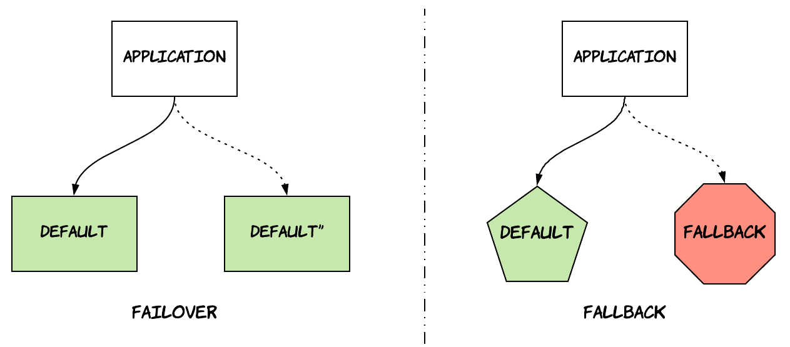
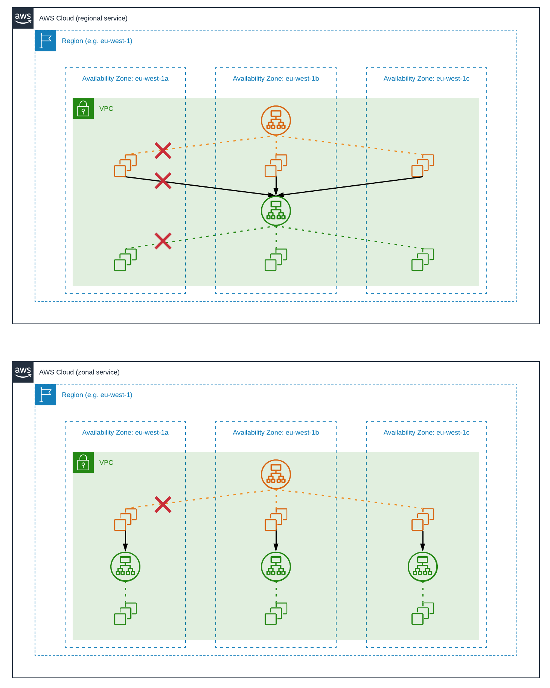
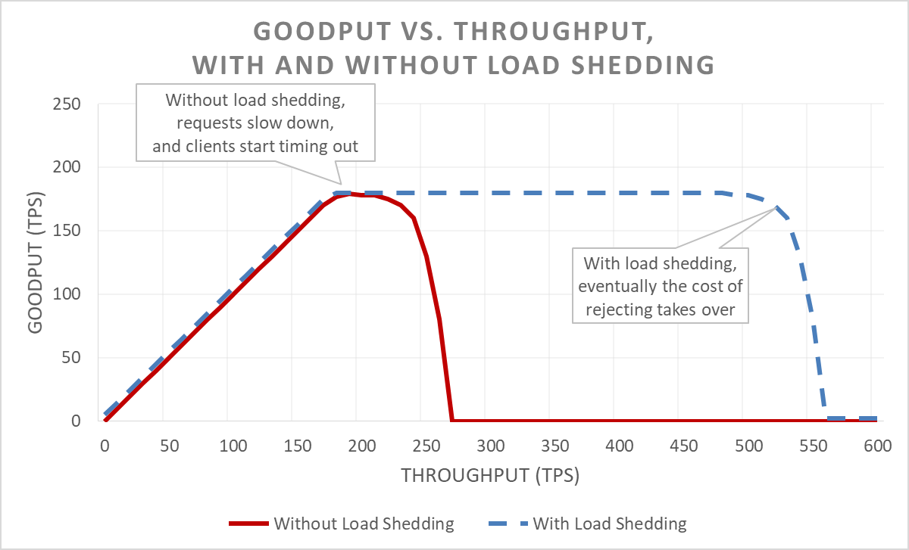

Amazon recently announced the [Amazon Builders' Library](https://aws.amazon.com/builders-library), a collection of articles written by senior technologists working for Amazon sharing lessons they learned while building the systems that power Amazon's services for the last 20 years or so. Having worked for ~2.5 years for Amazon myself in the past, I have to admit I have felt extremely lucky and grateful for all the internal resources that were available to me. There were numerous cases, where I was able to learn so much from the work of other people, e.g. by reading post mortems, design documents or watching internal tech talks of how systems like S3, DynamoDB or VPC were built. At that time, all of that was internal and confidential, which meant I could only discuss it with my colleagues. As a result, I was very excited to see Amazon is now sharing publicly some of it. First of all, because I am not working for Amazon anymore, but I still get to read to some of this awesome material :smiley:! Second, because I believe sharing this type of content is mutually beneficial both for Amazon and the whole community, since there is now a space for open discussion on common problems people face in different contexts and different approaches to them.

During the Christmas break, I got the chance to wind down and read some of these articles. Some parts were really insightful, so I thought I'd share the parts I liked most in this post.

I'll start with the article that struck me most, called "*Avoiding fallback in distributed systems*". The title can seem a bit counter-intuitive, since one might think fallback is one of the main mechanisms to increase availability in distributed systems. However, the author makes a clear distinction between **fallback** and **failover**. Failover is about performing the same activity against a different resource, which is still an exact replica of the primary resource. Fallback refers to using a completely different mechanism to achieve the same result. The article explains why fallback mechanisms can be dangerous, since systems that make use of fallbacks tend to have a bimodal form of operation. One of the two modes is rarely exercised and might be harder to test appropriately, so it can lead to problematic situations when it kicks in. The article also gives an interesting example from a real outage that happened in the Amazon retail website back in 2001, where a database was used as a fallback mechanism to an in-memory, local cache. When the cache failed, the system started falling back to database queries turning a partial website failure into a full-site outage that affected unrelated parts, such as fulfillment. If you look around on the Internet, you will probably be able to find more post-mortems from similar outages caused by this phenomenon, such as [this one](https://blog.coinbase.com/incident-post-mortem-june-25-26-2019-1d08c1657cbc).

My second favourite article was titled "*Static stability using Availability Zones*". Availability Zones are logically isolated sections of an AWS Region, which are physically separated by a meaningful distance and do not share power or infrastructure to avoid correlated failures. They are also connected to each other with a private, low-latency network, so that they can fail over quickly without interruptions. The most typical use of Availability Zones is when an application is deployed into multiple availability zones in each region and fronted by a load balancer that directs traffic to all of them, so that the application can still operate when there is an outage in one of the AZs. **Static Availability** is the practice of overprovisioning the infrastructure of an application, so that it can cope with failures without having to dynamically provision infrastructure, which might require some time leading to customer impact[^static_availability_note]. 

The article also makes a very interesting distinction between **regional** and **zonal services**. Regional services provide a region-specific endpoint that might transparently delegate to specific availability zones, such as the previous example with the load balancer. Zonal services provide multiple, zone-specific endpoints for each region. An example of a zonal service is the Amazon EC2 NAT gateway which provides outbound internet access from a private subnet and needs to be instantiated separately by customers per Availability Zone. The reason behind this distinction is the need for fault isolation, which is achieved by minimizing traffic that crosses the boundary of a single AZ. Another nice and simple example is provided in the article illustrating the benefits of this. As shown in the diagram below, a request between two regional services is less likely to succeed during an AZ outage, when compared to a request between a regional and a zonal service. Of course, the increased availability comes at the cost of complexity in terms of deployment, operations and user experience. As a result, Amazon selects between these two approaches based on multiple criteria, favouring zonal deployments mostly for foundational services that are on the critical path and need to provide zonal availability guarantees. 

The same article also discusses the difference between the **control plane** and the **data plane** of a service, two terms used widely in the context of AWS services. The control plane is the part of the system that is responsible for making changes to the system, such as creating, modifying or deleting resources. The data plane is the part of the system that is responsible for helping these resources perform their core business purpose. For example, in EC2 the control plane is responsible for provisioning a physical server and allocating network interfaces, while the data plane is responsible for routing packets or reading and writing from EBS volumes. The main point made in the article is around the benefit of clearly differentiating and decomposing these two dimensions of a system. This can be useful when designing a system for the following reasons:

* The data plane is usually more important to customers than the control plane. As an example, most customers of AWS would be more concerned about their EC2 servers failing than they would be about not being able to start new EC2 servers. As a result, it's useful to design a data plane that is statically stable against failures in the control plane. This is the case in EC2, where during a problem in the control plane, EC2 servers might not be able to see newly created servers, but they will be able to perform operations they were performing before the outage. One technique for achieving this is allowing the data plane to cache locally any data needed to perform their operations. 
* The data plane usually operates at a higher volume than its control plane. So, it's useful to keep them separated, so that they can be scaled independently.
* The data plane tends to be a lot simpler than its control plane. More moving parts usually lead to more failures, so isolating the failures between the two planes is beneficial.

Another article I really enjoyed was titled "*Using load shedding to avoid overload*", where the author essentially explains the basics of queueing theory in a very simple way and gives some tips on how to build systems that can fail more gracefully. There are two main reasons why services do not fail gracefully by default:

* **Wasted work**: When an application starts operating at the tipping point where the incoming load is more that the application's capacity, then requests start to queue up. In most cases, clients of an application have established specific timeout thresholds after which they give up on a request, because they consider it failed or late results would not be useful to the business. As a consequence, the application spends resources working on requests that will be discarded later on. This means a team owning a service might think the service maintains high availability and good thoughput, because it lacks visibility into how upstream services make use of the results.
* **Client retries**: In many cases, clients of an application will not just timeout and give up, but they will retry the request later on. This is so that they can recover from transient failures. However, this creates a vicious circle, where extreme load causes a service to be overloaded and delay servicing requests, which in turn creates even more load due to retries.
* **Resource saturation**: As traffic increases, the resources of an application become increasingly saturated. This means requests take more to complete, which decreases the throughput of a service thus feeding again into the vicious circle described before.

There's a part I really liked about this article; it makes a distinction between **throughput** and **goodput**.

> *Throughput is the total number of requests per second that is being sent to the server. Goodput is the subset of the throughput that is handled without errors and with low enough latency for the client to make use of the response.*

It also provides a nice graph that illustrates the behaviour described above.

The red line corresponds to a service without load shedding, while the blue line corresponds to a service with load shedding. The tipping point comes a lot later for a service with load shedding, since it will start rejecting requests that are over a threshold thus reducing the amount of wasted work. It's interesting to observe that even the service with load shedding is subject to this tipping point though. This is due to the fact that even just rejecting requests comes with a cost that can eventually take over and having the same impact. The article provides some more practices that can help move this tipping point even further, such as implementing load shedding on the client side (e.g. via circuit breakers) or providing timeout hints from clients to servers to reduce wasted work even further.

As mentioned in the beginning, this post contains the parts that I personally found most insightful[^useful_caveat]. Of course, there is still a lot of useful information in the other articles, such as:

* general guidance on resiliency patterns, such as retries, jitter, circuit breakers etc.
* how to deal with big backlogs in queueing systems.
* the role of leader election in distributed systems and how to use it.
* good practices around instrumentation and operational visibility[^production_readiness_note].
* good practices for continuous delivery and rollback safety during deployments.

So, I would highly recommend reading all of the articles yourself when you get some time.

-----------------------------------------

 

[^static_availability_note]: Interestingly, we've been following this practice in most of the teams I worked in Amazon that were responsible for operating highly available services, but I didn't know there was a name for this until now!
[^useful_caveat]: This might be either due to the fact that these topics have not been covered extensively yet or simply because I didn't know where to look for them!
[^production_readiness_note]: I actually found this article ("*Instrumenting distributed systems for operational visibility*") extremely useful, but it was not part of this post because it contains a lot of useful tips and details that I would not like to dilute in a summarised version. However, I can assure you these are all extremely useful practices that are widely used across Amazon and should arguably be part of your production readiness checklist.
