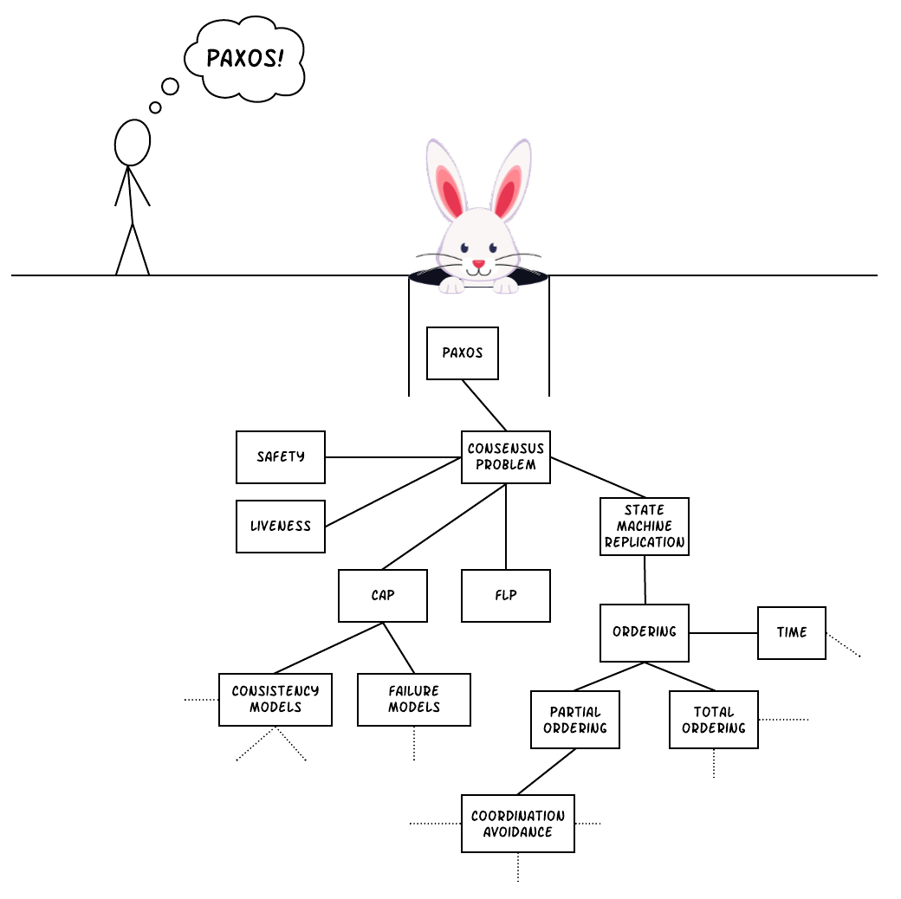
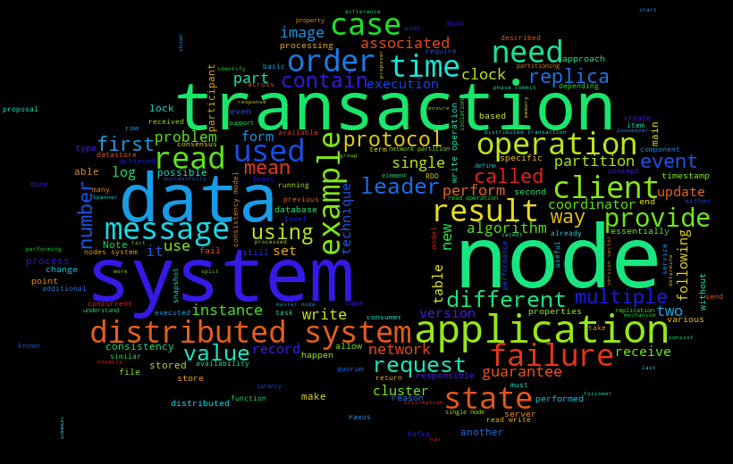
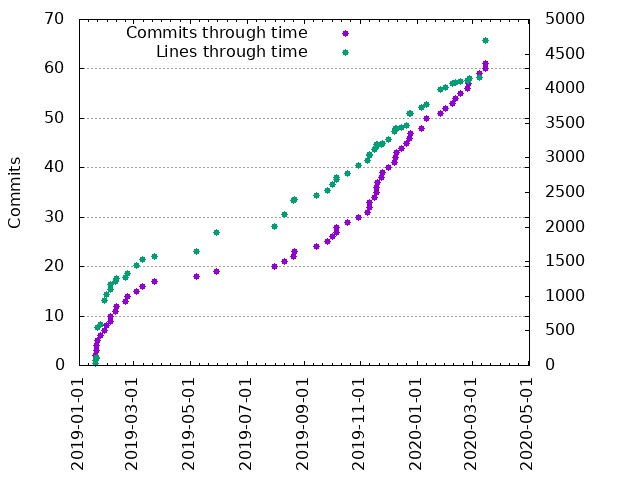
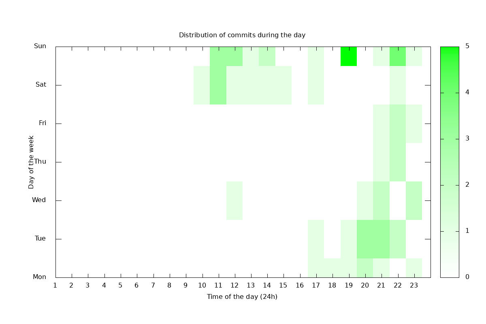

I recently completed a book I had been writing for the last two years on distributed systems, called **Distributed Systems for practitioners**. So, I thought it would be a good idea to write a blog post now sharing some background information about the book, why I decided to write it and what the process was like. 

Let's start with how I made the decision to write this book. Of course, the actual decision to write the book was made roughly two years ago, as I mentioned already. However, after completing the book I realised that the incentive originated way back in time during my undergraduate studies. Back then, I had enrolled in a course on distributed systems, which contained [Paxos](https://en.wikipedia.org/wiki/Paxos_(computer_science)) as part of its curriculum. I remember this was considered a rather hard topic for students. As a result, it was not included in the exams material, it was only included in the curriculum as a somewhat optional topic and I also remember the professors pulling our legs saying things like "Oh, if you understand Paxos, please come tell us, there's no need to take the exam" or "One does not simply understand the Paxos paper by reading it only one time"[^ntua_caveat]. Needless to say, I tried to read and understand the paper. Not only I tried, but I made a significant effort, I think I tried to read the paper two or three times, but still I could not get it. It was a miserable failure, but I didn't really bother at that point. If the professors said it was a very hard topic for an undergrad, who was I to challenge them? So, I just pressed Crtl+Del and moved on with my life. Fast forward almost 10 years and here I am again reading the Paxos paper! Only this time, I get it. I not only get it, but I feel unable to understand why it was so hard for me to understand it back then.

But, while trying to understand Paxos, I realise there are a few ideas and topics that seem to be predecessors to it and I don't know about them, so I start reading these papers. And this recursion keeps going on. After a while, I realise I have just fallen in the rabbit hole of distributed systems literature...

I take a step back and wonder: what about all these poor souls that are going to fall in the same rabbit hole? So, I decide to keep some notes as I am going through the papers thinking they will probably be useful to other people that are going through the same journey. 

In the meanwhile, I spend my daytime writing software - don't forget I also have to pay some bills at the end of the day. As a nice coincidence, most of the software I have been writing is for distributed systems. So, I keep facing some of the problems I have been reading about again and again. In some cases, this helps me realise there are some problems that are widely misunderstood across the industry. One such example is the semantics of message delivery between two systems. You would be amazed to see how many software engineers have not realised the fact that you cannot have exactly-once message delivery in a distributed system with an asynchronous network, which is what we practitioners work with in most cases. Interestingly enough, this is not something you will only need when building something extremely complex. It is something you will need even when building the simplest system you can imagine - two servers that want to communicate with each other. So, I am collecting notes from such bits and pieces that are relatively easy to explain and extremely useful in the majority of the cases. I am also reading about commonly used systems and how they solve this kind of problems, most of the times in order to understand if such a system can be useful to an application I am building or maintaining.

And this is my book. If you skim through the table of contents, you will see what I mean. The table contains four main parts:

* **Fundamental Concepts**: this contains the basic concepts, definitions and theorems you will need before being able to understand more complex topics presented later in the book. Some of them are seminal papers in the field, such as the CAP theorem.
* **Distributed Transactions & Consensus**: these are the two major problems that one faces when trying to build a distributed system, how to perform operations across multiple machines in a safe way and how to make many servers agree on the state of the system. This part contains explanations of these problems and several available solutions with the trade-offs of each one.
* **Time & Order**: this is one of the most unintuitive areas for people that are new to distributed systems. It contains a basic explanation of the concepts of order and time, why they are strongly related and what are their implications in a distributed system.
* **From theory to practice**: this explains how the theory presented previously can be applied in practice, by examining case studies of real-life distributed systems and other practices and patterns that I have seen being applied widely across the industry. I am personally very excited about this part, because I think it's something that is missing from other books on distributed systems that are analysing the theoretical parts very thoroughly. I was also happy to see that some readers had the same opinion and particularly liked this part of the book.

I guess the last question that needs to be answered about the book is "who is this book for". When I started writing it, I was intending the main audience to be software engineers that have recently come into the field of distributed systems or want to upskill to get in the field. However, I have made a conscious effort to simplify explanations as much as possible, accompany them with a lot of diagrams and cover edge cases in order to help the reader get the intuition behind the concepts and the algorithms presented. As a result, I believe this book can also be useful to people that are not actually writing software, but are operating in a role peripheral to the people that do.

And now for the fun part. After completing the book I started playing around a bit, since I am a data lover and I'd like to share some interesting artifacts. Of course, what's better to start with than a clichéd wordcloud of the book's content.

Going to something more science-y, I decided to create a plot that would be showing my progress through time. So, I plotted the new lines and commits made through time.

They both seem to be quasi-linear, which makes sense since I had a steady pace throughout this period. You might notice that the commits graph becomes a bit flat at some point in the beginning, while the slope is increasing signiciantly in the end. This can be explained by various factors. First of all, I was becoming a bit more excited (or desperate?) as the completion of the book was approaching, so I probably pushed a bit more. I also became a bit more disciplined as I kept writing. In the beginning of the book, I remember writing big chunks and sometimes forgetting to commit in milestones, while near the end I was making smaller and frequent commits. The final stage also contained parts where I was addressing feedback from reviewers and fixing typos and mistakes, which are naturally smaller changes. This is partially explained by the fact that the graph of new lines is becoming flat near the end as the commits graph is spiking. The absolute numbers in the graph are quite small, because I was committing changes mostly between milestones (e.g. a new section) and every paragraph was written in a single line[^toolset]. Given I was alternating between reading and writing throughout this period, I realised it would be nice to also contain a graph of my reading activity in this plot. However, I only realised this after the fact, which means I didn't use a reading application that could provide this sort of data making this impossible.

Another plot I really liked was the distribution of commits during the day for each day of the week.

The first thing that stands out is that I was mostly contributing during the late night hours on weekdays, but that changes during the weekend where I was more active earlier in the day. This is explained by the fact that I have a day job during weekdays and I usually go for training after work, so I ended up working on the book after that. You can also see that I worked late hours on Sundays a bit more when compared to Saturdays. This is most likely due to the fact that I prefer spending Saturdays outside and chilling at home on Sundays to prepare emotionally for Monday :laughing:. Another interesting observation is that apparently the contribution on weekdays was decreasing as the end of the week was approaching, which is what I would call the [TGIF](https://en.wikipedia.org/wiki/Thank_God_It%27s_Friday) effect.

And now for the boring housekeeping stuff:

* You can find the book on [Leanpub](https://leanpub.com/distributed-systems-for-practitioners) and [Amazon](https://www.amazon.co.uk/Distributed-Systems-practitioners-Dimos-Raptis-ebook/dp/B086551JHY) at the moment.
* If you are in a financial situation where you cannot afford it, you can send me an e-mail and I will be happy to give you a free copy. If you are a student, just send me an e-mail from your university address and I can give you a student discount.
* If you have already read the book, feel free to send me an e-mail with your feedback, I am open to both positive and negative feedback :smiley:. Alternatively, you can leave an Amazon review or send me your testimonial and I can add it on Leanpub.

Thanks for reading and I hope you enjoy the book!

-----------------------------------------

 

[^ntua_caveat]: Don't get me wrong, I don't mean to say these were bad professors or anything like that. In fact, this university was great and it was the main reason I selected this profession after realising I have a real passion for it. I am just stating facts.
[^toolset]: For those curious about the toolset I used, it was git and Github for versioning, Sublime for text editing, pandoc for generating the final artifacts (pdf, epub and mobi files) and mostly Lucidchart for the diagrams.
