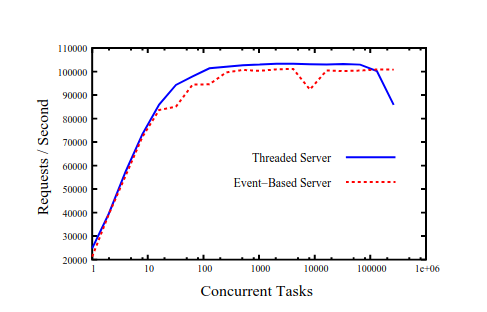
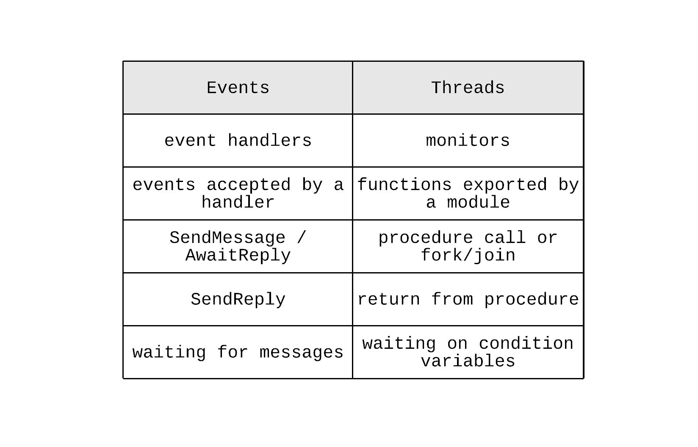

This week I decided to start investing some time to read all those papers that had slowly accumulated in my bookmark. The first of them was on the topic of event-based systems[^paper] and why they might not be as beneficial as previous claims argued they were. [Fuzz](https://twitter.com/dazraf/status/1251445548403625991) asked me what's my view on this, but Twitter's character limit is not a very good fit for this sort of thing. So, I thought I'd share my thoughts in a blog post. What I am trying to say is this blog post was driven by that event (pun clearly intended).

This has been a rather controversial topic in the past. It was interesting to see that one of the authors, Eric Brewer[^brewer], was also the author of another paper that is commonly cited as an argument on the superiority of event-based systems. That paper is known as [SEDA](https://en.wikipedia.org/wiki/Staged_event-driven_architecture), which stands for staged event-driven architecture and it performs a comparative analysis between the classical thread-per-request web server and a web server where request processing is decomposed into multiple stages that exchange events via in-memory queues. So, it is interesting to know this paper is coming from someone that has been on the other side of the fence in the past.

The argument of the paper essentially boils down to two basic parts. In the first part, the authors explain why threads are not necessarily worse than events in terms of performance. Then, they proceed by enumerating some of the drawbacks of event-based models, thus claiming that they are actually worse as a programming paradigm. Let's review each part separately.

The fact that thread-based applications used to be very inefficient when compared to event-based, asynchronous applications is not due to some inherent limitations of the threading model, but mostly due to the underlying implementation of them. In order to prove this, the authors repeated the benchmark from the SEDA paper with an optimised version of the [GNU Portable threads](https://www.gnu.org/software/pth/) package, which was able to scale up to 100,000 threads performing similarly to the SEDA architecture. 

 

 

So, the difference in performance comes from the fact that event-based models tend to make use of cooperative scheduling, while thread-based models tend to make use of preemptive scheduling. However, the software industry is catching up and there is now support for cooperative scheduling provided under synchronous-looking APIs. These usually take the form of lightweight threads, aka fibers, or coroutines[^libraries].

With performance out of the way, the question then is whether there is any reason to prefer event-based models. This is where the second part of the paper's argument starts. Interestingly, the paper references a paper from back in 1978 about the duality of these two models. That paper argues that these two models are dual and a solution for a problem in one of these models can be structurally translated to the other model. This paper summarises this duality in a table that contains concepts and their equivalent in each model.

As a result, a solution to a problem can be modelled in these two ways and the paper argues that modelling the solution using events can cause several problems. All of these problems stem from a fundamental difference between these two models on how state is managed. In thread-based models, state is managed implicitly through the use of the stack. In event-based models, the same state needs to be managed explicitly by the application. This has the following consequences:

* **Control flow**: thread-based models tend to have a more linear structure that is easier to reason about, while event-based models introduce a lot of indirection that can lead to what is known as [callback hell](http://callbackhell.com). The linear structure of thread-based models enables powerful paradigms, such as structured concurrency[^structured_concurrency]. Event-based programs usually need to implement the state management at the application level, which is  referred to as stack ripping. This essentially boils down to storing the necessary state on message delivery, so that it can be used by the associated event handler when time comes. This introduces additional development effort and complexity at the application level.
* **Troubleshooting & Debugging**: thread-based models are also a lot easier to troubleshoot and debug. An exception with a full stack trace can be invaluable while trying to understand what really happened in a system and track interactions between components. Similarly, having the ability to easily jump between components in the stack while in a debugger session reduces development effort significantly.
* **Error handling**: Error handling is also easier in a thread-based model, since exceptions tend to propagate vertically and allow callers perform the necessary error handling and cleanup. In an event-based model, this becomes a lot harder, since the decoupling between event producers and consumers can remove this connection or it might require additional machinery (e.g. response message queues or dead letter queues). The paper references a system the authors were working on that frequently suffered from memory leaks due to this reason.

These points form a pretty strong argument that reflects to some extent my experience from having worked with systems from both of these worlds. There might be some domains that are a good fit for an event-based model, but force-fitting this model into an application in order to achieve some secondary properties (e.g. performance) usually doesn't end well. 

However, this paper focuses on the merits of an event-based model in the micro context of a single application. I think there is a lot more to be said when viewing this model in the macro context of multiple applications.

One example is the concept of event sourcing that has become a commonly used pattern nowadays. This takes focus away from state and brings events to the front. State is now a second-class citizen, a materialised view of all the events that have happened so far. This paradigm enables many different functions for an application, such as natural auditing, temporal querying and data integrity[^event_logs]. Of course, this doesn't mean it doesn't come with trade-offs as  everything in software.

So, are events bad after all?

As every software engineer indulges in saying, it depends.

 

-----------------------------------------

 

[^paper]: The paper is "Why Events Are A Bad Idea(for high-concurrency servers)", available [here](https://www.usenix.org/legacy/events/hotos03/tech/full_papers/vonbehren/vonbehren.pdf).
[^brewer]: If the name sounds familiar, it's because he is also the brain behind the [CAP theorem](https://en.wikipedia.org/wiki/CAP_theorem), which is a foundational finding in the field of distributed systems.
[^libraries]: [Quasar](https://github.com/puniverse/quasar) is a commonly known fiber library for the JVM, while project [Loom](https://openjdk.java.net/projects/loom/) is the native equivalent for the JVM. Coroutines have now been implemented in several languages, such as [Python](https://docs.python.org/3/library/asyncio-task.html), [Go](http://www.golangpatterns.info/concurrency/coroutines), [Kotlin](https://kotlinlang.org/docs/reference/coroutines-overview.html) etc. You can find several benchmarks that prove the same thing; that these have similar performance & scalability to asynchronous, event-based libraries.
[^structured_concurrency]: If you haven't heard of the concept of structured concurrency before, I think [this post](https://vorpus.org/blog/notes-on-structured-concurrency-or-go-statement-considered-harmful/) explains the idea very nicely.
[^event_logs]: This is one of the reasons why event logs started seeing a lot of adoption recently. This [article](https://www.confluent.io/blog/using-logs-to-build-a-solid-data-infrastructure-or-why-dual-writes-are-a-bad-idea) explains how an event log can help ensure data integrity in a distributed system architecture.