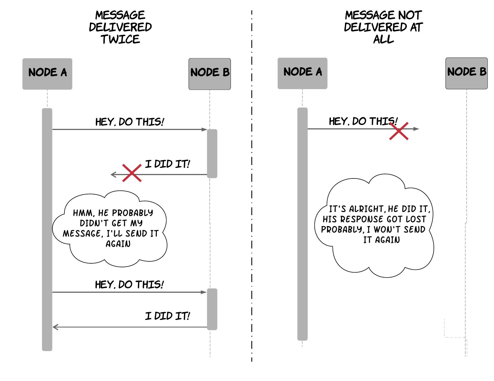

The notion of exactly-once semantics is one of the most commonly used concepts in the world of building software. I believe that every engineer gets to work in at least one project in their life that has a stong requirement for exactly-once semantics. Unfortunately, it's also a frequently misunderstood topic and a controversial one too[^exactly_once_debates]. So, I decided to dedicate today's blog post to this topic hoping to make things a bit more clear for people not very familiar with it.

But first, what do we really mean with exactly-once semantics?

There are two main aspects: **delivery** and **processing**. The former relates to a system receiving a message from another system, while the latter relates to the system processing the message with any associated side-effects taking place. When talking about exactly-once semantics, it is useful to specify which aspect we are referring to. Are walking about exactly-once delivery or exactly-once processing? In practice, we mostly care about processing semantics, not delivery. As an example, a payment application does not care if it receives a message instructing a payment multiple times as long as the application performs the associated payment only once. This is quite important, since:

>> In an asynchronous network[^asynchronous_network], it is impossible to achieve exactly-once delivery semantics. However, it is possible to achieve exactly-once processing semantics.

Let's explain this through an example. We can assume we have 2 machines trying to communicate over an asynchronous network, where the first machine is sending an instruction via a message to the second one. As shown in the following diagram, the network might delay or lose messages at the most unfortunate time, so that the sender will not be able to tell what happened to a message that has already been sent. If the sender hasn't received a response from the recipient, it can try sending a message again. However, if the recipient had already received the first message but the response was slow or got lost, it will receive the same message again, thus leading to a duplicate delivery. As a result, the sender might act conservatively and avoid sending the message again. However, if the first message got lost, the recipient will never receive the intended message. As a consequence, achieving exactly-once delivery semantics is impossible. On the other hand, exactly-once processing semantics is possible and there is an established pattern to achieve it. The sender can keep resending a message[^infinite_retries_caveat] when no response is received from the recipient, while also tagging the message with a unique identifier. On the other side, the receiver can keep track of the messages already received and processed (e.g. by storing their identifiers in a database) in order to identify and ignore any messages that have already been processed.

Of course, this is not enough. There are some more pitfalls you need to consider. The recipient needs to be careful about how it stores the message identifiers and how it persists any side effects from the message processing, since these two have to be done atomically to preserve the exactly-once processing guarantees. To understand why, imagine what can happen if the recipient stores the message identifier, but it crashes before processing the message. The message will never be processed! Alternatively, you can consider what can happen if the recipient first processes the message, but it crashes before managing to store the message identifier. The message will be processed multiple times! If all the side-effects of message processing are local to the system and do not require other third-party systems, there is an easy way to do both of these actions in an atomic way. The application can store both the side-effects and the message identifiers in a database that supports atomic transactions and perform both of these operations in a single transaction. If we go back to our payment example, this would mean the tables for the account balances and the message identifiers must all reside in the same database, so that the application can update the balances and store the message identifier in a single transaction. If the message processing involves third-party systems, there are still ways to do this, but it can get quite complicated. In any case, the main takeaway is that persisting the message identifiers and performing any side-effects related to the processing of the message need to be done in an atomic way to provide exactly-once processing guarantees.

At this point, one could reasonably ask "hold on, doesn't TCP already do all of this? Do I really have to care about it?". The answer is it depends, but in most cases you do have to care. I can give you two examples that are pretty common and they will probably be familiar. The first one is the example of two applications communicating over HTTP. Let's imagine application A wants to invoke an operation on application B, which exposes an HTTP endpoint. Application A makes use of a common HTTP library (e.g. [Apache Commons](http://commons.apache.org/)) to perform these requests and it also makes use of an additional library that wraps these requests with retry functionality to cope with transient issues (e.g. [Hystrix](https://github.com/Netflix/Hystrix)). HTTP operates on top of TCP, which provides guarantees of in-order, reliable, exactly-once delivery per connection. However, in this case a retried HTTP request might be performed on a new TCP connection, which means no guarantees will be given. Furthermore, TCP provides guarantees on delivery of a packet from the transport layer to the application layer, but it does not provide any guarantees around processing of the packet at the application layer. As a result, application A will need to do additional work to provide exactly-once processing semantics at the application level. One way to do this is using the mechanism described above. Another example that is quite common in the industry is that of two applications communicating via an intermediate message queue. In this case, messages are transferred in a pull-based approach, instead of a push-based. Application A sends the messages to a message queue. Application B retrieves a message from the message queue, processes it and then acknowledges it, so that the message queue will remove it and not redeliver it. On top of the complexities described previously, application B might consist of multiple machines processing messages from the queue concurrently. This means that under some unfortunate conditions, a message might be picked up by two different machines[^sqs_example]. If the application persists the message identifier and any side-effects from message processing atomically, then only one of these two machines will succeed in processing the message, thus giving exactly-once guarantees. This phenomenon that higher layers of the stack cannot always rely on guarantees provided at lower layers is a more general idea that applies to other aspects and it's also known as the end-to-end argument[^end_to_end].

In the pattern described here, it is important to note that after having sent the first message and before having received an acknowledgement, the sender is in a limbo state. Even if it has waited for a long time without receiving any acknowledgement, it cannot abandon this request being confident it will never be executed, since the original message might be at delivered any time in the future in theory. So, it has to stick to an infinite retry of the request, until it's completed. Of course, this is not very practical, since in many cases applications cannot keep retrying infinitely and some requests might be considered valid only for a specific window of time. In these cases, the application will have to make some assumptions about the network and all the involved machines in order to be able to abandon a request that appears to be failing. The sender can also include a time window[^timeout_hints] inside the message that indicates the time after which a request should be considered stale by the recipient, which means the recipient should discard it and not act on it. As an example, an application can assume that a message will be delivered between any two machines in at most 5 seconds, so that all the requests will contain a timeout hint spanning the next 2 seconds and every sender will wait for a worst-case round-trip of 10 seconds before abandoning a request. As a result, the sender will have a consistent view on whether a message has been processed or not only as long as these assumptions hold. When these assumptions don't hold, the sender might think a message wasn't processed, while it was processed but the acknowledgement was slower than expected. It's essentially a safety tradeoff made by the application to gain some practicality.

Another practical aspect one needs to consider when applying this pattern is how to cleanup the persisted message identifiers, since they can grow unbounded and cause issues. A common mistake is to think that the sender can just send a subsequent cleanup message after receiving an acknowledgement from the recipient. This is not completely safe in all cases, since the recipient might receive a retried request later on and it will be unable to identify it's an already processed request if it has cleaned up the identifier already[^safe_cleanup]. A safer option is to allow the responder to clean up identifiers only after they have been acknowledged successfully and a specific amount of time has elapsed, thus reducing the probability that retried requests are in transit. The longer this time window is, the lower the probability is. This is another tradeoff between practicality and safety.

Hopefully, this post helped you understand what is possible and what is not in terms of exactly-once semantics and it made you appreciate some of the practical complexities involved in providing exactly-once semantics and how you can navigate them.

If you enjoyed it and you are interested in distributed systems, you might also enjoy reading my book, [_Distributed systems for practitioners_](https://distsysbook.co.uk).

**[Update - 13/08/2022]** I recently came across a few blog posts demonstrating how one can leverage ACID transactions of relational databases to quite elegantly build atomic and consistent workflows across systems with approaches like [idempotency keys](https://brandur.org/idempotency-keys) and [transactionally staged job drains](https://brandur.org/job-drain). These are nice examples of the problems described in this post, how they can be approached and the various pitfalls one needs to keep in mind. 

 

-----------------------------------------

 

[^exactly_once_debates]: If you are a curious spirit and not afraid of rabbit holes, you can spend a whole week reading people's arguments on the topic. There was actually a pretty [big debate](https://www.reddit.com/r/programming/comments/6kh65f/exactlyonce_semantics_is_possible_heres_how/) that was triggered from a [blog post](https://www.confluent.io/blog/exactly-once-semantics-are-possible-heres-how-apache-kafka-does-it/) about a new feature of Kafka that claimed exactly-once guarantees that later evolved into further [discussion](https://www.the-paper-trail.org/post/2017-07-28-exactly-not-atomic-broadcast-still-impossible-kafka/) on whether atomic broadcast is possible! All this is very interesting reading, but it requires quite a lot of time and background context. I was hoping for this post to be a bit more easy to follow and less controversial.
[^asynchronous_network]: An asynchronous network is one that does not provide any success guarantees or upper bounds on the time required to transmit a message between two machines. As a result, the Internet can be considered mostly as an asynchronous network. 
[^infinite_retries_caveat]: The astute reader will notice that even if the client keeps retrying infinitely, the network can theoretically keep losing all the messages and this would mean this does not achieve exactly-once processing. This is true, but we are trying to be pragmatic and we assume that the network will eventually recover.
[^sqs_example]: The circumstances under which this can happen might differ depending on the technologies used, but I can give you an example based on Amazon SQS which is widely used and familiar to many people. When an application receives a message from an SQS queue, the queue will _hide_ the message for a specific time window, called the [visibility timeout](https://docs.aws.amazon.com/AWSSimpleQueueService/latest/SQSDeveloperGuide/sqs-visibility-timeout.html). If the application hasn't signalled that the message has been processed inside that window, the message will become visible again. This means that if the acknowledgement of the application gets delayed, the queue might deliver the message to another machine, which might try to process it one more time.
[^end_to_end]: If you are interested, have a look at the paper "End-to-end argument in system design", available [here](https://web.mit.edu/Saltzer/www/publications/endtoend/endtoend.pdf).
[^timeout_hints]: This is also sometimes called a "timeout hint".
[^safe_cleanup]: One case where this is safe to do is when the sender has only sent a single message that has been acknowledged successfully.
