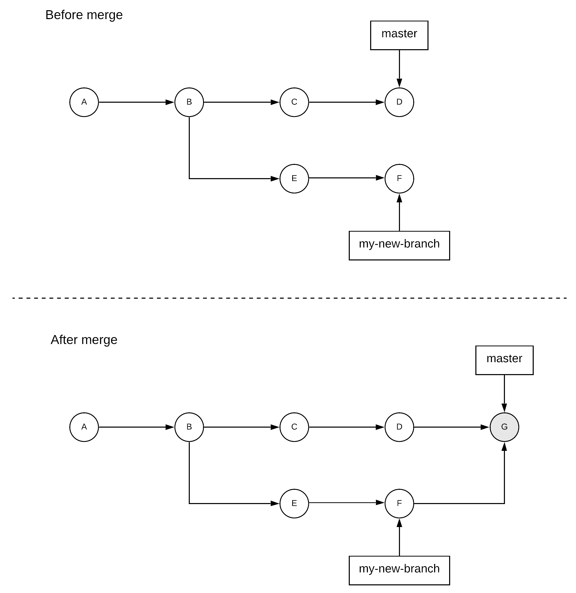

Git has now become one of the most, if not the most, popular version control systems. It is mostly used by developers to keep track of changes in source code and collaborate with each other, but it can be very useful in many other situation too. I've been using Git for the last 10 years or so and I've been constantly learning new things. I decided to write this post in order to explain some of those things and some of the patterns I've been using. In order for it to also be useful to people without a lot of experience with Git, I will combine this with a quick introduction. So, if you are already familiar with Git, you might want to skip the introduction and go straight to the second section with the patterns.

## Introduction

Of course, Git is not the first version control system. There were many successful version control systems before Git, such as [CVS](https://en.wikipedia.org/wiki/Concurrent_Versions_System) or [SVN](https://en.wikipedia.org/wiki/Apache_Subversion). However, Git came with a wholly different architecture and philosphy to its predecessors. Most of these old tools were built on a centralised architecture based on a  single, centralised repository of data that users are interacting with. Instead, Git is a distributed version control system, which means that data can reside in multiple different repositories that are continuously reconciled with each other.

Git repositories can be classified into two basic categories from the perspective of a user: **local** and **remote** repositories. A local repository is one that a user has on their personal computer for direct use. A remote repository is one that typically resides on a different machine and that is used to fetch changes from and push changes towards[^remote_repo_caveat]. As a result, one can register multiple remote repositories for a local repository. Alternatively, one might not have any remote repositories registered at all, if they don't need to collaborate with anyone else or they don't need their data to be stored in a separate repository (e.g. for backup purposes). The most typical setup in professional environments is to have one server hosting a repository that is registered as a remote repository by all the users of a group that is then used by them to exchange their local changes. There are several services that provide such hosting of remote repositories, such as Github, Gitlab or Bitbucket.


There are two main ways to start working on a new repository. The easiest way is to create a local repository, which you can do by just going in the directory that your data reside and simply run:

```
git init
```

If you want to register a remote repository to your local repository, you can do so using the `git remote` command:

```
git remote add origin git@github.com:dimosr/git-playground.git
```

You have now registered a remote repository with the name `origin`, which is located on Github under the URL `git@github.com:dimosr/git-playground.git`. This is a public repository which you can browse [here](https://github.com/dimosr/git-playground). This means you can fetch changes from it or push your local changes to it[^permissions_caveat]. You can also inspect all the remote repositories registered using the following command:

```
git remote -v
```

Alternatively, if a remote repository already exists and you just want to create a local repository based on it, you can just use the `git clone` command. For example, if you wanted to clone the previous repository, you could do:


```
git clone git@github.com:dimosr/git-playground.git
```

Your Git project is conceptually composed of three different parts:
* the **working directory** (or working tree)
* the **staging area** (or index)
* the **repository** (or repo)

The repository contains all the _committed_ changes to your files. The working directory contains all the files that you are currently modifying. The staging area contains all the files that you have modified and you are prepared to commit to your local repo. As a result, when you are making local changes you usually move files in this direction: working directory → staging area → repo. In our previous example, we would do this in the following way:

```
# create a new file in our working directory that contains the text "Hello world"
echo "Hello world" > file.txt
# move the new file to the staging area to prepare it for commit
git add file.txt
# commit everything that's in the staging area in our local repo with the commit message "My first commit"
git commit -m "My first commit" 
```

If we want to share this with our coworkers, we can just push our changes to the remote repository using the command `git push`. This command gets all the local changes that do not exist in the remote repository and pushes them there. Then, our coworkers can retrieve our new changes using the `git pull` command. This command identifies any changes in the remote repository that do not exist in their local repository and brings them in their local repo. This workflow can be summarised in the following diagram.


This is an overview of the basic functionality, but in order to understand better the more advanced features of Git it is useful to first get familiar with some of its inner workings. As explained before, Git tracks the changes to the files of our project. The history of all these changes can be seen as a discrete continuum of versions, known as **commits**. Each of those commits corresponds to a specific snapshot of our project and has a unique identifier[^unique_caveat], known as **commit hash**. This looks something like `90a3857cf2481260cfdb2c8183a2ac202f10df89`. The calculation of this identifier is making use of various pieces of data, but the most relevant to us for now are the contents of the project's files and the parent's commit hash. But, hold on.. the parent's commit? Yes, all these commits do not exist in a vacuum, they form a historical sequence of commits. Each new commit builds on top of an older commit and this forms a parent-child relationship. These commits form a line, which grows continuously as one keeps committing changes to a project. The latest commit that stands at the end of this line can be considered to be the _latest_ state of the project. In some cases, one needs to maintain and add changes to multiple _versions_ of the project, e.g. if people want to change different aspects of a project without affecting each other. This is achieved in Git through the concept of the **branch**. A branch can be thought of as a separate history of changes for a project. When you do a `git init`, Git creates automatically a branch for you, called `master`. By default, this is the branch you are working on. You can create a new branch based on your current commit and start adding changes to it by using the command `git checkout -b my-new-branch`. You can switch back to your old `master` branch using the command `git checkout master` and you can check which branch you are currently at using the command `git branch`. As you might be thinking already, a branch name is simply a pointer to a commit in the repository's history. 

Sometimes, after working on a branch for a while you want to combine the changes of this branch with another branch. Let's say for example you have added some commits on the branch `my-new-branch`, while another person was adding changes on the `master` branch and you now want to combine your changes. There are two main mechanisms to do that in Git:
* a **merge**
* a **rebase**

A merge operation combines multiple sequences of commits into one single sequence. Typically, this is done when some work is performed in a secondary branch and needs to be brought back to the primary branch. In our previous example, let's assume that `master` is the primary branch where everyone is working on and you were working on `my-new-branch` for some experimental piece of work that is now complete and can be brought back to the `master`. This would be achieved by doing a `git checkout master` to move back to the `master` branch and then doing a `git merge my-new-branch`. The last operation will identify the most recent common commit of both branches, it will retrieve the changes of all the commits in `my-new-branch` from this point on and it will move them on the `master` branch by creating a new commit. If you don't need the secondary branch anymore, you can delete it using `git branch -d my-new-branch`.



A rebase operation takes a set of changes from a branch and lays them on top of another branch. Typically, this is done when you are working on a secondary branch and you want to receive any new changes that have been performed in the meanwhile in a primary branch, so that you are up to date. In our previous example, let's assume that you haven't completed your work on the `my-new-branch`, but your coworkers have already added some changes in the `master` branch you would benefit from. So, you want to bring these changes in your branch. You can do so by doing a `git checkout my-new-branch` and then doing a `git rebase master`. The last operation will take all your changes and put them on top of your coworkers' changes.


The end result of performing a merge and a rebase can seem very similar from a user's perspective, but the way these results are achieved and the side-effects of these operations present important differences, which can create serious problems if not used properly. One of the main differences is that the merge operation will always preserve the history of existing commits, while the rebase operation can _rewrite_ history. This can easily be observed by the fact that the rebase operation changes the parents of some commits, thus changing their commit hashes etc. This is the main reason rebase is usually discouraged on branches that have been shared with other people. Another difference is that a merge operation might generate a merge commit that somewhat pollutes the history of the repository with metadata that we might not want to show up in the history of commits. For example, when we bring changes from a primary branch to our personal, secondary branch, we don't want to introduce merge commits that will show up later when merging our personal branch back to the primary, since these commits will provide no useful information to our coworkers and people that might be looking at the history of the project later.

## Basic patterns

After going through a quick introduction, I will now try to give a quick overview of the basic patterns of Git usage I have come to use. I think there are two main situations that require slightly different patterns.

The first one is projects where people are using a single branch and commit directly to this branch. This is a common situation in personal side-projects or group projects in university. This is the simplest case, since making changes and adding them to the remote repository consists of the sequence described before: `git add .` → `git commit` → `git push`. If someone has pushed changes in this branch in the meanwhile, the push operation will fail. The reason for this is that by default Git won't let you push when it results in a non-fast-forward merge in the remote repository[^fast_forward_merge]. In this case, I typically use `git pull --rebase`, which will rebase my changes on top of any new changes from the remote repo. This can then be followed by a `git push`, which will end up in a fast-forward merge and is guaranteed to succeed. The main benefit of performing a `git pull --rebase` instead of a plain `git pull` is realised if there are conflicts between the changes in the remote repo and your local changes, e.g. if your colleagues edited the same part of a file you also changed locally. The `git pull` operation performs a regular merge operation, so when you resolve these conflicts and complete the merge operation, you will end up with an additional merge commit that does not give any useful information besides the fact that you sync'ed your local repo to the remote one and there were some conflicts. Instead, if you use `git pull --rebase` these conflicts will be rebased as your local commits are applied individually, thus not creating any additional commit besides the ones already present in the local repository and your local repository.

The second common situation is one where some branches in the remote repository contains restrictions that do not allow pushing straight to them. This is typical in professional environments, where any changes need to be reviewed and checked before they get merged. A typical example is one where the `master` branch contains the authoritative source code for an application. In teams that follow a continuous delivery approach, any commits on this branch might trigger builds and deployments of the new application code. As a result, some protection is needed to ensure any commits added on this branch are safe and will not cause any issues. In Github, this is typically solved through the use of [pull requests](https://help.github.com/en/github/collaborating-with-issues-and-pull-requests/creating-a-pull-request). People make their changes on a separate, non-protected branch (e.g. `x-feature`) and they push this branch to the remote. They can then create a pull request that can be used to merge the branch `x-feature` back into the `master` branch. This pull request might trigger execution of tests to ensure these changes are safe and coworkers can review the changes to provide feedback and request any changes that might be needed before merging. Developing on the `x-feature` branch falls into the first bucket and the same patterns described above apply. When starting to work on a new feature, one just needs to run the following commands to fetch the latest version of the `master` branch and create a branch from it to start working:

```
git checkout master
git pull
git checkout -b y-feature
```

In some cases, a branch might live a bit longer than a single pull request. In these cases, one needs to bring any changes from the `master` branch back to this branch that might have been added by other coworkers. This can be done using the following commands:

```
git checkout master
git pull
git checkout y-feature
git rebase master
```

Again, this will ensure no _redundant_ merge commits will pollute our commit history.

In the second type of situation, I occasionally find myself having the following issue: I have a relatively big piece of work to do that can be done and reviewed in smaller increments. I have completed the first piece of work and opened a pull request, but I would like to keep working on the remaining pieces while waiting for people to review the open pull request. I also want to do this in a way that will allow me to build on top of the existing changes, but without having to resolve unnecessary conflicts that might have been resolved already or do a lot of additional work just for the sake of integrating changes. When this happens, I turn to the `cherry-pick` operation, which allows me to select a specific commit and apply it on top of a different branch. For example, let's assume I start working on the `big-work` branch initially in order to eventually merge my results into the `master` branch. After I have opened the first pull request, I create a new branch using `git checkout -b big-work-part-2` and start working on the remaining work. When the initial changes have been merged into `master`, I can update my branch and apply any additional commits from the second piece of work before continuing using the following commands:

```
git checkout master
git pull
git checkout big-work
git rebase master
git cherry-pick <part2_commit_hash>
```

Last, I have started performing interactive rebase (`git rebase -i`) for various tasks and it's one of those operations I find very useful and intuitive. For example, I use interactive rebase for squashing multiple commits into one or reword commit messages of multiple commits. I have even used it to re-order commits in some cases. For instance, I remember one time a test was introduced in a single commit, so I could easily move this commit around in history with an interactive rebase and detect the points at which the test started failing. Of course, an interactive rebase is going to rewrite the history, so you have to be careful to avoid doing this in parts of the history you have already shared with colleagues (e.g. via a remote repository). Otherwise, people will get very angry at you and they will probably be right!

<br/>

-----------------------------------------

<br/>

[^remote_repo_caveat]: The word "typically" here is intentional, since it's perfectly possible to have a repository that resides on your local machine registered as a remote repository.
[^permissions_caveat]: Well, you might not have the necessary permissions to push directly to this repository, since it's under my account. But, feel free to create a Github account and register a remote repository there, if you want to play with some commands as you go through the post.
[^unique_caveat]: This identifier is generated using a hash function, which means there is an extremely low probability of hash collisions. This means that these identifiers are not completely unique in theory, but I am trying to keep things simple here.
[^fast_forward_merge]: A fast-forward merge is a special case of a merge operation that can be performed when the current branch is just an extension of the branch in the remote repository, i.e. the branch in the remote does not contain any changes not present in the local one. In these cases, the merge can be performed by just appending the new changes from the local branch to the branch in the remote repo, thus not ending up in an additional merge commit.
