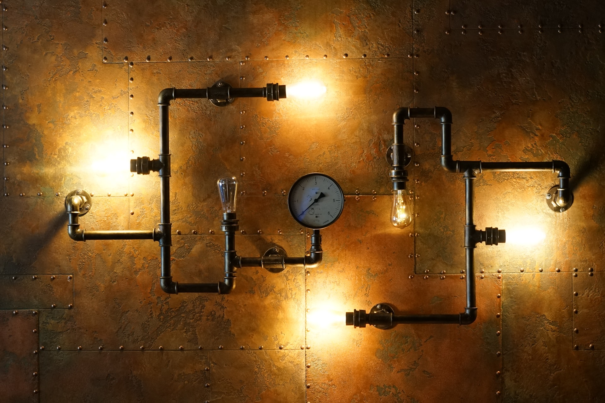
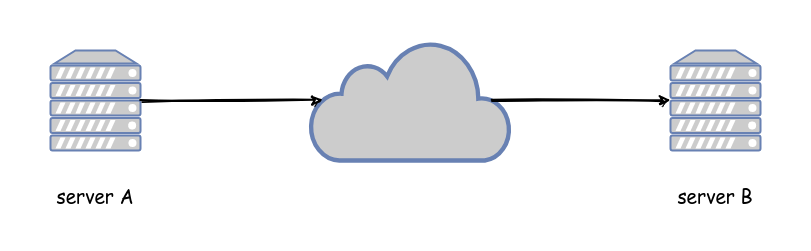
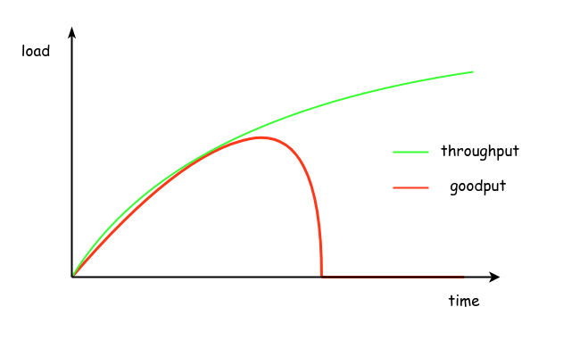
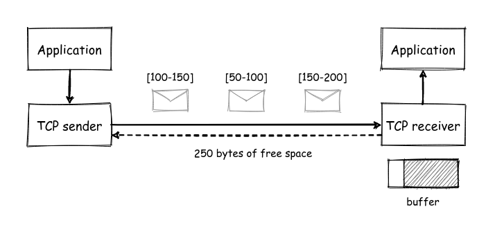
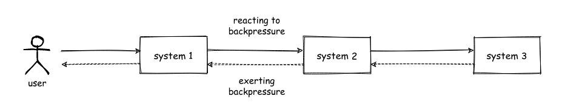

Today, I am going to talk about **backpressure** and the role it can play in building more reliable software systems. The term backpressure originates from the field of physics and it is the resistance or force opposing the desired flow of fluid through pipes. In the software world, the network that connects two different systems can be thought of as the pipe and the data that is transferred between the systems can be thought of as the fluid. This would mean backpressure in the software world could be defined in the following way:

 

> The resistance or force opposing the desired flow of data through (network)[^network_connection] connections between systems.

 

At this point, you are probably asking yourself "if backpressure is opposing the flow of data, how is it really going to help?". This would be a reasonable question, since backpressure is not going to be of any value when your systems operate as expected. It is going to help when something goes wrong. Unfortunately, "something goes wrong" is a scenario that is commonly neglected by engineers when designing and building systems, so it might feel a bit unfamiliar. Let's take a step back and think about the simplest possible distributed system we can think of: two servers communicating through the network.

Under normal operation, server A sends requests to server B that processes them and sends back the appropriate responses. However, if server A generates more load than server B can handle, this can cause serious problems. Initially, the performance of server B will start leveling off, requests will start taking longer to complete and less work will be achieved in the same amount of time. Eventually, as the generated load from server A keeps increasing, server B will become so overloaded that it will be able to do very little or no work at all and at some point it might even fall over. The diagram below illustrates this behaviour, where the generated load is shown with green color and the load processed successfully by server B is shown with red color[^goodput_throughput].In general, there can be many different reasons for the increased load, such as increased customer demand or a software bug causing more requests than necessary. So, it is infeasible to predict all these cases in advance and prevent this increase in load. However, we can build our systems in a way that makes it easier to handle this overload more gracefully. This is where the concept of backpressure becomes useful.

Conceptually, there are two different types of backpressure:

* **implicit backpressure**, which is exerted by a system naturally as a reaction to arising issues. In our previous example, the backpressure exerted from server B was implicit in the form of requests taking longer to complete or not completing at all due to overload and resource exhaustion. 
* **explicit backpressure**, which is exerted by a system in a more controlled and proactive way to prevent issues from arising. A common example of explicit backpressure is [**load shedding**](https://aws.amazon.com/builders-library/using-load-shedding-to-avoid-overload/), where a system is aware of its maximum capacity and starts rejecting requests before it becomes overloaded.

Explicit backpressure has a big advantage when compared to implicit backpressure, which is that the system is able to reject requests early on and avoid wasting more resources for them. It is thus able to sustain good performance for the load that is accepted. However, it comes at the cost of extra effort, since the system needs to be properly analysed, so that the breaking points are identified and appropriate thresholds are set. Otherwise, the system might be rejecting or accepting more requests than it should, both of which scenarios would lead to suboptimal performance for the given resources. If more requests are rejected than necessary, then suboptimal performance will be due to unused resources. On the contrary, if the system accepts more requests than it can handle, suboptimal performance wil be due to inefficient use of oversubscribed resources.

Despite all this, the backpressure exerted by a system is only one part of the equation. Unless the clients of the system respond politely to this backpressure by reducing the load they generate, the backpressure exerted by the system is not going to do much to improve the situation. This is why backpressure is a _dance for two_. The network between a system and its client is usually considered an asynchronous medium[^asynchronous_network], which means data can take infinite time to get from one point to the other. As a result, clients tend to abandon requests that take too long and in some cases retry them to recover from transient errors at the network or at the end system. In some cases, clients might even retry requests that have failed. This is why it is important to provide the necessary amount of information in the responses back to your clients, so that they can differentiate between requests that could be retried (e.g. because they failed due to a transient error) and those that shouldn't be retried (e.g. because they failed due to a permanent or semi-permanent error). In any case, a good practice for clients is to use [**exponential backoff**](https://en.wikipedia.org/wiki/Exponential_backoff) and introduce [**jitter**](https://en.wikipedia.org/wiki/Jitter) when retrying requests in order to spread the load and give the other system a chance to recover from any temporary issues. The politest of clients will also make use of a [**circuit breaker**](https://martinfowler.com/bliki/CircuitBreaker.html), which will allow them to detect when there is an increased number of failed requests on a downstream system. In this case, the client can fail any requests locally without sending them at all to the downstream system for a period of time. After a while, the client can start sending a sample of requests downstream to check if the system has recovered, in which case it can return back to the normal mode of operation. This does not only help the downstream system recover from any temporary overload, but it can also provide a better experience to the end user. For example, the downstream system might be providing some data that are not critical to the overall functionality, such as the advertisements for a product page. Instead of waiting for a long time for the advertisements and lead to a negative customer experience, the client could provide an incomplete product page that does not contain any advertisements. Depending on the business context, this might be an acceptable tradeoff. 

The TCP protocol is a great case study of how backpressure can be used in practice. TCP provides a guarantee of in-order delivery of data to the application regardless of any packet reordering happening at the network level. This is achieved by numbering data at the sender side and delivering them in the order defined by this numbering at the receiver side. In some cases, the receiver needs to hold on to some data that have arrived early before delivering them to the application, so that previous data have also arrived and can be delivered first. In theory, the memory buffers holding this temporary data can grow unbounded causing issues. For this reason, a receiver imposes a limit on these buffers and communicates the remaining space to the sender, so that the sender can stop sending data when the buffers are full. This is a nice example of explicit backpressure exerted by a TCP receiver and the graceful reaction to this backpressure from the TCP sender[^flow_control].

The examples presented so far were intentionally contrived. In more realistic scenarios, there can be many systems that will make requests to each other essentially forming a chain. Each one of those systems should be able to react to backpressure exerted by the downstream systems accordingly. This means it should help the downstream system recover, following techniques like the ones described before, but it should also exert the same amount of backpressure upstream, where there is more context on what the user is trying to achieve. The systems in the middle and at the end of the chain will exert backpressure in a relatively mainstream way, e.g. by failing requests. Systems at the start of the chain that interact directly with users will usually be able to exert backpressure in more creative ways. For instance, they could present incomplete information to the user as illustrated in the previous example or they could temporarily block user actions, e.g. by disabling an action button and showing a message "please try again in a while". This is where backpressure starts becoming a _dance for more than two_!

Of course, doing all of this requires a considerable amount of engineering effort, which might not be justified in every single case. However, this effort can be minimised by establishing common processes and tooling, so that different systems and teams can benefit from previous work. In any case, knowing what backpressure is, what is the difference between implicit and explicit backpressure and how you can exert it and react to it is a very good first step towards building more reliable software systems.

 

-------------------------------------------------------

 

[^network_connection]: The _network_ part was put into parentheses on purpose. The reason is backpressure can also exist within a single software system, e.g. between two different components exchanging data via memory, intead of going through the network. However, the benefits of backpressure manifest more strongly in distributed systems communicating through the network, so we will focus on this scenario here. Of course, this does not mean the same principles cannot be applied in the general case.
[^goodput_throughput]: The generated load is sometimes called throughput, whereas the load that is successfully processed is called goodput.
[^flow_control]: In TCP parlance, this is known as flow control.
[^asynchronous_network]: This is especially true in public networks, like the Internet, where data need to go through multiple intermediaries that are simultaneously used by many other systems and can be overloaded themselves.
