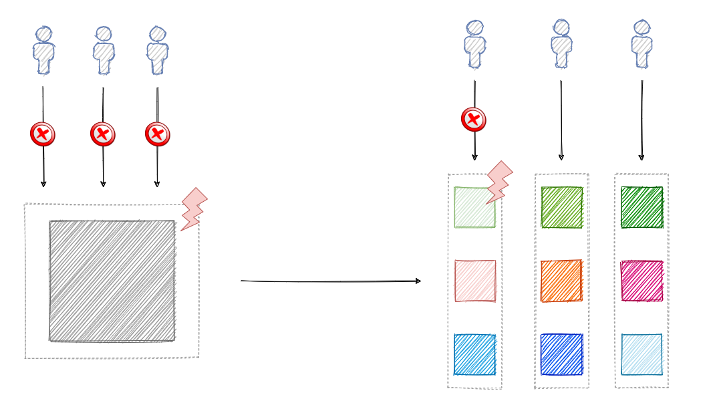
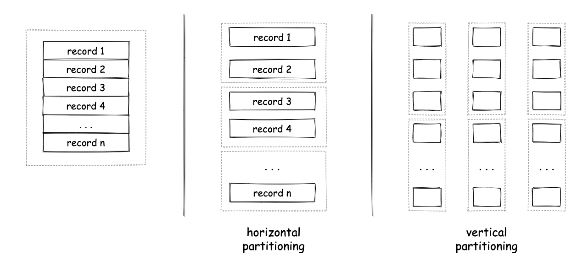
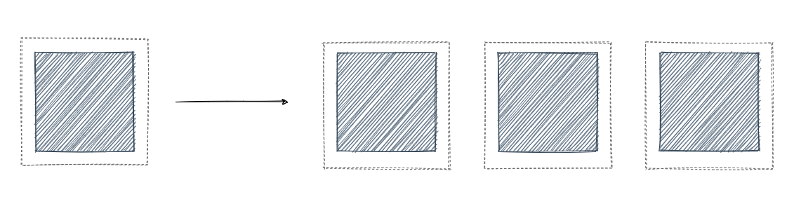
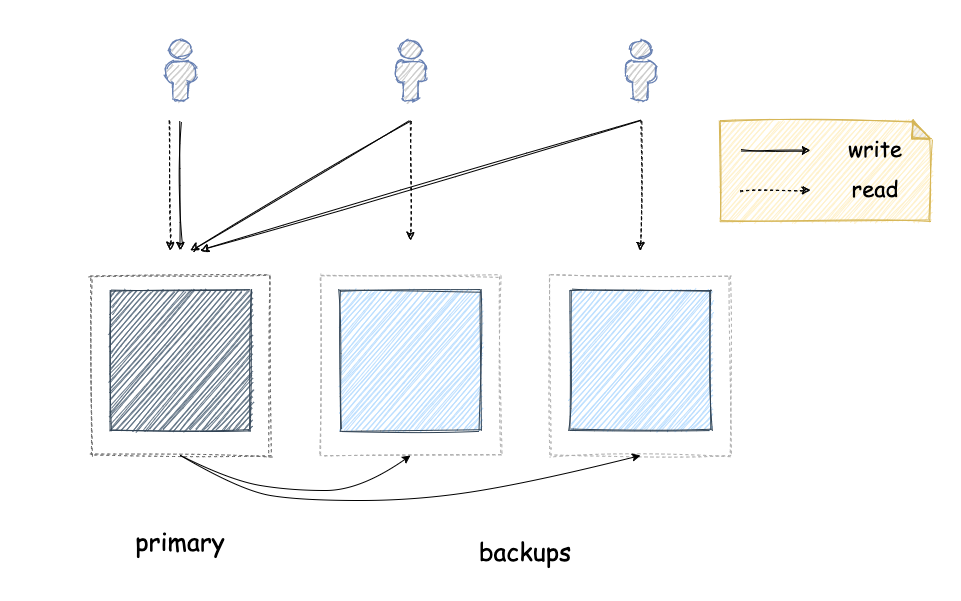
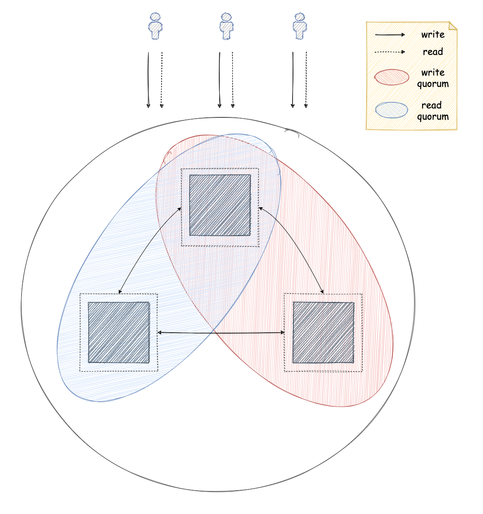
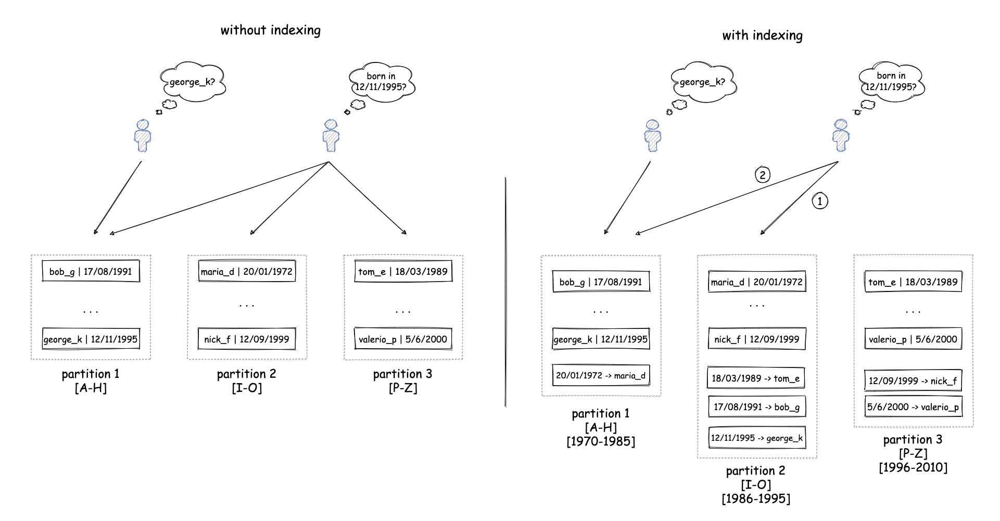
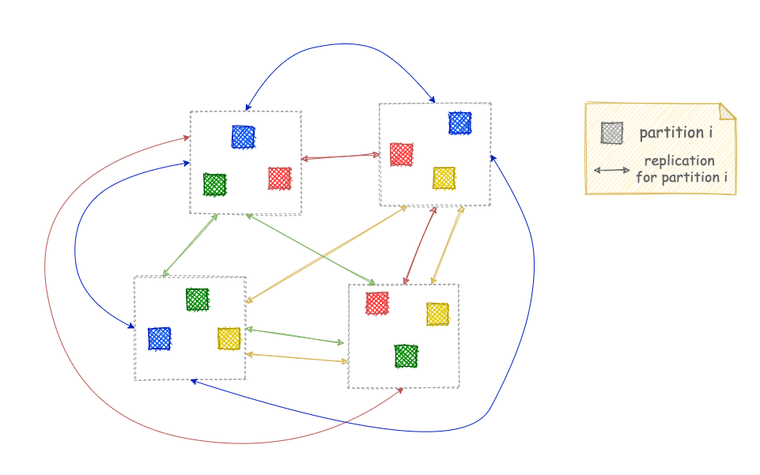

In this blog post, I will talk about the two cornerstone concepts in the field of distributed systems: partitioning and replication. I will provide a quick introduction on what they actually are, the benefits they can provide, the challenges they present and how they are used in practice.

## Partitioning

**Partitioning** is the process of splitting the data of a software system into smaller, independent units. Each one of those units is typicalled called a **partition**. We can then assign one or more partitions to a single machine, where this machine will be responsible for serving requests for the associated data. These requests can generally belong in two main categories: requests that retrieve some data (read requests) and requests that update some data or create new data (write requests).  

Partitioning a system can provide several benefits. First of all, the system becomes fault-tolerant to failures. Failure of a single machine means only the affected partitions are impacted and users accessing data from the other partitions can continue using the system. That is in contrast to a non-partitioned system hosted in a single machine, where failure of that machine can bring the whole system down for all of its users.

Partitioning a system also makes it easier to scale. In a non-partitioned system hosted in a single machine, as the user base increases and the system needs to handle a bigger workload, the main approach is to replace this machine with a more powerful machine. This can get quite expensive as one goes to more and more powerful hardware, since the cost does not scale linearly with the specs of the hardware. Another issue with this approach is that hardware is subject to physical constraints, so it cannot scale infinitely. A partitioned system can be adjusted to handle a larger workload by creating more partitions and distributing them on more machines. In this approach, the system can also use relatively low-spec machines, which are typically more cost-efficient.

Apart from scalability and fault-tolerance, a partitioned system can also provide better and more reliable performance. This is thanks to the fact that each each machine needs to handle a smaller workload and can serve it more efficiently. There is also less interference between workloads from different partitions. That is in contrast to a non-partitioned system, where all requests access the same resources and can thus affect each other negatively.

Of course, the concept of partitioning can be implemented in many different ways even though the idea remains the same. A basic differentiation is between vertical and horizontal partitioning. **Horizontal partitioning** is when you split a dataset, so that each data record (e.g. a row in a relational database) is kept as a whole in a single partition. This means each partition can hold one or more data records. **Vertical partitioning** is when you split a dataset, so that each data record is split into pieces and each piece can be assigned to a different partition. This means each partition can hold pieces from multiple records, but each partition might not necessarily contain a data record as a whole. For example, if your dataset contained one record for each one of your users and each record contained multiple attributes for each user (e.g. user name, profile photo etc.), then assigning the full record for a user to one partition would be a form of horizontal partitiong and splitting the attributes of each record and storing them in separate partitions would be a form of vertical partitioning. Of course, each approach has its own pros and cons.

In order to partition data, one also needs a way to determine the partition a piece of data will be assigned to. There are many different algorithms to do this, but I can't cover those here. Some examples are round-robing partitioning, hash partitioning, consistent hashing, range partitioning etc.

## Replication

**Replication** is the process of creating multiple copies of the same data and storing them into multiple machines. Each one of these copies is typically called a **replica**.

The main benefit of replication is increased fault tolerance. Since the same data is stored redundantly in multiple machines, the whole system can tolerate failure of one or more machines since the users can access the data from a different machine that functions normally.

## Challenges

I have now explained the main benefits of these techniques, so it is time to look at some of the challenges they present. Let's start the other way around now looking at replication first.

As explained before, different replicas contain the same data. This means that any changes to the dataset need to be performed on all the replicas in a controlled way. Otherwise, there is a risk of having different data on each one of the replicas. This can create a lot of thorny issues. I will explain through a basic example. Imagine a system that stores the bank balances of users. Now think what would happen if a user tries to deposit some money to his account, one of the replicas handles the request successfully with the user completing the transaction, but then the machine fails. The user then tries to check his balance, but the request is sent to a different replica (as the original has crashed) that hasn't seen the original deposit request and is thus showing to the user his old balance.

For this reason, systems that make use of replication usually make an effort to ensure any updates to the dataset are done in a safe way, so that issues like that don't happen. This is done through a sophisticated set of rules that define how different replicas communicate when an update needs to be performed and when a request should be considered successful. These are known as **replication protocols**. The two main replication protocols known widely are the **primary-backup replication** and **consensus-based replication**.

In primary-backup replication, one of the replicas is designated as the primary and the other replicas are the backups. All the write requests need to go through the primary replica, which is then responsible for making sure the backup replicas have also performed them before acknowledging to the client that the request has been completed. As a result, backup replicas can only serve read requests. If the primary replica fails, then one of the backup replicas needs to be designated as the new primary. Until this has happened, no write requests can be served.

In consensus-based replication, any of the replicas can process write or read requests. However, in order to do this they have to communicate with the other replicas to make sure any read requests return the right data and write requests will update all the replicas properly. In other words, they ensure all the replicas are in agreement or consensus, hence the name. The simplest way to do this is by creating groups of replicas that have to coordinate with each other to process read or write requests. Such a group is typically called a quorum. The simplest protocols make use of majority quorums, which are groups that contain more than half the replicas. When using majority quorums, replicas make sure write requests have been performed to more than half of the replicas (> 50%). In the same way, read requests read data from more than half of the replicas. In this way, replicas can ensure every read request reflects all the completed write requests as the read and the write quorums will always contain one replica that has seen all the write requests so far. Of course, the actual protocol is a lot more complicated than this, so I won't go into more detail here. Some examples of consensus-based replication protocols are [Raft](https://raft.github.io) and [Paxos](https://en.wikipedia.org/wiki/Paxos_(computer_science)).

In some cases, replication is also used to improve the scalability of a system on top of making it more fault tolerant. For example, in a primary-backup replication setup where the workload is predominantly composed of read requests, one can add more backup replicas which can then serve some of those read requests reducing the load on the other replicas. However, more backup replicas means more coordination needed by the primary to propagate any write requests to them. So, this is an especially tricky territory with subtle trade-offs one needs to consider.

I hope some of the challenges around replication have now become clear, so I will move on to partitioning. Challenges around partitioning might differ a bit, but they are caused by the same underlying constraints.

One challenge around partitioning is the fact that you have to decide how you want to partition the data. Usually, the way you partition the data depends on how you access it most frequently, so that you can access it in an efficient way. For example, if you are typically searching data for a single user based on their username, then you can use the username of a user as a partition key. This will allow your system to quickly locate the partition that contains a user with a specific username and retrieve the corresponding record. However, there are cases where a system needs to access data in different ways. For example, your system might also need to find a user based on their date of birth or some other attribute. This might mean the system needs to search the whole dataset, thus accessing all the partitions, which will negate some of the benefits derived from partitioning. For example, single-machine failures can make the whole system unavailable again. One way to avoid this is to create indexes based on those additional attributes, which can be used to find which partition holds a record and then search only this partition. However, this index will also need to be partitioned, which means any write request will generate two updates on the underlying system, one for the actual data and one for each index. If a data record and the corresponding records for its indexes reside on separate machines, we face similar challenges as described above for replication[^cross_partition_coordination].

So far we have looked at requests that access a single data item. However, there are cases where an application might need to access multiple data items that can potentially reside in different partitions. In our previous example with the banking application, you could think of the case where a payment request needs to update the balance of two different accounts. This needs to be done in a safe way to avoid requests seeing data from other requests that haven't completed yet (what's known as [isolation](https://en.wikipedia.org/wiki/Isolation_(database_systems))) or failing in a partial way that only updates some partitions (what's known as [atomicity](https://en.wikipedia.org/wiki/Atomicity_(database_systems))). There are many protocols that can help with this, such as [two-phase locking](https://en.wikipedia.org/wiki/Two-phase_locking) for isolation or [two-phase commit](https://en.wikipedia.org/wiki/Two-phase_commit_protocol) for atomicity. However, naturally these protocols require communication between partitions, which can have a negative impact on performance and fault-tolerance.

## Combining partitioning with replication

Finally, there are many systems that employ both replication and partitioning. In this way, they can reap the benefits of both techniques, but they are also subject to the limitations of both. The common pattern of doing this is splitting the dataset into separate partitions and then creating multiple replicas for each partition. The replicas for each partition coordinate with each other as I explained above to complete requests. The system decides whether it also requires communication across partitions depending on what kind of operations and guarantees it needs to provide to its users.

:books: By the way, if you liked this post you might also enjoy my book [**Distributed Systems for practitioners**](https://distsysbook.co.uk).

 

-------------------------------------------------------

 

[^cross_partition_coordination]: This is the reason why some partitioned systems, such as [DynamoDB](https://aws.amazon.com/dynamodb) or [Cassandra](https://cassandra.apache.org), do not guarantee indexes will be [up-to-date immediately](https://docs.aws.amazon.com/amazondynamodb/latest/developerguide/GSI.html#GSI.Writes) after a write request completes or might have to [search all the partitions](https://docs.datastax.com/en/cql-oss/3.3/cql/cql_using/useSecondaryIndex.html) thus making requests very slow. There are systems that avoid both of those issues by using more sophisticated protocols to ensure that the data and any indexes are updated in a consistent way across multiple machines. However, these protocols introduce coordination between partitions which in turn compromises the fault-tolerance and performance of the system.

