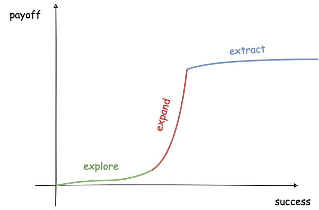
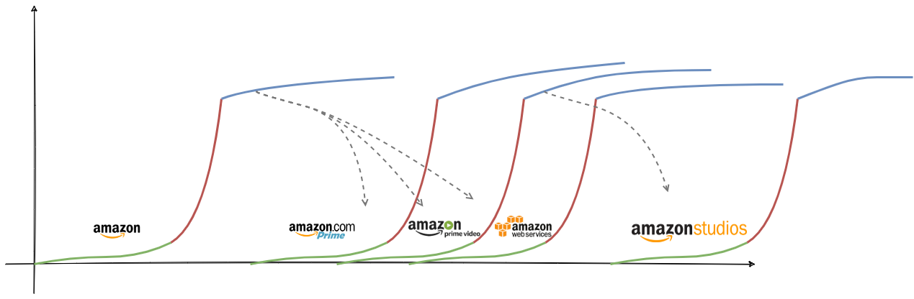

A few weeks ago, I learned about Kent Beck's 3X framework. I found it quite simple to understand, yet extremely insightful at the same time. I believe it can be a very useful tool for decision making, especially for software engineers and engineering leaders. So, I decided to dedicate today's blog post to it.

## A quick intro to 3X

3X stands for Explore / Expand / Extract, which are the 3 major phases a software product can go through according this model:

* **Explore** is the initial stage, where we usually don't know yet what the product might look like. As a result, we are exploring to find out what the user of that product would really want it to be like. There are different ways to do that, e.g. via focus groups or via a very early and rough-edged MVP. However, they all have the same goal and operate under the same constraints. The goal is to find out what the customer wants and the main constraint is the product is not successful yet, so this exploration process needs to be as quick and cost-efficient as possible. As a result, a common strategy at this phase is to try many different experiments and see what sticks. As Kent says, the possibility of success for every experiment is low, but the payoff for those few that succeed can be large. This is what the spike represents at the end of the explore phase, it is the point where you have identified that one experiment that seems to be extremely successful. 
* **Expand** is the second phase, where you have worked on improving the initial experiment that proved promising and you now start seeing extreme user growth. Everybody wants to use your product. A common phenomenon in this phase is scaling bottlenecks start to manifest and can prevent existing or new users from enjoying your product. At this phase, you are typically scrambling to find a way to remove one bottleneck after the other in order to keep the product from falling flat on its face and cause all the customers to run away. The main goal of this phase is to keep the product _alive_. The payoff at this phase is really high, since word of mouth keeps bringing many new users every day. However, this phase is not sustainable in the long term as you might be doing things in suboptimal ways just to keep everything up and running.
* **Extract** is the third phase, where you start getting a good grasp of what the problem space is. In this phase, you might also realise what parts of the problem space are worth tackling and what parts are not going to provide a lot of value to you and can be ignored. The main goal of this phase is to make the product sustainable in the long term. In order to do this, among other things you need to find a way to fund everything required to sustain the product. As a result, you will be looking for ways to reduce the costs and increase profits. In the previous phase, you were probably solving problems in suboptimal ways to survive, but in this phase you will need to revisit some of these approaches and optimise them to cut down costs. Another differentiator with the previous phase is during expand you don't care so much about monetisation as long as you keep the user growth in its natural increasing trend, but during extract you care about monetisation so work is prioritised based on what will bring the most value[^value_not_money]. In this phase, payoffs are typically small in relative terms, but they can translate to a bigger payoff in absolute terms. For example, some new functionality might bring a 0.5% increase in profit. This seems small, but it might translate to 5 million dollars for a product with 1 billion dollars revenue.

The transition between these phases is triggered by different actors. The transition between the explore phase and the expand phase is typically triggered by the market. As you throw different experiments to users, they are the ones that decide which one of them will take off. In contrast, the transition from the expand phase to the extract phase is decided by those who build the product or those who make decision about the process of building it. Sometimes, this transition is also regulated by other constraining factors. For example, the population of the Earth in combination the with access of people from different countries to technology can set an upper bound to the user growth of your product[^facebook_user_base]. Some of these transitions might never happen for a product. For example, you might run out of money or time before finding out an experiment that works during the exploration phase. Alternatively, you might fail to remove the right bottlenecks during the expand phase.

An organisation can also run many products concurrently and each one of them can be in a different phase. It might also be the case that the transition of one product triggers a transition for another product. Amazon products are a good example of this. The success of retail led to experimentation around the Prime offering and subsequently Amazon video, which created the opportunity for bundling with preexisting products. The need for cost reduction and more efficient utilisation of computing resources created the opportunity for Amazon Web Services (AWS). Later on, the adoption and success of Amazon Video provided the necessary capital for Amazon to create their own production channel, called Amazon Studios.

## Thinking in 3X

This model can help guide how people think and make decisions from different divisions of an organisation. Different phases require a different mindset and behaviour. This can have implications on different areas, but let's have a look at a couple of them here focused mostly on the aspect of building & operating software:

* The software development process can differ significantly between these phases. For example, when you are in an exploration phase, it makes sense to put your "hacker" hat on and sidestep some practices that are extremely useful in other scenarios. Extremely thorough testing and quality control in this phase might be a waste of resources as the end result might just be thrown away if it's not attractive to users. In fact, testing a hypothesis by writing the minimum amount of software might be the wisest choice in this phase[^lean_startup]. However, as you move on to the extract phase, quality control becomes extremely important as small mistakes can lead to very large reputational damage when you have a big user base. This is where you start adding guardrails on what needs to be done when software is delivered, such as load testing, canary releases etc. Taking more time to release software might be a good trade-off in this phase, as the expected payoff in absolute terms can outweigh the time spent.
* How much time you spend on analysing problems or solutions can also differ. In the expand phase, what you care about is whether and how fast you can solve the problem at hand to prevent the product from failing in the users' hands. The cost of the solution might become a second priority. However, when you are in the extract phase, you want to make sure you are extracting value in the most efficient way, so cost is a primary factor in decision making. As a result, technical solutions to a problem might need to be analysed in more detail. In the extract phase, organisations end up with checklists and guidelines on how to solve common problems, such as releasing a new service in production or expanding an existing service to a new country. Problems that need to be solved many times are sometimes better solved centrally by a bigger team. For example, during the expand phase you might let teams build their own monitoring infrastructure, but during the extract phase you can consolidate all this infrastructure and let a single team run and improve it. Other teams can rely on this team to enable them to do things like A/B testing, alarming etc.
* How teams are structured and perform their daily work can differ. The skills needed to succeed in each one of those phases are different, so teams need to be structured accordingly. People that perform well in environments with extreme uncertainty (see exploration phase) might not feel very comfortable in environments that are risk averse (see extract phase). Working overtime might be acceptable temporarily during the expand phase, but it is not sustainable in the long term so it would be a red flag if observed regularly during the extract phase.

As you might have realised, each one of those phases imposes different trade-offs and there are many areas that are affected by these trade-offs. These were just a few examples for the sake of illustration.

## More resources

This was a brief introductory post on purpose. There are many more resources on the topic if you are interested. Here are some of them:

* This is (I _believe_) the original post from Kent introducing the concept: https://medium.com/@kentbeck_7670/the-product-development-triathlon-6464e2763c46
* This is one of the talks[^3x_talk] Kent gave a few years ago for the auditory learners amongst you: https://www.youtube.com/watch?v=YGhS8VQpS6s
* This is a set of essays also written by Kent on various areas and how they differ across phases: https://www.facebook.com/notes/kent-beck/comparing-explore-expand-and-extract-topics-in-3x/1241983035834558/
* Of course, there are many more resources that would take too much space to list here. However, the following post has a quite thorough list containing many of those: https://medium.com/@plindberg/kent-becks-3x-87088712d8aa

 

-------------------------------------------------------

 

[^value_not_money]: Of course, value does not directly translate to money in all cases, but it usually has second order effects on money. For example, providing a new feature for free will not increase profits directly, but it might increase your user base which can then increase the number of premium customers that pay for some other non-free features.
[^facebook_user_base]: As an example, by 2021 [almost 25% of the Earth's total population](https://www.statista.com/statistics/241552/share-of-global-population-using-facebook-by-region/) was using Facebook.
[^lean_startup]: As Eric Ries explains in the book "The Lean Startup", creating a fake button in a website to gauge potential interest from users might be all you need.
[^3x_talk]: I have personally watched this video when I first learned about the concept and I thoroughly enjoyed it. Apart from the thorough coverage of the topic, this talk also contains these rare bits where Kent will naturally diverge and start making jokes that I enjoy equally.

