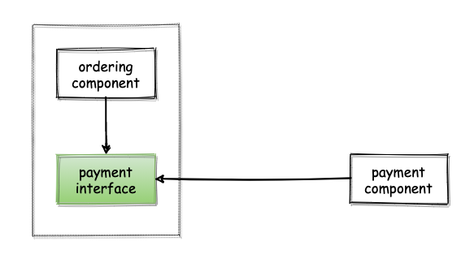
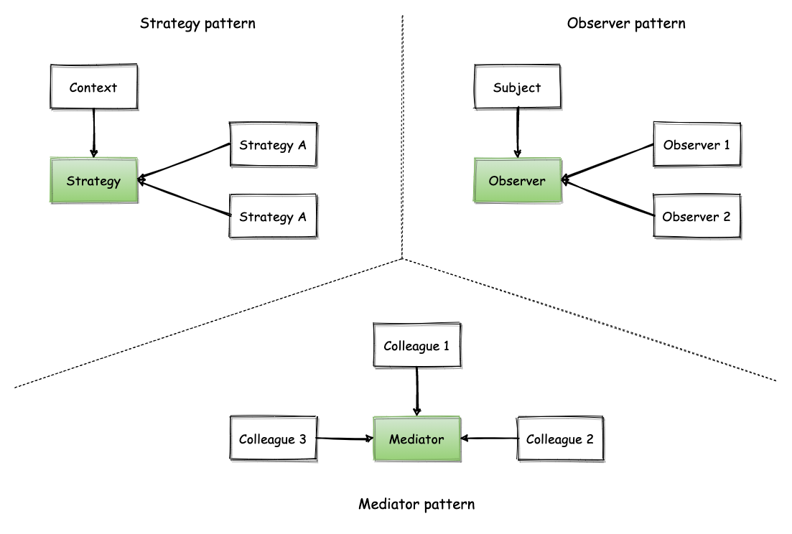
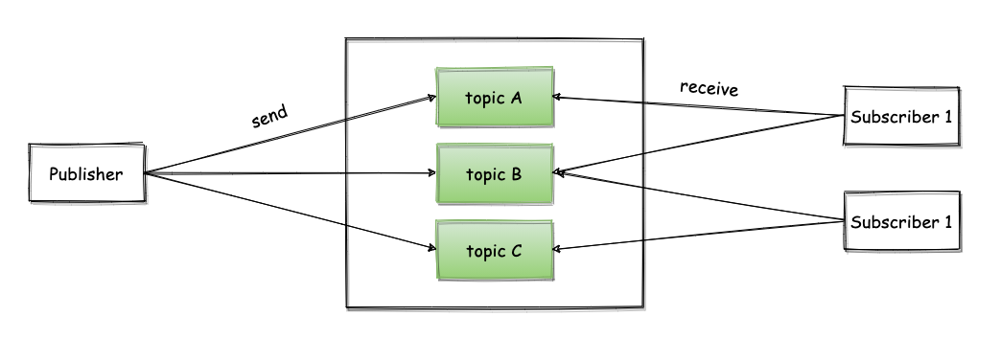
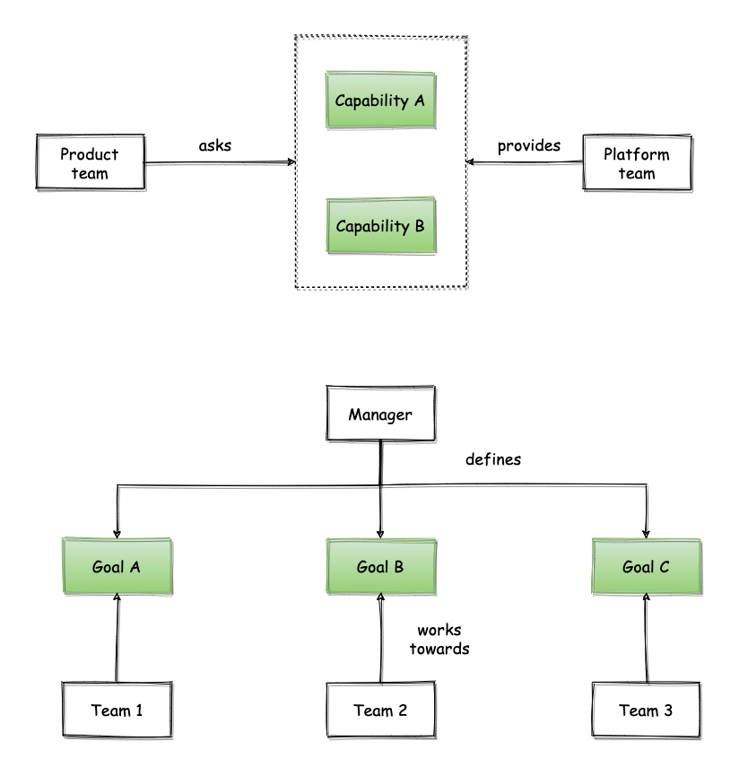

From time to time, I have these quirky ideas floating around in my mind. I find the best way to stop thinking about them is to write them down. This is one of these cases. Today, it is about the concept of dependency inversion.

Dependency inversion is one of the concepts that confused me most when I started writing software. I still remember myself going blog post after blog post trying to understand what it really means and what are the benefits to be gained from using it. After all, isn't dependency an inherent structural property of a system? Or is it really something malleable that can be adjusted by the designers of a system depending on requirements?

As I kept working with software and people, I started realising dependency inversion is not just a software development practice, but a general philosophy that can be applied more widely. In this blog post, I will try and share what I mean by that.

## A quick intro to dependency inversion

Let's start with a trivial example for those of you that haven't heard of the concept before. Dependency inversion is part of a wider set of principles, known as [SOLID principles](https://en.wikipedia.org/wiki/SOLID), intended to make software more understandable, flexible and maintainable. It's one of the concepts software engineers come across when they start reading about how to write better software.

The principle advocates the inversion of a common dependency created between components[^dependency_direction]. As an example, imagine a software component that is responsible for accepting customer orders and makes use of a separate component responsible for performing payments for these orders. This could be built in the following way:

Here, the ordering component invokes the payment component before proceeding with the fullfilment of the order. Following the dependency inversion principle, one could invert this dependency in the following way:

* The ordering component would define the set of behaviours required for the purpose of performing payments. In practical terms, this would typically be an interface that contains a set of methods that need to be implemented.
* The components that are able to perform payments would then have to implement this interface, thus satisfying the requirements set by the ordering components. This effectively reverses the dependency to be from the payment component towards the ordering component.
* From a static point of view, the ordering component would not depend anymore on the payment component. Instead, it would depend on the generic payment interface it has defined. From a dynamic / runtime point of view, the ordering component would depend on whatever realisation of this interface is used. 

This provides several benefits:

* pluggability: multiple, different payment methods can easily be implemented and injected at runtime. In some cases, this can even be done without even having to recompile or restart running software components.
* behaviour contracts: the definition of this interface naturally establishes a stricter contract on what are the behaviours expected from those that provide implementations for it. This is in contrast to the original situation, where the ordering component will just have to live with whatever the behaviour is of the payment component that needs to be used.

As always, there are also drawbacks:

* extra work: defining the interface and its behaviour contract introduces extra development effort, coordination between teams and generally upfront work to make sure the interface is fit for purpose
* flexibility: it is possible that the interface defines a rigid set of behaviours that are hard to be satisfied by different payment methods. This is usually something that can be mitigated by thinking more carefully when designing that interface. However, that is always a difficult exercise that becomes even harder if you have to design an interface at a point in time where you don't have multiple, concrete cases to draw requirements from. In some cases, it might even be physically impossible to define an interface that can capture behaviours that are contradicting each other. As a contrived example, think of the difference between synchronous and asynchronous payments and how forcing both under a single interface could lead to problematic situations when looking at the integrity of the overall system.
* mental overhead: each one of those interfaces introduces an extra step of indirection. So, the more of them you have the harder it might become to navigate a codebase and reason about the overall system. The fact that static dependencies are essentially converted into runtime dependencies can sometimes make it harder to understand how the various pieces of the system will interact during execution.

## Dependency inversion & design patterns

Software design patterns is another concept that is commonly studied by people that are relatively new to software development and want to become better in solving problems in the best possible way. There are so many design patterns nowadays that it's probably impossible to remember them all. However, if you look closely you might observe that dependency inversion is the foundation behind many of them. A few examples are the [strategy pattern](https://en.wikipedia.org/wiki/Strategy_pattern), the [observer pattern](https://en.wikipedia.org/wiki/Observer_pattern) or the [mediator pattern](https://en.wikipedia.org/wiki/Mediator_pattern). I find this useful, because it is easier to rely on an overarching principle that guides your design rather than trying to pattern match your problem to identify a design pattern within a huge pool of patterns[^design_patterns].

## Dependency inversion & system design

Dependency inversion has practical value even when designing systems. The [pub-sub pattern](https://en.wikipedia.org/wiki/Publish%E2%80%93subscribe_pattern) for architecting systems is a striking example. Instead of having the sender depend on all the recipients of a message, the sender only defines the structure of the message and the location where messages will be delivered and the recipients depend on them to receive messages and process them.

## Dependency inversion & organisational design

If I were to go out on a limb, I would say that even organisational design makes use of dependency inversion in many cases. Think about the interaction between an internal platform team and a "product" development team making use of platform capabilities to build a software product. What would you say is the direction of the dependency here, e.g. does the product team depend on the platform team? Maybe, but are there cases where the product team defines what's the problem that needs to be solved and the platform team provides a concrete solution for it? Same could apply in other situations. For example, a person might be managing 3 different teams, which means it depends on them to achieve the desired outcome. At the same time though, the manager might only define the business problem each team needs to solve and the teams then initiate any communication needed from their side, such as asking for extra information when needed or reporting progress on objectives defined by their manager. Stretching this idea further, the manager could determine goals that are even more high-level and pertain to the organisation as a whole and let the teams define their team-specific goals that will contribute to these organisation-wide goals[^kpi].

 

-------------------------------------------------------

 

[^dependency_direction]: Usually, this principle refers to dependencies from so-called high-level (policy-setting) modules to low-level modules. However, it can be applied more universally regardless of the abstraction level, as shown by the example here.
[^design_patterns]: I also believe this is part of the reason people that develop software tend to have a love-hate relationship with design patterns. They are useful, but they are too many and some of them tackle very similar problems which reduces the density of information they can provide. This is why a principle can provide more clear guidance sometimes. However, this is a big topic that deserves a separate discussion.
[^kpi]: This is an approach increasingly followed by organisations nowadays, which gives teams more autonomy to define not only how they are going to solve a problem, but also which problems they need to focus on solving. These goals are commonly known as [key performace indicators (KPIs)](https://en.wikipedia.org/wiki/Performance_indicator).