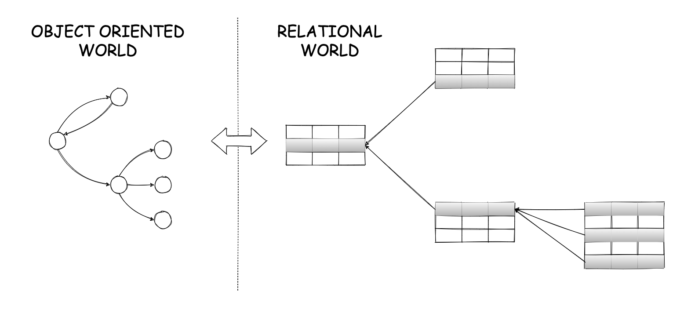

Whether one should use an object-relational mapping (ORM) framework or not tends to be one of the most controversial topics in the software engineering world. This is not because people like to argue[^engineering_arguments], but because it is something that is inherently difficult and not an easy decision to make.

ORM frameworks are typically considered in situations, where an application is developed using object-oriented programming and some business data also need to be stored on a relational database. There is a natural tension between these two models, which is known as as the object-relational impedance mismatch. The in-memory objects that are used by the application form a graph, which might contain both unidirectional and bidirectional relationships, i.e. object references can potentially be circular. In contrast, the data in the relational database are represented in a tabular form, where relationships can only have a unidirectional direction in the form of foreign keys between different tables. This structural difference is the main tension between these two worlds, but not the only one. In-memory objects can usually be traversed in any way desired by an application with minimal performance cost. However, databases typically retrieve data from persistent storage[^database_caching], which tends to be significantly slower than memory. The direct implication is that the way an application tries to access data can make a big difference performance-wise. Another crucial difference has to do with concurrency control and partial failures. Applications rarely have to consider what happens if an operation that processes data in-memory fails midway, as any data that were mutated in-memory will be lost anyway. This is not the case for relational databases, where data might have been changed in the persistent storage. This is one of the reasons relational databases provide the concept of ACID transactions that can be used by the application to specify atomic units of work that are guaranteed to either by executed completely or not at all by the relational database. An ORM framework is essentially trying to bridge these two worlds.

## Benefits of using an ORM framework

Let's have a quick look at some of the benefits typically promised by ORM frameworks:

* ORM frameworks can save you from writing a lot of boilerplate code. If you don't use an ORM framework, some of the things the application will have to do are crafting SQL queries, iterating over the results and building the in-memory objects by translating between columns and the corresponding fields. In contrast, when using an ORM framework you typically define a class, which you then decorate with annotations that specify the table name for that class, the column name for each field etc. When you want to retrieve data from the database, you can perform a query using an API provided by the ORM framework, where you specify the class you want to retrieve and some query criteria. In the simplest case, you can just specify the identifier for that object. The ORM framework will take care of crafting the necessary SQL query and converting the results, giving you back an in-memory object. This annotation-based technique can also help you map associations between objects into their relational equivalents relatively easily. This usually implies a couple more annotations specifying for each field that acts as a reference between two different classes which tables are used in the relational database for this mapping, and any relevant foreign keys if necessary. Some ORM frameworks even allow you to map class inheritance structures to their relational equivalents.
* ORM frameworks can help you easily migrate between different relational databases if you need to, since they can translate object queries to any of the underlying database transparently to the application. Going even further, if you use standards like the Java Persistence API (JPA), you can even migrate between different ORM frameworks with minimal code changes as both of them will essentially implement the same APIs.
* ORM frameworks typically promise increased performance, when compared to directly querying the database. Performance improvements come in different forms. Some ORM frameworks support two different modes of data fetching, eager and lazy. This allows the application to define whether all data for an object graph need to be fetched immediately or pieces of data can be fetched incrementally as they are used by the application. Some frameworks provide optimisations for generating identities via bulk reservation of identifiers from the database thus reducing the number of round trips. Some frameworks provide caches that can be scoped either per session/transaction or globally scoped for the whole application, which can help reduce the load to the database and network traffic in general. 

## Pitfalls of using an ORM framework

Time to play devil's advocate. Surely, there are pitfalls, right? Here are some of them:

* As explained above, you can get much more productive by letting the framework write all the boilerplate code around SQL query generation and result parsing. However, there are cases where this might be done in a suboptimal way, which means you will have to investigate what the framework really does under the hood. Many frameworks allow you to instruct them to log all the queries they generate. So, if you want to be really cautious and avoid performance issues in production, you might end up sanity checking all the generated queries as you add new functionality. This can reduce the productivity benefits from code generation. However, there is a bigger more fundamental risk here. People that make use of an ORM framework might start building an application from their domain model leaving the modelling of the persistence layer as the last step, trusting that the framework will do the mapping properly. This can be a recipe for disaster especially for applications that are performance sensitive, since it might not be easy to create a mapping that will give satisfactory performance. There is also a discussion to be made on whether some of these things are really meant to be mapped or they are best left separate. For example, do you really want to map inheritance relationships to the persistence layer?
* The topic of migrating between different databases is one that comes up quite often. However, I haven't seen an actual migration been performed by a company that often. Data have some form of gravity, which makes it quite hard to migrate from one database system to another one. This becomes harder the bigger the datasets are and the most critical an application is for a business, since migrations naturally come with availability risks. Moreover, the fact that you are not using an ORM framework doesn't necessarily mean you cannot easily migrate an application to a different database system. For example, if you stick to using the standard SQL APIs most relational databases support, the code changes needed to migrate between them will be minimal. In many cases, these APIs are perfectly sufficient, so this is not a purely theoretical example.
* Last, ORM frameworks can help you achieve a really good performance, but there are some caveats attached. First of all, in order to get good experience you will need to become an expert in using these frameworks, since they contain many different levers. You will need to spend a considerable amount of time to understand the different ways each one of those levers can be used and how they might interact with each other. Second, some performance optimisations might end up creating counter-intuitive results and leaky abstractions. For example, a developer might expect that accessing an object field is an in-memory operation, so it should be very fast and always available. However, this will not be the case if you are using lazy fetching as this might require a query to the database, which can be much slower or even not responding at all if the database has failed or is overloaded.

One thing that is worth thinking about is: do we really need to bridge these two worlds? Separation of concerns is a very useful design principle to consider here. These two worlds are addressing slightly different concerns, so it might be worth keeping them separate.

## Conclusion

If you read this post hoping to get an answer about whether or not you should use an ORM framework, I am afraid I will have to disappoint you. This decision is yours to make. I can only hope I provided you with some extra data points you can use to make a more informed decision.

 

-------------------------------------------------------

 

[^engineering_arguments]: Well, truth be told, we engineers tend to get quite argumentative at times, but I'll ignore this for now.
[^database_caching]: In general, databases also employ some form of caching in-memory to improve performance, but this is only an optimisation that cannot be taken for granted as not all data can be stored in memory in most cases.