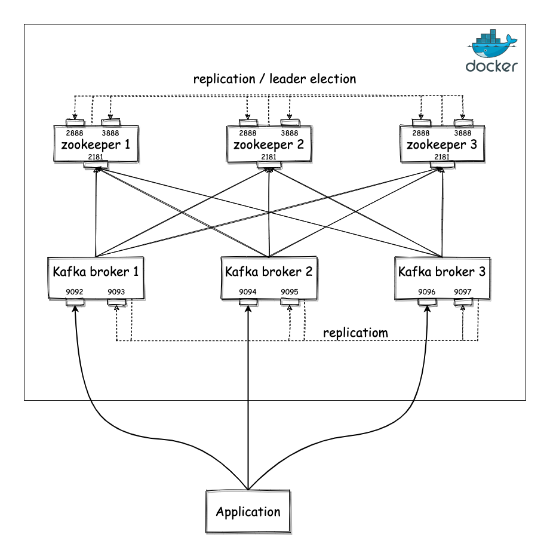

  


I suspect that if you ended up on this article, you probably already know what Apache Kafka is and you are already considering making it part of your system, which means you have to perform the necessary testing to ensure your system works as expected. Being a distributed system, Kafka consists of many different moving parts you need to operate making this process complicated and time consuming, especially for people that are not familiar with all the intricacies involved[^stub_caveat]. This article will give you an easy way to spin up a cluster locally, which you can use for testing. We will do that using Docker, but I assume you are already familiar with what Docker is. If that is not the case, I would suggest familiarising yourself with Docker a bit first.

After following the instructions in this article, you will run a system that will look like the following:



Briefly, it will contain a Zookeeper cluster of 3 nodes and a Kafka cluster of 3 nodes connected to the Zookeeper cluster for coordination purposes[^zookeeper]. The ports of the Kafka brokers will be exposed outside Docker, so you can connect your application to Kafka.

We will use Docker Compose to deploy this environment, so you first have to make sure you have installed this locally. The next step is to create a file that will contain the definition of the environment, you can call it `kafka-cluster.yml`. The content of the file will be the following:
```
version: '3.4'

x-common-variables: &kafka-common-variables
  KAFKA_MIN_INSYNC_REPLICAS: 2
  KAFKA_DEFAULT_REPLICATION_FACTOR: 3
  KAFKA_NUM_PARTITIONS: 5


services:
  zoo1:
    image: zookeeper:3.7.0
    restart: "no"
    hostname: zoo1
    container_name: zoo1
    ports:
      - 2181:2181
    volumes:
      - ./data/zookeeper1/data:/data
      - ./data/zookeeper1/datalog:/datalog
    environment:
      ZOO_MY_ID: 1
      ZOO_SERVERS: server.1=0.0.0.0:2888:3888;2181 server.2=zoo2:2888:3888;2181 server.3=zoo3:2888:3888;2181

  zoo2:
    image: zookeeper:3.7.0
    restart: "no"
    hostname: zoo2
    container_name: zoo2
    ports:
      - 2182:2181
    volumes:
      - ./data/zookeeper2/data:/data
      - ./data/zookeeper2/datalog:/datalog
    environment:
      ZOO_MY_ID: 2
      ZOO_SERVERS: server.1=zoo1:2888:3888;2181 server.2=0.0.0.0:2888:3888;2181 server.3=zoo3:2888:3888;2181

  zoo3:
    image: zookeeper:3.7.0
    restart: "no"
    hostname: zoo3
    container_name: zoo3
    ports:
      - 2183:2181
    volumes:
      - ./data/zookeeper3/data:/data
      - ./data/zookeeper3/datalog:/datalog
    environment:
      ZOO_MY_ID: 3
      ZOO_SERVERS: server.1=zoo1:2888:3888;2181 server.2=zoo2:2888:3888;2181 server.3=0.0.0.0:2888:3888;2181

  broker1:
    image: confluentinc/cp-kafka:6.1.1
    restart: "no"
    hostname: broker1
    container_name: broker1
    depends_on:
      - zoo1
      - zoo2
      - zoo3
    ports:
      - "9092:9092"
    volumes:
      - ./data/kafka1/data:/var/lib/kafka/data
    environment:
      <<: *kafka-common-variables
      KAFKA_CLUSTER_ID: test-kafka-cluster
      KAFKA_BROKER_ID: 1
      KAFKA_ZOOKEEPER_CONNECT: 'zoo1:2181,zoo2:2181,zoo3:2181'
      KAFKA_LISTENER_SECURITY_PROTOCOL_MAP: CLIENT:PLAINTEXT,INTER_BROKER:PLAINTEXT
      KAFKA_ADVERTISED_LISTENERS: CLIENT://localhost:9092,INTER_BROKER://broker1:9093
      KAFKA_INTER_BROKER_LISTENER_NAME: INTER_BROKER

  broker2:
    image: confluentinc/cp-kafka:6.1.1
    restart: "no"
    hostname: broker2
    container_name: broker2
    depends_on:
      - zoo1
      - zoo2
      - zoo3
    ports:
      - "9094:9094"
    volumes:
      - ./data/kafka2/data:/var/lib/kafka/data
    environment:
      <<: *kafka-common-variables
      KAFKA_CLUSTER_ID: test-kafka-cluster
      KAFKA_BROKER_ID: 2
      KAFKA_ZOOKEEPER_CONNECT: 'zoo1:2181,zoo2:2181,zoo3:2181'
      KAFKA_LISTENER_SECURITY_PROTOCOL_MAP: CLIENT:PLAINTEXT,INTER_BROKER:PLAINTEXT
      KAFKA_ADVERTISED_LISTENERS: CLIENT://localhost:9094,INTER_BROKER://broker2:9095
      KAFKA_INTER_BROKER_LISTENER_NAME: INTER_BROKER

  broker3:
    image: confluentinc/cp-kafka:6.1.1
    restart: "no"
    hostname: broker3
    container_name: broker3
    depends_on:
      - zoo1
      - zoo2
      - zoo3
    ports:
      - "9096:9096"
    volumes:
      - ./data/kafka3/data:/var/lib/kafka/data
    environment:
      <<: *kafka-common-variables
      KAFKA_CLUSTER_ID: test-kafka-cluster
      KAFKA_BROKER_ID: 3
      KAFKA_ZOOKEEPER_CONNECT: 'zoo1:2181,zoo2:2181,zoo3:2181'
      KAFKA_LISTENER_SECURITY_PROTOCOL_MAP: CLIENT:PLAINTEXT,INTER_BROKER:PLAINTEXT
      KAFKA_ADVERTISED_LISTENERS: CLIENT://localhost:9096,INTER_BROKER://broker3:9097
      KAFKA_INTER_BROKER_LISTENER_NAME: INTER_BROKER

```

You can spin up the environment using the following command:
```
docker-compose -f kafka-cluster.yml up -d
```

When that's complete, you can inspect the state of all the containers using `docker-compose -f kafka-cluster.yml ps`. If everything went smoothly, the state of all the containers will be `Up`. If anyone of them has exited, something has gone wrong and you can use the `docker logs <container-name>` command to look at the logs of the container and understand why it exited.

Now let's have a quick look at the main parts of the Docker file:

* We have 6 containers in total, 3 for Zookeeper and 3 for Kafka. We use the official Zookeeper image available in [Dockerhub](https://hub.docker.com/_/zookeeper) and the Kafka image maintained by Confluent, which is also available in [Dockerhub](https://hub.docker.com/r/confluentinc/cp-kafka).
* We dedicate a directory (`data`), which will contain one subdirectory that will be mounted as a volume to each container used to store any persistent data. This allows you easily kill and restart containers to simulate process failures without losing any data, if you want. The propery `restart` is also set to `no` for the same reason. 
* The environment variable `ZOO_SERVERS` should contain all the servers that are part of the Zookeeper cluster, so that they can discover each other. Similarly, the Kafka brokers use the `KAFKA_ZOOKEEPER_CONNECT` environment variable to discover the Zookeeper servers they need to connect to.
* There is a set of shared environment variables for all the Kafka brokers, which configure settings of the brokers. We have 3 Kafka brokers, so we have setup a default topic replication factor of 3 (`KAFKA_DEFAULT_REPLICATION_FACTOR`) and default number of partitions of 5 (`KAFKA_NUM_PARTITIONS`). These override the defaults which can lead to topics without any replication and a single partition, so that you can exercise your application in a more realistic distributed setting with many partitions. The minimum number of in-sync replicas is set to 2 (`KAFKA_MIN_INSYNC_REPLICAS`), which means we can tolerate failure of 1 broker while keeping the Kafka cluster available for read & write operations.
* The last tricky part is the configuration of the listeners. We have configured two listeners, one for inter-broker communication (`INTER_BROKER`) and one for client-to-broker communication (`CLIENT`). The former is used for brokers to communicate with each other (e.g. for replication purposes) and the listener is using the hostname that can only be resolved within the Docker network (e.g. `broker1`, `broker2` etc.). The latter is used by the external application to communicate with Kafka and it is bound to the localhost interface.

That's it, you can now test the environment by deploying an application that writes & reads data to Kafka. If you want to quickly inspect the cluster, you can also deploy an application that provides an admin UI for Kafka, such as the one provided by Provectus Labs [here](https://hub.docker.com/r/provectuslabs/kafka-ui). You can deploy that easily adding the following in your Docker file:

```
  kafka-ui:
    image: provectuslabs/kafka-ui
    container_name: kafka-ui
    depends_on:
      - broker1
      - broker2
      - broker3
    ports:
      - "8080:8080"
    restart: "no"
    environment:
      - KAFKA_CLUSTERS_0_NAME=test-kafka-cluster
      - KAFKA_CLUSTERS_0_BOOTSTRAPSERVERS=broker1:9093
      - KAFKA_CLUSTERS_0_ZOOKEEPER=zoo1:2181
      - KAFKA_CLUSTERS_0_READONLY=true
``` 

<br/>

-------------------------------------------------------

<br/>

[^stub_caveat]: Instead of setting up a full-blown Kafka cluster, there are other approaches you can follow, such as using libraries like [KafkaUnit](https://github.com/chbatey/kafka-unit) that allow you to create a single-server cluster. However, you need to be aware that if you don't test with a real cluster containing multiple replicas, you might end up missing subtle behaviours of your system.
[^zookeeper]: There is current ongoing work to simplify Kafka, so that it doesn't require a deployment of a Zookeeper cluster (see [KIP-500](https://cwiki.apache.org/confluence/display/KAFKA/KIP-500%3A+Replace+ZooKeeper+with+a+Self-Managed+Metadata+Quorum)). However, at the time of writing this hasn't been released yet.