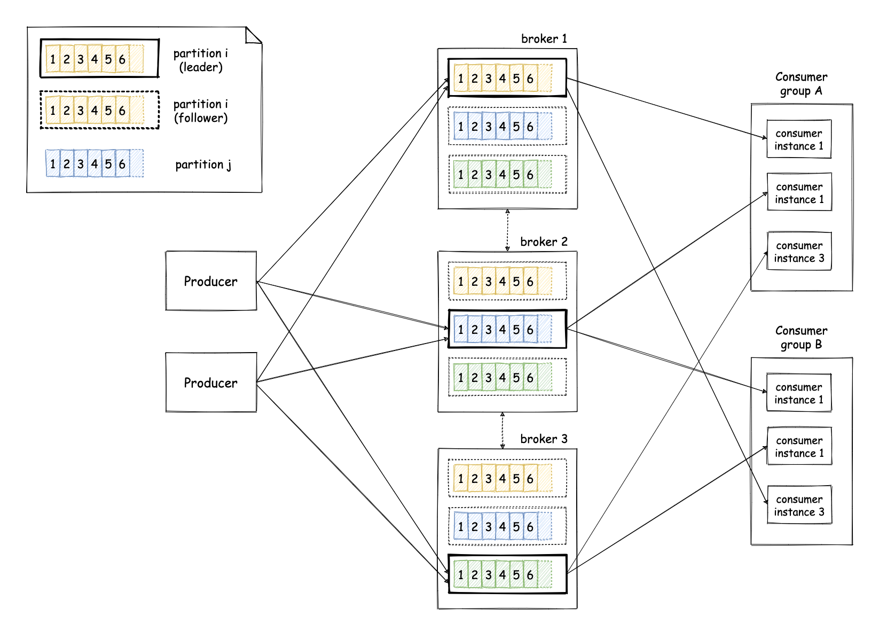

  

Apache Kafka is a widely adopted tool that is being used across many different industries nowadays. As a result, there is a vast amount of material available online for people thinking about using it, which made me wonder: does it really make sense to write yet another blog post on it? After some thinking, I concluded the answer was yes as this material can easily lead to information overload. This blog post is an attempt to help people that are thinking about using Kafka understand what is designed for, how it should be used and what are some pitfalls you have to keep in mind.

There are many different terms for what Apache Kafka is, but the way I like to think about it is as a **distributed event log**. Even though these are just three worlds, they actually contain a lot of compressed information, so let's try and extract this information piece by piece.

## The concept of an event log

First of all, what is an event log? This is relatively easy to explain. You can think of it as a linked list of records that are sorted in the order they were written to the system. You can think these records as regular data messages, but they are commonly referred to as **events**, hence the name event log. I will call them events here just for the sake of consistency. **Producers** are called the applications that write events to the log, which is responsible for imposing some order to these events and returning this ordering back to the producer in the form of a number that indicates the position of each event in the log. This number is known as the **offset** of an event. **Consumers** are called the applications that read events from the log from a specified offset. Consumers will typically read events serially from the log, advancing the offset as they process them. However, there are cases where consumers might have to jump back to a previous offset and start reading events from earlier on. This could be the case if a consumer application crashed or there was a bug and the application wants to reprocess data from the past. An event log system can have multiple of those lists, where each one can contain different data. For example, one list could contain sales, another list could contain page views etc. Each one of those lists is called a **topic**. Producers are ideally decoupled from consumers completely. This means producers do not know who will consume the data and consumers do not know who is producing that data. In order for them to be able to coordinate so that that consumers can read the data producers write, producers need to specify the format of the data that are written on a topic and consumers can use that same format to parse the data that are read from the log. This format is typically called the **schema** and it is typically owned, maintained and evolved by the producers. 

## Kafka as a distributed event log

Now that we are done with the "event log" part, we can have a look at the "distributed" part. The previous explanation was simplified intentionally to ease the introduction to the concept of the event log. In reality, Kafka is a bit more complicated than that. The server that is responsible for storing the events and handling requests from producers and consumers is known as a **broker**. Kafka employs many brokers, so that it can provide horizontal scalability and fault tolerance against broker failures. Each topic is split into multiple sub-lists, which are called **partitions**. One can scale horizontally an event log by adding more brokers and increasing the number of partitions for topics. Each partition is an ordered list of events in itself and it is stored in many different brokers, which are called **replicas** for that partition. One of those replicas is designated as the **leader** of that partition and is responsible for handling requests from producers and consumers to that partition. The other brokers replicate the data continuously, so that they can take over the role of the leader in case the current leader fails. In this way, the data for a partition can remain available even though the leader broker might fail. This means producers and consumers can write (and read) data to (and from) multiple partitions of a topic, so let's look at how this works. The producers have two main ways to indicate the partition an event should be written to[^custom_partitioning]. If they don't do anything special, events will be automatically written to different partitions in a [round-robin](https://en.wikipedia.org/wiki/Round-robin_item_allocation) fashion. Alternatively, producers can specify a value that will be used to identify the partition in which an event will be written. This value is known as a **partition key** and this way of identifying the partition is known as **semantic partitioning**. Kafka will ensure that events with the same key will end up in the same partition and we will see later on why that is useful. A consumer application can have many processes consuming data from Kafka. Each one of these processes is called a **consumer instance** and all the instances that form part of a consumer application are known as a **consumer group**. A consumer instance indicates the topics it's interested in and Kafka will allocate partitions for a topic equally to the various instances of each consumer group. If some of those instances fail, Kafka will identify that and adjust the allocations of the partitions, so that other healthy instances can pick up partitions from the instances that failed.

## The gotchas

We have now described the general architecture of Kafka as a distributed event log. However, there are some smaller details that matter a lot. I will try to cover some of those here:

* In many cases, it is common for applications to benefit from ensuring a consumer instance will process all the events for a specific entity. In some cases, that might be a strict functional requirement, while in other cases it might be a performance optimisation. The most common way to achieve that is using semantic partitioning, as mentioned before. In this way, producers use as a partition key the entity events should be grouped by. For example, if we want to ensure a consumer instance will process all page views for each customer, we can use the customer identifier as a partition key, which means all the page views for that customer will fall into the same partition and will be processed by the same consumer instance. However, there are cases where this condition might be violated, which you have to think about if that's a strict requirement you need to satisfy at all times. For example, if you increase the number of partitions for a topic, it is very likely events for a specific partition key will start falling into a different partition. Furthermore, if you rely on Kafka's automatic fault recovery for consumers, two different consumers might consume the same partition in between failures[^assign_vs_subscribe].

* The concept of **durability** takes a slightly different meaning in Kafka, when compared to other distributed datastores. By default, Kafka brokers that replicate events from the leader acknowledge them only after they have stored them in memory, even if they haven't been stored on disk yet. Events are asynchronously written to disk. This is all in line with Kafka's design focus on high performance. This is in contrast with other technologies, where a write is considered to be durable when it has been stored on the disk of multiple machines. This means that in case of a transient failure of all the brokers replicating a partition (e.g. a datacenter outage), you might suffer data loss for some events that have already been acknowledged to the clients. This aspect is something you should probably be aware of well before you deploy your application on production, ideally during the design phase. What makes it trickier is that Kafka provides many different levers that can be used to adjust this behaviour on various dimensions. The main configuration options you need to select wisely are `acks`, `flush.ms` / `log.flush.interval.ms`, `min.insync.replicas` and `default.replication.factor`. The `acks` option determines how many followers need to acknowledge a write request before the leader can consider it complete and acknowledge it back to the producer. At the moment of writing, this can take three possible values: `0` which means no acknowledgements are needed (not even from the leader), `1` which means the leader will write the event locally and acknowledge without waiting for any acknowledgement from follower replicas and `all` which means the leader will wait for all in-sync replicas to acknowledge the record. The `flush.ms` and `log.flush.interval.ms` options determine the frequency at which new events will be flushed to disk. The `default.replication.factor` determines the number of replicas for each partition of a topic and the `min.insync.replicas` determines the minimum number of replicas that need to be insync for the cluster to remain available. The latter effectively indicates the minimum number of replicas that must acknowledge a write when a producer sets `acks` to `all`. For instance, if you create a topic with a replication factor of 3, you set `min.insync.replicas` to 2 and produce `acks` with `all`, this means writes will be acknowledged only after they have been written to at least 2 replicas.

* The programming of Kafka is centered around the concept of the offset and serial consumption of events. This is in contrast with the programming model adopted by other message queueing technologies, where messages are processed individually and not necessarily serially. This can make a difference in the way you build an application that integrates with these tools. For example, in these technologies it is possible to acknowledge messages individually as you process them. This is not possible natively in Kafka, since once you commit an offset that means the application has processed all the messages up until that offset. If you want selective acknowledgement, you can build this on top of Kafka, but you have to be aware you will be introducing some extra overhead. This [blog post](https://softwaremill.com/using-kafka-as-a-message-queue/) elaborates further on this idea.

* Kafka's design has a strong focus on performance and this is evident in some design decisions. In order to build an application that achieves maximum efficiency, you need to understand these design aspects and build the application in harmony with them. For example, Kafka makes extensive use of batching to achieve high throughput. Events are delivered to consumers in batches. Events sent by producers are grouped and sent periodically in batches. This is the reason the producer's API returns a `Future<RecordMetadata>` when you send an event to Kafka. Instead of sending an event, waiting for that future to complete and then repeating with the next event, instead you can send one event after the other and then wait for all the futures in the end. This will help Kafka group events and send them in larger batches, thus utilising the network more efficiently.

* As explained above, Kafka takes care of many aspects of fault tolerance and recovery, but it is not always clear where this is done and you might be caught by surprise by some behaviours. Kafka makes use of a heartbeating mechanism between clients (e.g. consumers) and brokers to identify clients that might not be healthy and react accordingly. In the case of consumers, this might mean evicting a consumer instance from a group and triggering a partition rebalance. In the context of consumers, this heartbeating consists of two main parts. The first part is a periodic heartbeat sent by the client under the hood automatically and the second part is a heartbeat sent by the client when invoking the `poll()` API to retrieve new events in a topic. The second part is used to avoid _"livelock"_ situations, where a consumer is sending the periodic heartbeats but is stuck processing a single event thus making no real progress. This means you have to be very careful to avoid introducing scenarios, where this might happen. A common example is when event processing requires blocking calls to third-party systems, which might be unavailable and cause a consumer to block infinitely. There are many different options to mitigate these issues, such as introducing timeouts, offloading events to a separate queue and processing them asynchronously etc. This heartbeating behaviour can also be limiting if you want to make use of more special access patterns. For example, you might want to perform lookups for specific offsets at random times that might also be very rare, instead of constantly polling the cluster. In that case, you might have to move away from the `subscribe()` API and assign partitions manually using the `assign()` API.

* As already mentioned previously, Kafka is a system optimised for serial data access. This means it might not be the right tool for the job if your application needs to make use of random access patterns. For instance, Kafka relies heavily on caching at the operating system level to ensure events near the latest offset will be served to consumers from memory. When you start consuming from offsets way back in time, you might start fetching data from disk with the associated consequences. In the worst case, if you do that continuously going back and forth in a random way, you could introduce cache thrashing that could even affect well behaved clients that consume serially from the head of the log. If you want to make use of transactional semantics, you might find it hard or even impossible. An example of this is if you want to perform a conditional write from a producer, so that an event is written atomically to a topic only if some condition holds.

* In the context of transactions, Kafka provides some form of transactions that allow you to produce and consume events atomically from different topics in the same Kafka cluster. However, it is important to understand that exactly-once processing semantics is an end-to-end property, so Kafka transactions are not sufficient without making sure any external systems are also participating in the right way. If you want to read more about this, you can have a look at one of my older blog posts [here]().

* In general, assignment of partitions across topics is independent. This might become an issue if your application needs to ensure consumer instances are processing events from the same entity that come from two different topics. An example scenario is if you are making use of semantic partitioning and you have two different topics that make use of the same partition key. If you need events with the same partition key from both topics to be sent to the same consumer instance (e.g. so that you can process page views for a customer along with their purchases), you need to think carefully about how this can happen. Of course, one option is to perform assignment manually from your application, but as explained before this will introduce some extra complexity. A simpler option is to ensure both topics have the same number of partitions and the default assignment strategy of Kafka is used (known as [`RangeAssignor`](https://kafka.apache.org/24/javadoc/org/apache/kafka/clients/consumer/RangeAssignor.html)). In that case, each consumer instance will be assigned the same partitions from both topics.

To sum up, Kafka can be a really powerful tool that allows you to build high-performance, fault-tolerant, decoupled applications. However, you need to invest some effort to understand the basic mechanics of it and make sure that Kafka can provide the capabilities your application needs and your application makes use of Kafka in the most efficient way.

P.S.: If you enjoyed this blog post and you are interested in distributed systems, you might also enjoy reading my book, [_Distributed systems for practitioners_](https://distsysbook.co.uk).

 

-------------------------------------------------------

 

[^custom_partitioning]: In fact, Kafka is very flexible and even provides an interface ([`Partitioner`](https://kafka.apache.org/24/javadoc/org/apache/kafka/clients/producer/Partitioner.html)) a producer application can implement to apply custom partitioning policies, but this is quite advanced so I won't cover it here to keep everything simple.
[^assign_vs_subscribe]: The most common consumer API is the one, where you subscribe to a set of topics and indicate your consumer group and Kafka is responsible for partition allocation, monitoring of consumers health and recovery from failures via reallocation. If you want to avoid all this machinery and do something custom on your own, you can also assign partitions and implement recovery on your own (this is known as the `assign` API). However, you must be warned that this is not a simple task and you will have to solve many difficult problems that have already been solved by the default API of Kafka.
