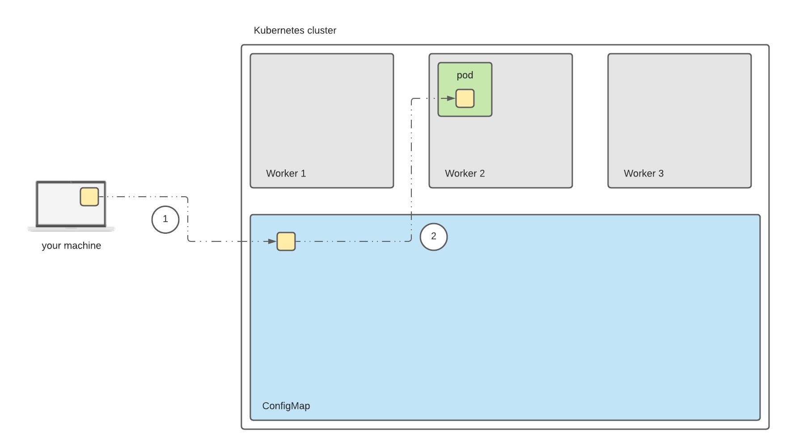

  


Kubernetes has become a widely used platform to deploy software during the last decade. Along with all its benefits, there comes a steep learning curve and a paradigm shift compared to the way people deployed software a few decades ago. A salient difference is the move towards ephemeral infrastructure, also known as "pets vs cattle". Configuring an application to run in different ways depending on the environment was an arguably trivial thing in the old world, but something that requires more thought in this new world. In this post, I will quickly go over a simple way to achieve that in a Kubernetes environment.

If you have played with Docker before, you have probably encountered similar issues around ephemerality and one of the ways these are typically solved are via the concept of [volumes](https://docs.docker.com/storage/volumes/). These allow you to mount directories or volumes from the underlying host to the container running within it. This is quite convenient, but not very useful in a Kubernetes environment as there is an extra layer of isolation between your machine and the pod, the host or worker on which the pod is running. In many scenarios, the relationship between a host and a pod is also very loose as a pod can potentially run in one of many hosts. The way to bridge this extra step is with the use of a [ConfigMap](https://kubernetes.io/docs/concepts/configuration/configmap/). In layman terms, you can think of this as a big key-value map containing configuration data that can be used by any pod in the cluster. 



Let's see how we can use this to inject some configuration in a pod. In order to follow the steps below, you will need to make use of a Kubernetes cluster and one of the easiest (and cheapest) ways to do that is by installing [minikube](https://minikube.sigs.k8s.io/). Once you have a Kubernetes cluster running and have setup `kubectl` so that it makes use of it[^kubectl_setup], you can follow the steps below.

## Creating an entry in the configuration map

First of all, we need to create an entry in the ConfigMap containing our configuration data. Let's say we have a configuration file called `example.txt` containing some configuration data that an application needs to read. Of course, for my example that could be nothing else but a file that contains the string `Hello World!`.

Let's create a ConfigMap entry called `example-config`, which will contain inside a single entry with the key `example-config` and the content of the file as value:
```
$ kubectl create configmap example-config --from-file=example-config=/Users/dimosraptis/Desktop/example.txt
```

We can confirm that entry exists with the following command:
```
$ kubectl get configmap
NAME               DATA   AGE
example-config     1      49m
...
```

We can also inspect the data with the following command:
```
$ kubectl describe configmaps example-config
Name:         example-config
Namespace:    default
Labels:       <none>
Annotations:  <none>

Data
====
example-config:
----
Hello World!

BinaryData
====

Events:  <none>
```

## Creating a pod with configuration data from the ConfigMap

Now that we have created our configuration data, it's time to create a pod that makes use of them.

First, we need to add the following in a file, called `example_pod.yaml`:
```
apiVersion: v1
kind: Pod
metadata:
  name: ubuntu
  labels:
    app: ubuntu
spec:
  containers:
  - name: ubuntu
    image: ubuntu:latest
    command: ["/bin/sleep", "3650d"]
    imagePullPolicy: IfNotPresent
    volumeMounts:
    - name: config-volume
      mountPath: /home/config.txt
      subPath: example-config
  restartPolicy: Always
  volumes:
  - name: config-volume
    configMap:
      name: example-config
```
This describes the resource we want to create, which is a single pod running a container with the `ubuntu` image. We also specify a volume to be created (named `config-volume`) based on a ConfigMap entry and then we mount this volume to the path `/home/config.txt` inside the pod. We specify that the container will run the command `/bin/sleep 3650d`, so that it keeps running for a while. In order to create this pod, we can run the following command:
```
$ kubectl apply -f ./example_pod.yaml
```

We can now check the pod is running successfully with the following command:
```
$ kubectl get pod
NAME                              READY   STATUS              RESTARTS   AGE
ubuntu                            1/1     ContainerCreating   0          6s
...
```

Next step is to connect to the pod's container, get an interactive shell and ensure the file was injected succesfully:
```
$ kubectl exec --stdin --tty ubuntu -- /bin/bash
root@ubuntu:/# cat /home/config.txt
Hello World!
```

That was it, pretty simple. Of course, only after you've put all the pieces together.

<br/>

-------------------------------------------------------

<br/>

[^kubectl_setup]: By the way, this is done automatically when you install minikube. So, nothing to do here in this case.