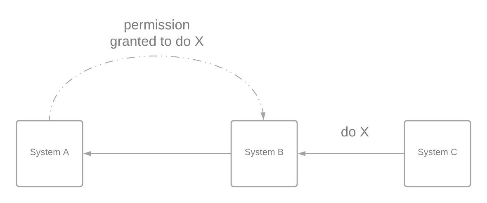
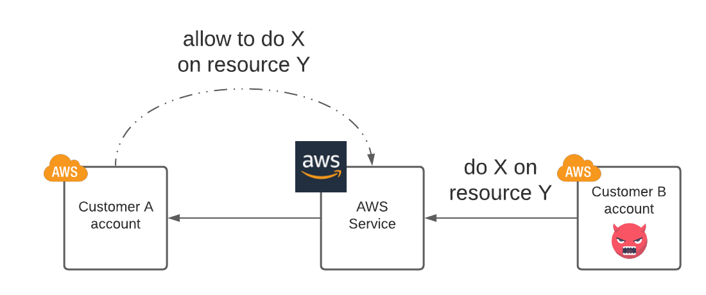

The **confused deputy problem** is a vulnerability, where a system acting on behalf of another entity uses some of its privileges that haven't been granted explicitly to the entity it is operating on behalf of. As shown in the diagram below, system A grants the permission to system B to execute operation X. However, system B is also being used by other systems. One of these systems, say system C, asks system B to execute operation X. Even though system A never granted permission to system C to execute operation X, the system B is tricked into misusing its permissions on behalf of system C. In this case, system B is the **confused deputy**.

The [Wikipedia entry](https://en.wikipedia.org/wiki/Confused_deputy_problem) for this problem provides an example of how this probem might manifest in practice, where a user takes advantage of the permissions granted to a compiler to access files they shouldn't be able to. Even though this is an example that is simple and easy to relate to, when I first encountered it didn't give me a good sense of how realistic this issue is to happen in real life.

It so happens that quite recently, this same problem was present in one of the biggest public cloud providers, AWS. This is a much more realistic (and scary, of course) example from real life. So, I will quickly give an explanation of what the problem is hoping it will be more illuminating than the compiler example. In AWS, it is possible to allow an AWS service to perform some operations on resources inside your AWS account. An attacker can exploit this in order to turn this AWS service into a confused deputy and access your resources. If you want to read more about the issue, [this article](https://blog.wiz.io/black-hat-2021-aws-cross-account-vulnerabilities-how-isolated-is-your-cloud-environment) explains it in more detail.

The vulnerability can be mitigated by refining the permissions in order to limit the context in which the permission applies, e.g. only when the AWS service operates on behalf of a specific AWS account. The AWS documentation also contains a page explaining the issue and possible solutions to prevent it [here](https://docs.aws.amazon.com/IAM/latest/UserGuide/confused-deputy.html).
