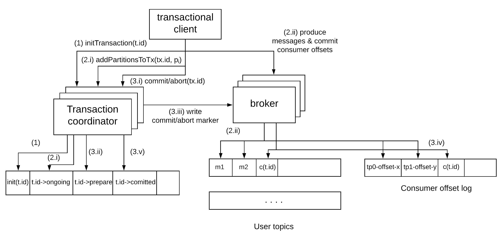

Apache Kafka is an open-source messaging system initially developed by Linkedin[^kafkaPaper], [^kafkaReplicationPaper] and then donated to the Apache Software Foundation[^kafka]. The primary goal of Kafka was:

* **performance**: the ability to exchange messages between systems with high throughput and low latency.
* **scalability**: the ability to incrementally scale to bigger volumes of data by adding more nodes to the system.
* **durability & availability**: the ability to provide durability and availability of data even in the presence of node failures.

The central concept of Kafka is the **topic**. A topic is an ordered collection of **messages**. For each topic, there can be **multiple producers** that write messages to it. There can also be **multiple consumers** that read messages from it[^delivery_model]. To achieve performance and scalability, each topic is maintained as a **partitioned log**, which is stored across multiple nodes called **brokers**. Each partition is an ordered, immutable sequence of messages, where each message is assigned a sequential id number called the **offset**, which uniquely identifies each message within the partition. Messages by producers are always appended to the end of the log. Consumers can consume records in any order they like providing an offset, but normally a consumer will advance its offset linearly as it reads records. This provides some useful flexibility, which allows consumers to do things like replaying data starting from an older offset or skipping messages and start consuming from the latest offset. The messages are stored durably by Kafka and retained for a configurable amount of period, called **retention period**, regardless of whether they have been consumed by some client. 

As explained before, every log is partitioned across multiple servers in a Kafka cluster. Messages written by producers are distributed across these partitions. This can be done in a round-robin fashion simply to balance load or the partition can be selected by the producer according to some semantic partitioning function (e.g. based on some attribute in the message and a partitioning function), so that related messages are stored in the same partition. Each consumer of a topic can have multiple consumer instances for increased performance, which are all identified by a **consumer group** name. Consumption is implemented in such a way that partitions in a log are divided over the consumer instances, so that each instance is the exclusive consumer of a *"fair share"* of partitions. As a result, each message published to a topic is delivered to one consumer instance within each subscribing consumer group. Each partition is also **replicated** across a configurable number of nodes for **fault tolerance**. Each partition has one node which acts as the **leader** and zero or more servers that act as **followers**. The leader handles all read and write requests for the partition, while the followers passively replicate the leader. If the leader fails, one of the followers will automatically detect that and become the new leader.

Kafka makes use of Zookeper for various functions, such as leader election between the replica brokers and group membership of brokers and consumers. Interestingly, log replication is separated from the key elements of the consensus protocol, such as leader election and membership changes. The latter are implemented via Zookeper, while the former is using a **single-master** replication approach, where the leader waits for followers to persist each message before acknowledging it to the client. For this purpose, Kafka has the concept of in-sync replicas (ISR), which are replicas that have replicated committed records and are thus considered to be in-sync with the leader. In case of a leader failure, only a replica that is in the ISR set is allowed to be elected as a leader. This guarantees **zero data loss**, since any replica in the ISR set is guaranteed to have stored locally all the records acknowledged by the previous leader. If a follower in the ISR set is very slow and lags behind, the leader can evict that replica from the ISR set in order to make progress. In this case, it's important to note that the ISR update is completed before proceeding, e.g. acknowledging records that have been persisted by the new, smaller ISR set. Otherwise, there would be a risk of data loss, if the leader failed after acknowledging these records but before updating the ISR set, so that the slow follower could be elected as the new leader even though it would be missing some acknowledged records. The leader maintains 2 offsets, the log end offset (LEO) and the high watermark (HW). The former indicates the last record stored locally, but not replicated or acknowledged yet. The latter indicates the last record that has been successfully replicated and can be acknowledged back to the client. 

Kafka provides a lot of levers to adjust the way it operates depending on the application's needs. These levers should be tuned carefully depending on requirements around **availability**, **durability** and **performance**. For example, the user can control the replication factor of a topic, the minimum size of the ISR set (`min.insync.replicas`) and the number of replicas from the ISR set that need to acknowledge a record before it's committed (`acks`). Let's see some of the trade-offs one can make using these values:

* Setting `min.insync.replicas` to a majority quorum (e.g. `(replication factor / 2) + 1`) and `acks` to `all` would allow one to enforce stricter durability guarantees, while also achieving good availability. Let's assume `replication factor = 5`, so there are 5 replicas per partition and `min.insync.replicas = 3`. This would mean up to 2 node failures can be tolerated with zero data loss and the cluster still being available for writes and reads.
* Setting `min.insync.replicas` equal to `replication factor` and `acks` to `all` would provide even stronger durability guarantees at the expense of lower availability. In our previous example of `replication factor = 5`, this would mean that up to 4 node failures can now be tolerated with zero data loss. However, a single node failure makes the cluster unavailable for writes. 
* Setting `acks` to `1` can provide better performance at the expense of weaker durability and consistency guarantees. For example, records will be considered committed and acknowledged as soon as the leader has stored them locally without having to wait for any of the followers to catch up. However, in case of a leader failure and election of a new leader, records that had been acknowledged by the previous leader but had not made it to the new leader yet will be lost.

Kafka can provide at-least-once, at-most-once and exactly-once messaging guarantees through various different configurations. Let's see each one of them separately:

* **at-most-once** semantics: this can be achieved on the producer side by disabling any retries. If the write fails (e.g. due to a `TimeoutException`), the producer will not retry the request, so the message might or might not be delivered depending on whether it had reached the broker. However, this guarantees that the message cannot be delivered more than once. In a similar vein, consumers commit message offsets before they process them. In that case, each message is processed once in the happy path. However, if the consumer fails after committing the offset but before processing the message, then the message will never be processed. 
* **at-least-once** semantics: this can be achieved by enabling retries for producers. Since failed requests will now be retried, a message might be delivered more than once to the broker leading to duplicates, but it's guaranteed it will be delivered at least once[^at_least_once_caveat]. The consumer can process the message first and then commit the offset. This would mean that the message could be processed multiple times, if the consumer fails after processing it but before committing the offset.
* **exactly-once** semantics: this can be achieved using the **idempotent** producer provided by Kafka. This producer is assigned a unique identifier (PID) and tags every message with a sequence number. In this way, the broker can keep track of the largest number per PID and reject duplicates. The consumers can store the committed offsets in Kafka or in an external datastore. If the offsets are stored in the same datastore where the side-effects of the message processing are stored, then the offsets can be committed atomically with the side-effects, thus providing exactly-once guarantees.

Kafka also provides a transactional client that allows producers to produce messages to multiple partitions of a topic atomically. It also makes it possible to commit consumer offsets from a source topic in Kafka and produce messages to a destination topic in Kafka atomically. This makes it possible to provide exactly-once guarantees for an end-to-end pipeline. This is achieved through the use of a **two-phase commit** protocol, where the brokers of the cluster play the role of the transaction coordinator in a highly available manner using the same underlying mechanisms for partitioning, leader election and fault-tolerant replication. The coordinator stores the status of a transaction in a separate log. The messages contained in a transaction are stored in their own partitions as usual. When a transaction is committed, the coordinator is responsible for writing a commit marker to the partitions containing messages of the transactions and the partitions storing the consumer offsets. Consumers can also specify the isolation level they want to read under, `read_committed` or `read_uncommitted`. In the former case, messages that are part of a transaction will be readable from a partition only after a commit marker has been produced for the associated transaction. This interaction is summarised in the following diagram.

The physical storage layout of Kafka is pretty simple: every log partition is implemented as a set of segment files of approximately the same size (e.g. 1 GB). Every time a producer publishes a message to a partition, the broker simply appends the message to the last segment file. For better performance, segment files are flushed to disk only after a configurable number of messages have been published or a configurable amount of time has elapsed[^flush_caveat]. Each broker keeps in memory a sorted list of offsets, including the offset of the first message in every segment file. Kafka employs some more performance optimisations, such as using the `sendfile` API [^zero_copy] for sending data to consumers thus minimizing copying of data and system calls. 

Some of the guarantees provided by Kafka are the following:

* Messages sent by a producer to a particular topic's partition will be appended in the order they are sent. That is, if a message M1 is sent by the same producer as a message M2, and M1 is sent first, then M1 will have a lower offset than M~2~ and appear earlier in the log[^ordering_caveat].
* As explained before, Kafka can provide at-least-once, at-most-once and exactly-once messaging semantics, depending on the configuration and the type of producers and consumers used.
* The durability, availability and consistency guarantees provided by Kafka depend on the specific configuration of the cluster, as shown in the examples above. For example, a topic with `replication factor` of `N`, `min.insync.replicas` of `N/2 + 1` and `acks=all` guarantees zero data loss and availability of the cluster for up to N/2 failures.

 

:book: This case study refers to version 2.3.1 of Kafka and it is an excerpt from my book ["Distributed Systems for Practitioners"](https://leanpub.com/distributed-systems-for-practitioners).

 

-------------------------------------------------------

 

[^kafkaPaper]: "Kafka: A Distributed Messaging System for Log Processing", Kreps Jay, Narkhede Neha, Rao Jun, NetDB 2011
[^kafkaReplicationPaper]: "Building a Replicated Logging System with Apache Kafka", Wang Guozhang et al., in Proceedings of the VLDB endowment vol. 8, issue 12, 2015
[^kafka]: See: [apache.kafka.org](https://kafka.apache.org/)
[^delivery_model]: This means Kafka can support both the *point-to-point* and the *publish-subscribe* model depending on the number of consumers used.
[^at_least_once_caveat]: Note that this is assuming infinite retries. In practice, a maximum threshold of retries is usually performed, in which case a message might not be delivered if this limit is exhausted.
[^flush_caveat]: This behaviour is configurable through the values `log.flush.interval.messages` and `log.flush.interval.ms`. It is important to note that this behaviour has implications in the aforementioned durability guarantees, since some of the acknowledged records might be temporarily stored only in the memory of all in-sync replicas  for some time until they are flushed to disk.
[^zero_copy]: See <https://developer.ibm.com/articles/j-zerocopy>
[^ordering_caveat]: Note that ordering guarantees are provided only per partition. Users of Kafka can control partitioning, as described before, to leverage the ordering guarantees.
