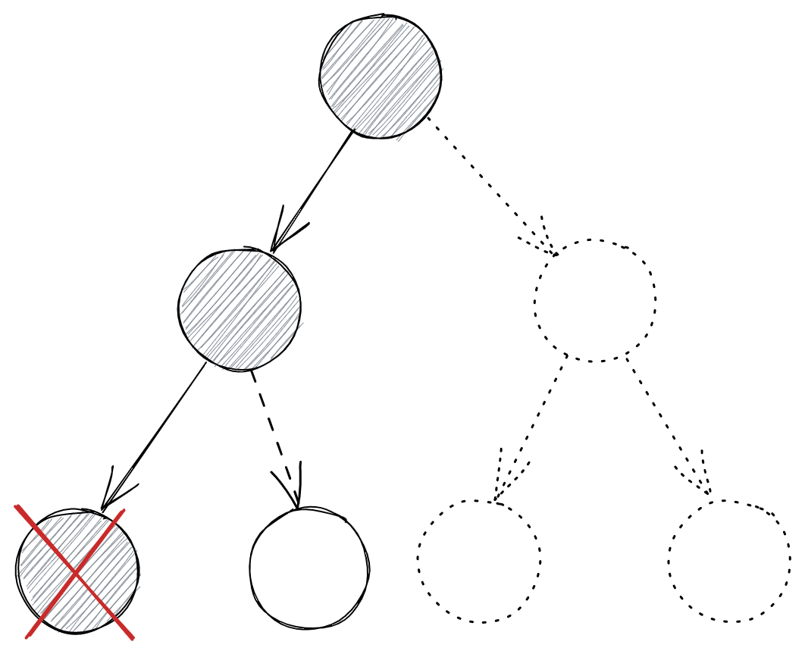

There seems to be a lot of confusion online about the difference between backtracking and depth-first-search. This is expected to some degree given people tend to refer to them as if they were completely different things, while in reality they are quite close.

In fact, depth-first-search can be thought of as special case of a backtracking algorithm, where you traverse your problem space in the form of a tree looking for a solution and at each step, you make an attempt to refine your solution walking back to your previous attempt and trying a different way if it doesn't work.




One area where there the difference between backtracking and depth-first-search takes concrete, practical meaning is when one starts to consider computational and space complexity of an algorithm. In some problems, as you traverse from node to node in the tree during a depth-first-search you have to expand the new node by creating a new copy of data structures from the previous node and adding any new elements to it. This typically results in a computation with linear (to the input/output size) space and time complexity. In contrast, when you implement backtracking manually, you can reduce some of this computation and memory consumption by using the same object and mutating along the way. You mutate it one way as you traverse the implicit tree downwards e.g. by adding elements to it. And then you mutate it again as you traverse the implicit tree upwards e.g. by removing elements from it. By making this mutation a constant time operation, you can save computation time and space. This is all very theoretical, so let's look at an example of how this works in practice.

We will examine the problem of calculating all the possible permutations of a list. For instance, given the list `[1,2,3]`, we want to calculate the lists `[[1,2,3],[1,3,2],[2,1,3],[2,3,1],[3,1,2],[3,2,1]]`. Doing this with DFS recursively is surpsisingly simple, e.g. it can be achieved in Kotlin using the following code:

```
fun permute(nums: IntArray): List<List<Int>> {
    val permutations = LinkedList<List<Int>>()

    permuteRecursive(nums.toSet(), LinkedList(), permutations)
    return permutations
}

fun permuteRecursive(remainingNums: Set<Int>, permutationSoFar: List<Int>, solutions: LinkedList<List<Int>>)  {
    if (remainingNums.isEmpty()) {
        solutions.add(permutationSoFar)
        return
    }

    for (num in remainingNums) {
        permuteRecursive(remainingNums.minus(num), permutationSoFar.plus(num), solutions)
    }
}
```

As explained previously, we have to allocate an extra set and an extra list at each step of the traversal. As an upper bound, the number of these steps is equal to the number of permutations, which is `N!` for an original list with `N` items. This means that the time complexity and space complexity of the algorithm is `O(N!*N)`.

How could we improve on that using backtracking. We would need a way to perform the mutation explained before in constant time, which is not straightforward. What if we go about it a different way? We can try to enumerate all the permutations by visiting one position in the final permutation and attempting to assign all the possible numbers there. We can do this assignment by swapping the two numbers in the array (the position we are filling with the number that will go to that position). This swap can actually be performed in constant time and the reverse swap can also be performed in constant time, which is what we need. This algorithm in Kotlin looks like the following:

```
fun permute(nums: IntArray): List<List<Int>> {
    val permutations = LinkedList<List<Int>>()

    permuteRecursive(0, nums, permutations)
    return permutations
}

fun permuteRecursive(first: Int, nums: IntArray, solutions: LinkedList<List<Int>>)  {
    if (first == nums.size-1) {
        solutions.add(nums.toList())
        return
    }

    for (num in first .. nums.size-1) {
        swap(nums, first, num)
        permuteRecursive(first+1, nums, solutions)
        swap(nums, num, first)
    }
}

private fun swap(nums: IntArray, i: Int, j: Int) {
    val temp = nums[i]
    nums[i] = nums[j]
    nums[j] = temp
}
```

Let's calculate the time complexity of this algorithm. In our previous example with the array `[1,2,3]`, when we calculate the possible permutations with different numbers in the first position, there are 3 different variations. Or more generically `N` variations for an array of size `N`. On the next step, we have to calculate for each one of those variations all the different numbers that can be assigned on the second position of the array. Since there are `N-1` numbers remaining (one has already been reserved for the first position), there are `N-1` variations for each variations from the previous stage. For all the variations of the first stage, this is a total of `N*(N-1)` variations for the second stage. If you follow this logic until the end, you will realise the number of all steps is `N + N*(N-1) + N*(N-1)*(N-2) ... + N!`, which is slightly better than `N!*N` and slightly worse than `N!`. With regards to space complexity, the algorithm does not use any extra space on top of what is already used the input and the output of the algorithm, which has upper bound of `O(N!)`.

This is also a nice example of how software engineering is full of trade-offs. The second solution is more efficient, but also considerably harder to understand and reason about.                                                                                                                                                          