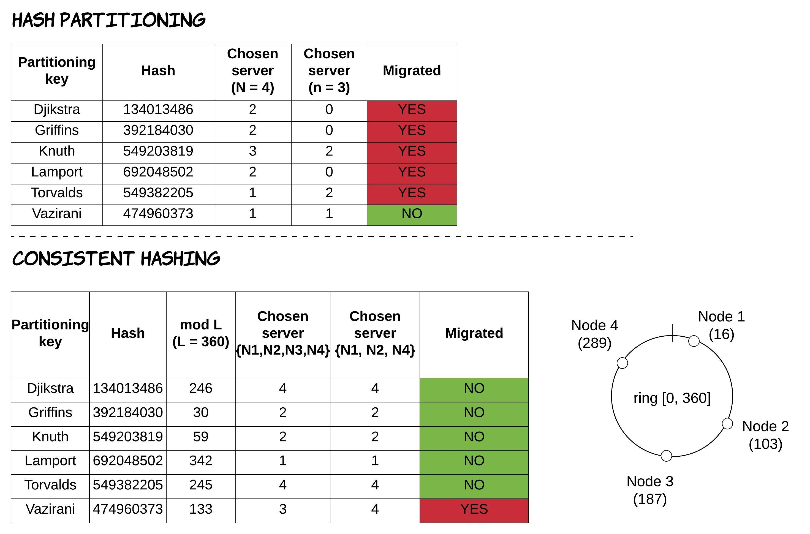

One of the main techniques to build distributed systems that can scale to large volumes of data and traffic is (horizontal scaling)({{ site.baseurl }})
, which involves partitioning a large dataset across different physical machines.
A quite popular method to partition that data is known as **hash partitioning**, where a hash function is applied to a specific attribute of each record, resulting in a number that determines which partition (and thus which machine) this record belongs to. 
For the sake of simplicity, let's assume we have one partition per machine and a hash function that returns an integer. If we have `n` number of machines in our system and trying to identify which machine a record with an attribute called `id` is located at, then we could calculate it using the formula `hash(id) mod n`. 
This mapping process needs to be done both when writing a new record and when receiving a request to find a record for a specific value of this attribute.

Some advantages of this technique are:

* the ability to calculate the partitioning mapping at runtime, without needing to store and maintain the mapping. This has benefits both in terms of data storage needs and performance (since no additional request is needed to find the mapping).
* a bigger chance of the hash function distributing the data more uniformly across the machines of our system, thus preventing some machines from being overloaded.

Some disadvantages of this technique are:

* the inability to perform range queries at all (even for the attribute used as a partitioning key), without storing additional data or querying all the machines.
* adding/removing machines from the system causes re-partitioning, which results in significant movement of data across all machines of the system.

**Consistent hashing** is a partitioning technique, having very similar characteristics to the previous one, but solving the problem of increased data movement during re-partitioning. 
The way it works is the following: each machine in the system is randomly assigned an integer in a range `[0, L]`, called *ring* (i.e. `[0, 360]`). 
Then, a record with a value `"abc"` for the attribute used as partitioning key is located to the machine that is the next one after the point `hash("abc") mod L` in the ring. 
As a result, when a new machine is added to the ring, it receives data only from the previous machine in the ring, without any more data needed to be exchanged between any other machines. 
In the same way, when a machine is removed from the ring, its data just need to be transferred to the next machine in the ring. 
For a visual representation of this behaviour and the difference between these 2 different algorithms, see the following picture. This is an example where a system initially starts with 4 machines and at a later point one of those machines (e.g. `N3`) is removed from the system, leading to re-partitioning of data.

Some disadvantages of this technique are:

* the potential for non-uniform distribution of the data, because of the random assignment of the machines in the ring.
* the potential for creating more imbalanced data distribution as machines are added or removed. For example, when a machine is removed, its dataset is not distributed evenly across the system, but it's transferred to a single machine.

Both of these issues can be mitigated by using the concept of *"virtual nodes"*, where each physical machine is assigned multiple locations (virtual nodes) in the ring. 
For more discussion on this concept, feel free to read the Dynamo paper [^dynamoPaper]. 
Another widely used system that makes use of consistent hashing is Apache Cassandra [^cassandraPaper].

 

:book: This post is an excerpt from my book ["Distributed Systems for Practitioners"](https://leanpub.com/distributed-systems-for-practitioners).

 

-------------------------------------------------------

 

[^dynamoPaper]:  G. DeCandia et al., “Dynamo: Amazon’s Highly Available Key-value
Store,” in Proceedings of twenty-first ACM SIGOPS symposium on Operating
systems principles, 2007.
[^cassandraPaper]:  A. Lakshman and P. Malik, “Cassandra — A Decentralized Structured
Storage System,” Operating Systems Review, 2010.
