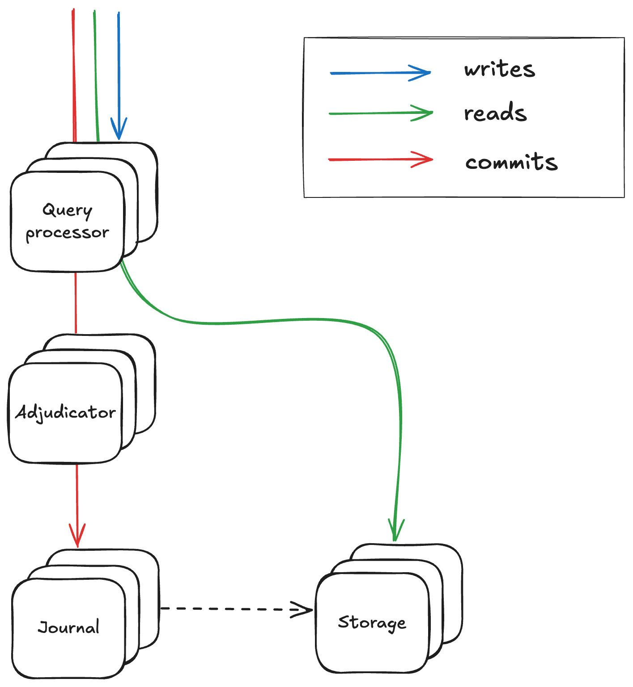
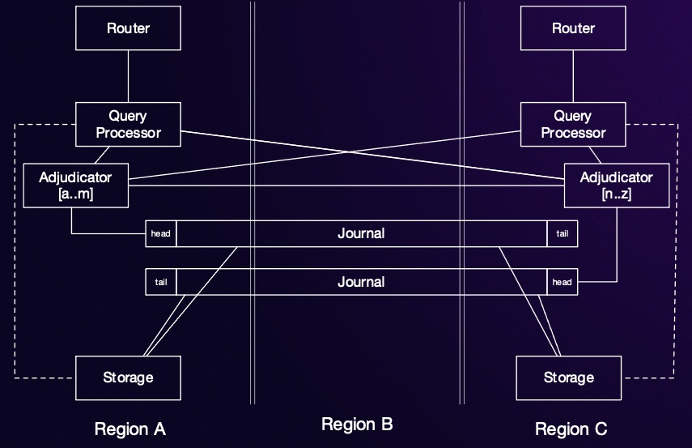

In the most recent re:Invent, AWS announced the preview release of a new distributed relational database product, called Aurora DSQL. The market of distributed relational databases, offering a combination of horizontal scalability, fault tolerance and ease of development through ACID transactions was originally inspired from Google Spanner [^spannerPaper] a bit less than a decade ago. But, it is now a pretty mature market, with products like [Google Spanner](https://cloud.google.com/spanner), [CockroachDB](https://www.cockroachlabs.com/) and [Yugabyte](https://www.yugabyte.com/) that have reached good penetration and adoption by many companies of diffent sizes and scales. AWS already had a competitive product in that space, called Aurora, so seeing a new product being released I suspected they must have discovered some innovation that would unlock a step-level change in one of the dimensions customers care about. Naturally, I decided to read more about it from whatever public sources existed, which you can find referenced below. The time was well spent as there are quite a few interesting ideas, SO I thought I would try and summarise my findings in a blog post.  

## Architecture 

One of the central approaches used in architecting DSQL is that of **disaggregation**. The components you typically see within any of the well known databases out there, such as query planner (or query processor in the DSQL parlance), storage engine, write-ahead log (or journal as it's called in the DSQL parlance), have been extracted into separate deployable components that can be scaled independently and can have isolated failure domains.

Query processors are responsible for creating efficient query plans for incoming requests and routing the appropriate requests to the right downstream components. The journal acts as the main replicated log of commited transactions in the database, ensuring transactions are stored durably and atomically. Apparently, this is a general component leveraged by various other products of AWS. The adjudicator is the component responsible to ensure transactions are isolated properly from each other. And lastly the storage engines are responsible for storing the data in a way that provides efficient access from the query processors. Up to now, nothing is ground breaking. But it gets more interesting as we get into the details.

## Providing ACID semantics

The main value proposition of relational databases is ACID semantics, which allow developers to easily build applications on top of them without having to think about what happens when transactions run concurrently or fail mid-way during execution. Providing ACID semantics without compromising the scalability and fault tolerance of the database is not an easy task.

Most other relational database offerings provide serializability as isolation guarantee to the applications. This ensures that even though statements from one transaction might be running concurrently with statements from different transactions interleaved, the end result will be the same as if they all run serially one after the other. Aurora DSQL takes a slightly different stance, offering snapshot isolation instead. Mark Brooker explains in his re:Invent talk (and in a blog post I've linked below) that their belief is that snapshot isolation is a pretty strong guarantee for building applications. Of course, serializability is stronger but requires technical mechanisms that can lead to degraded performance and scalability, thus taking some ease of development away from developers that now have to think about how to avoid these scenarios. The main anomaly allowed from snapshot isolation is write skew, which is not a very common access pattern anyway. An AWS blog post I've linked below explains that it is still possible to prevent write skew by using FOR UPDATE in statements to convert reads into writes.

On the positive side, snapshot isolation can be implemented in a distributed system in a scalable, performant and fault tolerant way without the need for locking mechanisms, as evidenced by DSQL. In this case, it's implemented via the following mechanisms:
* at the storage level, DSQL uses multiversion concurrency control (MVCC) to store data, so that transactions can read older versions of data without blocking writes from later transactions. Query processors select a start timestamp for each transaction and execute all reads using that timestamp, to ensure all statements read from a consistent snapshot of the database without seeing results from writes of other transactions.
* each transaction is written atomically as a single record into the journal, with the record containing all the statements of the transaction and an associated commit timestamp. This means that query processors do not need to write data directly into the storage engines. They only write the transactions into the journal and the storage engines consume the journal records and apply the writes into their storage. It also means that query planners can retain writes locally during the transaction and only send them in the journal during transaction commit, thus saving round trips and the corresponding latency on each statement of a transaction. As a result, DSQL can provide synchronous replication of transactions across AZs or regions, albeit with only a single round trip latency on transaction commit (with all read/write statements executed locally).
* the adjudicator component is controlling what transactions are allowed to go into the journal, safeguarding the isolation guarantees. It receives requests for transactions to be commited from the query processors and aborts transactions that would violate the isolation guarantees. It does this by keeping a record of all transactions and checking if there's any transaction already commited with a timestamp between this transaction's start and commit timestamp and overlapping write sets. Any non violating transactions are sent to the journal to be commited.

## Consensus elements

Any geo replicated database system needs a way to replicate data across locations in a safe way. Typically this is done via a consensus algorithm, such as Paxos or Raft that guarantee strong consistency (i.e. linearizability) and progress as long as a majority of nodes is healthy. This is the case for DSQL. I haven't found public information on the exact details of the algorithm, but reading between the lines of public information I suspect the journal uses a consensus algorithm for replicating the log. It's unclear whether the adjudicator also uses a consensus protocol, but given the journal is a generic replicated log and all the validation logic is done externally on the adjudicator, I suspect a consensus protocol is used by that component too either directly or indirectly (e.g. as part of a leadership protocol for adjudicators).

Interestingly, the adjudicator and the journal are likely to have a lot of similar functionalities, which is why in some systems the same roles are served by a single component. Dosaggregatimg them allows for abstraction and reuse of the log across systems and easier evolution of each of them at the cost of an extra round trip, since the adjudicator needs to consume the records of the journal to have an up to date view required to make right transaction validity decisions.

## Scalability and Fault Tolerance

Distributed systems typically achieve scalability and fault tolerance via a combination of [partitioning and replication]({{ site.baseurl }}). This is true for DSQL too. Data is partitioned at all levels, with each storage engine, adjudicator and journal only storing a subset of the data. Interestingly, the partitinioning scheme is different between different levels. For instance, the adjudicator and the storage engines use different partitioning schemes that serve their corresponding purposes in the best way, e.g. allowing efficient validation of transactions vs providing quick access to data.

Data is also replicated across different AZs or regions depending on the setup. The only exception is query processors that only contain transient state as we mentioned previously and thus don't require replication to prevent data loss. For adjudicators, a transaction might contain writes to records that are partitioned into separate adjudicators, in which case adjudicator use a cross-partitions replication protocol that uses a variant of 2-phase commit. This is not needed for the journal, since each transaction always contains all statements as explained above and so there is never a need for cross partition writes.

In the typical deployment across 2 regions, a duplicate set of replicas for each of the aforementioned components is deployed on each region. The only exception is the journal, which contains an extra replica set in a 3rd witness region, which doesn't receive and read/write but participates in consensus so that the system can retain a majority quorum and remain available in case one region is lost or is inaccessible.

## Comparison with other systems

The main difference with most of the systems in this category, such as CockroachDB, Spanner or Yugabyte, is these systems employ pessimistic concurrency controls such as 2-phase locking, while DSQL employs optimistic concurrency controls (MVCC).

Another difference is that DSQL doesn't write data directly to storage, but storage materialises them from the transaction log. A system that follows a similar principle is Calvin[^calvinPaper]. However, Calvin requires knowledge of the write/read set of a transaction ahead of time, so it doesnt allow interactive transactions. The reason for that is Calvin stores transactions in a replicated log at start time (instead of commit time, like DSQL) and this then allows deterministic execution across all storage nodes of the system.

All in all, DSQL doesn't use any groundbreaking technique [^aurora_paper], which is expected given these areas have been evolving over many decades and there are now established and battle-tested techniques. At the same time, DSQL combines some of these techniques in a novel and interesting way.

## References

Mark Brooker, a VP/Distinguished Engineer at AWS has a series of blog posts on Aurora DSQL which was my main source of knowledge for the above:

* A personal story about DSQL: https://brooker.co.za/blog/2024/12/03/aurora-dsql.html
* Disaggregation of storage and compute: https://brooker.co.za/blog/2024/12/04/inside-dsql.html
* Transactions and durability: https://brooker.co.za/blog/2024/12/05/inside-dsql-writes.html
* On availability and partition tolerance: https://brooker.co.za/blog/2024/12/06/inside-dsql-cap.html
* On using snapshot isolation vs serializability: https://brooker.co.za/blog/2024/12/17/occ-and-isolation.html

He also did a deep dive about the same topic in the recent re:Invent, you can find [here](https://www.youtube.com/watch?v=huGmR_mi5dQ) 

And [here](https://aws.amazon.com/blogs/database/concurrency-control-in-amazon-aurora-dsql/) is a blog post from AWS covering more details and subtleties related to concurrency control in DSQL.

Happy reading!

 

-------------------------------------------------------

 

[^spannerPaper]: Corbett, James C. et al., “Spanner: Google’s Globally Distributed Database” in ACM Trans. Comput. Syst., 2013.
[^calvinPaper]: Thomson, Alexander et al., “Calvin: fast distributed transactions for partitioned database systems” in SIGMOD '12: Proceedings of the 2012 ACM SIGMOD International Conference on Management of Data.
[^aurora_paper]: This is based on public information so far. I will be happy to be proven wrong if/when AWS releases a paper with more details about the design of Aurora DSQL. 
